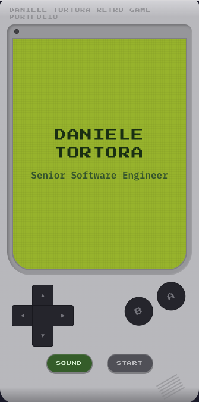

# Daniele Tortora — Retro Game Portfolio

<div align="center">


### [danieletortora.com](https://www.danieletortora.com)

_A personal portfolio disguised as a 90s retro game._

</div>

---

## What is this?

This is not your typical developer portfolio. It's an interactive point-and-click adventure game inspired by LucasArts classics like _Monkey Island_, _Day of the Tentacle_, and _Grim Fandango_ — wrapped inside a fully functional **Windows 95 desktop environment**.

Visitors don't just read about my work — they explore it. Click hotspots, talk to a pixel-art character, open windows, use a retro MS-DOS terminal, and discover Easter eggs along the way.

## Desktop Experience

The full desktop experience emulates a Windows 95 environment:

- **Desktop icons** — Double-click to launch applications (Game, MS-DOS Prompt, Recycle Bin)
- **Taskbar** — Shows running applications and a system clock
- **Window management** — Minimize, maximize, close, and drag windows just like the real thing
- **Game window** — A point-and-click adventure scene where you explore hotspots for About, Skills, Contact, Experience, and Resume
- **MS-DOS Terminal** — A retro terminal with commands like `help`, `about`, `skills`, `contact`, `talk`, and `resume`
- **Recycle Bin** — Contains humorous "deleted" files about software development
- **Loading screen** — An authentic Windows 95 boot sequence when opening the game
- **Keyboard shortcuts** — Navigate the experience without a mouse

## Mobile Experience

<div align="center">



</div>

On mobile devices, the portfolio transforms into a **Game Boy emulator**. The same content — about, skills, experience, contact — is presented through a retro handheld console interface, complete with a D-pad and action buttons. It's a fully responsive experience that embraces the retro theme rather than fighting the smaller screen.

## Built With

**Stack:**

- React 19 + TypeScript
- Vite (build & dev server)
- Framer Motion (animations)
- Zustand (global state)
- Lucide React (icons)

**AI & Creative Tools:**

This project was built with significant help from AI — not as a replacement for creativity, but as an amplifier. Tools used:

- **Claude Opus 4.6** (via OpenCode, GitHub Copilot, and VSCode) — code generation and architecture
- **GPT-4o image generation** (via ChatGPT) — visual assets and concept art
- **Nano Banana** — pixel art and artwork
- **Retro MIDI sounds** — sourced from the internet for authentic 90s audio

## Run Locally

Node.js is managed via **fnm**; the project expects the version in `.nvmrc`.

```bash
fnm use
npm install
npm run dev
```

Then open the URL shown in the terminal (typically `http://localhost:5173`).

### Scripts

| Command           | Description              |
| ----------------- | ------------------------ |
| `npm run build`   | Production build         |
| `npm run preview` | Preview production build |
| `npm run lint`    | Lint with ESLint         |
| `npm run format`  | Format with Prettier     |

---
