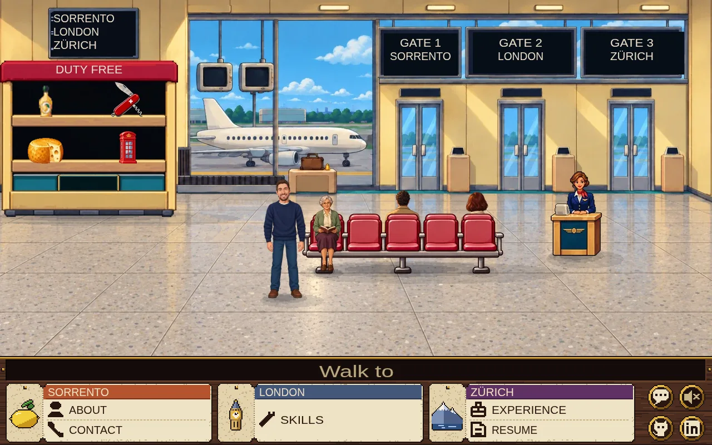
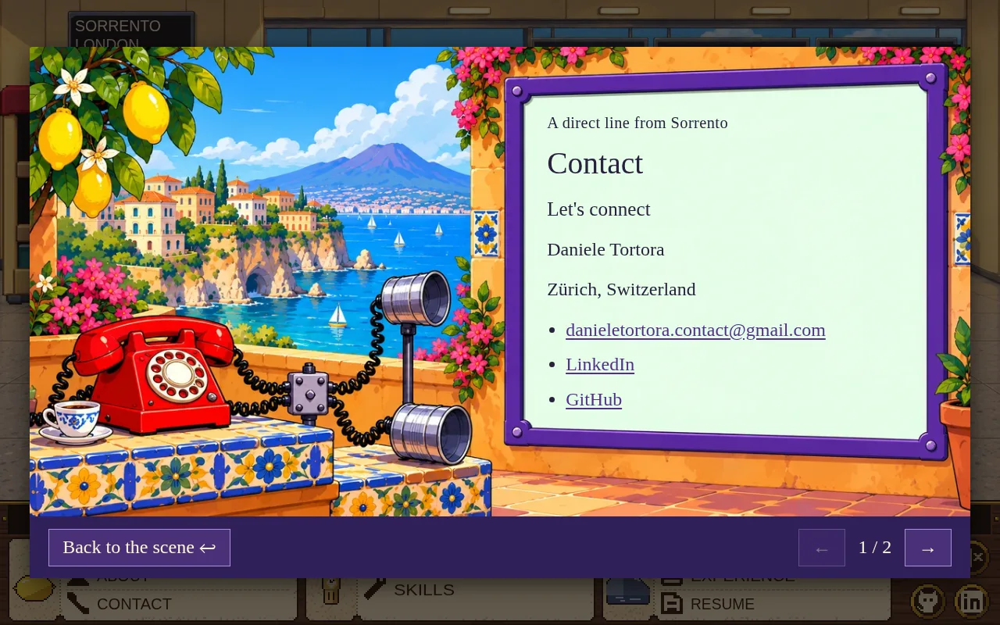
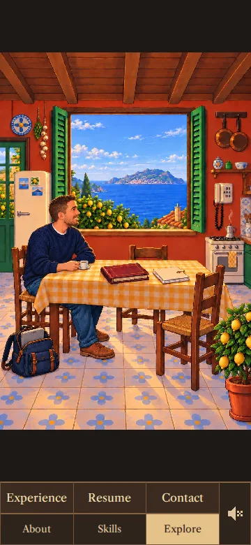

# Daniele Tortora — Retro Game Portfolio

<div align="center">



### [danieletortora.com](https://www.danieletortora.com)

_A personal portfolio disguised as a 90s point-and-click adventure._

</div>

---

## What is this?

This is not your typical developer portfolio. It's a point-and-click adventure in the spirit of LucasArts classics like _Monkey Island_, _Day of the Tentacle_ and _Grim Fandango_. On desktop it runs inside a working **Windows 98** desktop. On phones it becomes a portrait **Pocket Adventure**.

A painted Daniele is your guide through the three countries he has lived in. Each section of the portfolio lives in one of them: About, Skills, Experience, Contact and Resume.

**In a hurry?** You never have to play. On desktop, every section is one click away on the toolbar, from any room. On mobile, the section links are always on screen, and the welcome page links straight to Experience, Resume and Contact.

## The adventure

The game opens with a boarding pass. Press Space and you arrive in an airport.

| Place                  | What's there                                               | Sections           |
| ---------------------- | ---------------------------------------------------------- | ------------------ |
| **The airport hall**   | Three gates, a duty-free shop and a few waiting passengers | The way to all     |
| **A Sorrento kitchen** | A view of the Gulf of Naples, a postcard and a telephone   | About, Contact     |
| **A London pub**       | A rainy evening, a chalkboard of skills and a jukebox      | Skills             |
| **A Zürich chalet**    | An Alpine room with a cuckoo clock and a cow asleep        | Experience, Resume |

- **Travel.** Walk through a gate and you fly there over a sepia map of Europe, _Fate of Atlantis_ style. Click to skip the flight.
- **The travel trunk.** The toolbar is a painted trunk with a SCUMM-style sentence line. It holds one boarding pass per city, listing the sections that live there. Click a section and it opens right away, wherever you are.
- **Close-ups.** Clicking an object opens a cartoon close-up: a suitcase that won't shut, a telephone wired to tin cans, a London phone booth, a Swiss train and a runaway ticket. The text on them is live HTML, paged, keyboard-friendly, and closes back to the same spot in the room.
- **Conversations.** Talk to Daniele and choose your lines, _Curse of Monkey Island_ style. Use the mouse, the arrow keys or the number keys.
- **Duty free.** The shop sells four souvenirs: limoncello, a Swiss Army knife, a cheese and a phone booth with its own raincloud. Each has its own close-up. None of them are useful.
- **A living world.** Passengers wander through the hall, regulars drink in the pub, a ferry crosses the bay, and each room has its own music and ambience. With reduced motion on, the scenes keep still.



## The Windows 98 desktop

- **Desktop icons:** Portfolio Adventure, My Computer (a System Properties window about Daniele), My Resume and the Recycle Bin.
- **Start menu:** play the adventure, open the resume, jump to Work Experience or Contact, or read About this computer. It works with the arrow keys, Home, End and Escape.
- **Taskbar:** Quick Launch, Show Desktop, a button for each open window, a sound toggle and a clock.
- **Windows:** drag, minimise, maximise, restore, or double-click the title bar.
- **Launch dialog:** a Windows 98 progress dialog that tracks the real download of the first scene.
- **Recycle Bin:** a few humorous "deleted" files about software development.

## Pocket Adventure (mobile)



On phones and portrait tablets, the game becomes one painted scene: Daniele's Sorrento kitchen.

- **A welcome page** on every visit. It says the full game is on desktop, and links straight to Experience, Resume and Contact.
- **The kitchen.** Daniele sits at the table and sips his coffee through a 30-second day, sunset, night and dawn. A ferry and a wooden boat take turns crossing the bay.
- **Tap an object to read a section:** the postcards, telephone, career album, document folder, or backpack and laptop. The navigation bar is always on screen too.
- **Reading pages** use the same profile data as desktop. They support browser Back and direct links such as `#pocket-experience`.
- **Sound is opt-in** and plays the desktop's Sorrento music and ambience. Reduced motion keeps the scene still.

London, Zürich and the airport may become mobile locations later. See [the Pocket Adventure notes](docs/pocket-adventure.md).

<br clear="right" />

---

## How it's built

**Stack:** React 19, TypeScript, Vite, Zustand, Framer Motion, react-rnd (draggable windows), sharp (build-time image encoding), Vitest (unit and browser tests), and Playwright (end-to-end and screenshot tests, run in Docker).

- **A small canvas engine** (`src/engine/`). Scenes are plain data: walkboxes, depth, objects, exits and effects, in logical coordinates. The engine draws them, sorts objects by depth, walks Daniele between them and animates his cut-out rig.
- **Content is data.** Personal details and portfolio copy live in `src/config/profile.ts` and feed the desktop, mobile and SEO pages. Dialogue lives in `src/config/dialogTrees.ts`. No portfolio text is painted into the art.
- **Art.** Full-quality sources are committed with prompts and provenance. The build encodes them as WebP, and the game preloads them in tiers behind the launch dialog, within size budgets that are checked by a test. See [encoded images](docs/encoded-images.md), [the close-up artwork](docs/location-inspection-art.md) and [the duty-free artwork](docs/duty-free-inspection-art.md).
- **Audio.** The music is written as code, as MIDI phrases rendered with FluidSynth. The sound effects are synthesised by script.

### Made with AI agents

Version 2 was built by AI agents and directed by Daniele. **Claude Code** (Claude Opus 5.5 and Claude Sonnet 5.5) wrote the engine, tooling, tests and most of the integration, and ran the multi-agent orchestration. **OpenAI Codex** took implementation tasks and generated the artwork with its built-in image tool.

The full story, including the parts that went wrong, is in [Rebuilding a retro portfolio with two AI orchestrators](docs/blog/v2-revamp.md).

## Run locally

Use the Node.js version in `.node-version` and the npm version in `package.json` (`packageManager`). Install them with your preferred version manager, then run:

```bash
npm ci
npm run dev
```

Then open the URL shown in the terminal (usually `http://localhost:5173`).

### Scripts

| Command                   | Description                                             |
| ------------------------- | ------------------------------------------------------- |
| `npm run dev`             | Start the dev server                                    |
| `npm run build`           | Production build                                        |
| `npm run preview`         | Preview the production build                            |
| `npm run lint`            | Lint, types, formatting, styles, unused code and assets |
| `npm run format`          | Format with Prettier                                    |
| `npm run test:unit`       | Unit tests                                              |
| `npm run test:browser`    | Component tests in a real browser                       |
| `npm run test:e2e:docker` | Playwright end-to-end and screenshot tests, in Docker   |

### Developer views

These work under `npm run dev`:

- `?debug=scene` overlays walkboxes, hotspots, depth lines and exits, and shift-click copies coordinates.
- `/?remaster=hall` compares the original pixel-art hall with the remaster side by side.

Contributors and coding agents should start with [`AGENTS.md`](AGENTS.md).
