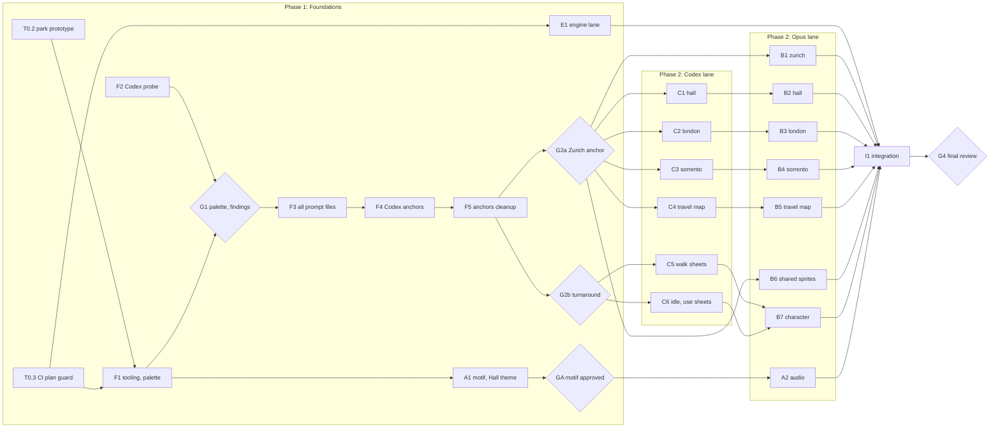

# Art spec and asset plan

This is the asset side of [the expansion plan](expansion-plan.md). The plan's [Creative direction](expansion-plan.md#creative-direction) is the source of truth for what the world contains. This spec says how every asset is made and in what order.

It's written for **two orchestrators**, one per model family. Each one runs every task in its own lane, starting each task as soon as its dependencies are met and running independent tasks in parallel. The work has three phases:

1. **Foundations:** a short sequential chain that everything else depends on.
2. **Fan-out:** everything that can run in parallel, across both lanes.
3. **Integration:** one final sequential pass.

**Trunk and worktrees.** Everything branches from and merges back into **`v2`**, never `main`. Each orchestrator works in its own git worktree, and each Opus task in its own worktree and branch. Daniele's main checkout is never touched by an agent. The layout and the reconciliation rules are in the plan's [Where to work](expansion-plan.md#where-to-work).

**The plan lives on `origin/v2`.** This spec and the expansion plan are read from `origin/v2`, never from a local copy, and only Daniele changes them, directly on `v2`. The full rules are in [Keeping the plan in sync](expansion-plan.md#keeping-the-plan-in-sync).

## Who does what

| Actor                                        | Runs                                                                                                                                                         | Never does                                                          |
| -------------------------------------------- | ------------------------------------------------------------------------------------------------------------------------------------------------------------ | ------------------------------------------------------------------- |
| **Opus orchestrator** (Claude Code, Opus)    | Every task marked Opus: tooling, palette, prompt files, pixelizing, cleanup, cutouts, hand-drawn sprites, animations, scene data, audio, engine, integration | Generate images                                                     |
| **Codex orchestrator** (Codex, ChatGPT plan) | Every task marked Codex: runs prompt files with its built-in image tool (`image_gen` / `$imagegen`) and saves candidates                                     | Edit code, docs, `src/`, or anything outside `assets-src/exchange/` |
| **Daniele**                                  | Gates: picking candidates, approving anchors and audio, the final review. Recording each passed gate in the Status column                                    | —                                                                   |

**Delegated gates (from 2026-09-29).** Daniele has stepped out of the loop. Until he says otherwise, the Opus orchestrator (the main Claude Code session) passes gates G1, G2, and GA, and makes every candidate pick. It records each decision and its reasoning in the [Gate log](#gate-log), and Daniele can overturn any of them later. **G4, the final review before `v2` is merged into `main`, stays with Daniele.**

No task calls a model API. Image generation happens only inside Codex sessions, billed to the ChatGPT plan, as a one-off batch of about 50 images. The scripts exist to turn each generated image into real pixel art and keep it that way.

## How an asset gets made

```
Opus writes      Codex runs it,      Opus pixelizes     Daniele    Opus cleans up,    validate
prompt file  ─▶  saves candidates ─▶  all candidates ─▶  picks  ─▶  cuts layers,   ─▶  (local lint)
                 into exchange/       + review sheet     one        writes scene data
```

1. **Prompt file.** Opus writes a self-contained prompt file in `assets-src/prompts/`. It's the handoff to Codex.
2. **Generate.** Codex runs it and saves each candidate to `assets-src/exchange/raw/<asset-id>/`.
3. **Pixelize.** Opus crops each candidate, downscales it by area-averaging to native size, and maps every pixel to the nearest allowed palette colour in OKLab, with no dithering. Magenta backgrounds become transparent.
4. **Pick.** Opus shows Daniele a review sheet of all pixelized candidates, and he chooses one. Judge at native size: a beautiful raw image can pixelize into mush.
5. **Clean up.** Opus edits regions as palette-index text grids, renders an 8× preview, looks at it, and repeats.
6. **Validate.** A script checks palette, size, alpha, naming, and provenance, as part of `npm run lint`.

Opus draws some assets directly, with no generation: object cutouts, clean plates, `@open` door states, talk heads, the generic slot sprites, the travel-map plane and markers, and the small animation frames.

## Art rules

### Resolution and coordinates

- Native scene size is **320×160**, displayed at 4× (1280×640) with `image-rendering: pixelated`. The logical viewport, toolbar, and tests keep working in 1280×640.
- All art-side coordinates (walkboxes, hotspots, object positions, slots) are **native pixels with a top-left origin**. The engine multiplies by 4 and converts to its own bottom-based Y for the character.
- The floor in every scene must be at least 40 native px deep, for depth scaling and walking around free-standing objects.

### Palette

One master palette, version-controlled at `assets-src/palette/master.hex`. It has a **core** shared by everything, plus **one ramp per scene** (Agreed in the plan's decision log). Each colour has a single-character index, used by the text grids. `.` is transparent.

| Indices | Group    | Colours | Used by                                                                  |
| ------- | -------- | ------- | ------------------------------------------------------------------------ |
| `0–P`   | Core     | 26      | Everything, including the character, UI-adjacent art, and the travel map |
| `Q–Y`   | Hall     | 9       | Hall only: beige plastic, patterned carpet, apron and daylight sky       |
| `Z a–h` | London   | 9       | London only: wet grey-blues, amber lamplight, brick                      |
| `i–q`   | Zurich   | 9       | Zurich only: plum, night navy, snow and lake                             |
| `r–z`   | Sorrento | 9       | Sorrento only: terracotta, lemon, majolica and sea blues                 |

- **Each scene may use only the core plus its own ramp.** The validator enforces this, which keeps the character and the shared sprites identical everywhere. The character uses the core only.
- **Core seed (v0),** from today's `background.png` and `retro-daniele.png`:

  | Ramp    | Indices | Hex                                                         |
  | ------- | ------- | ----------------------------------------------------------- |
  | Neutral | `0–5`   | `#0f0d12` `#2a2328` `#4a4046` `#7a6e6c` `#b0a49a` `#e8dcc8` |
  | Wood    | `6–A`   | `#3a2220` `#49322d` `#6d3f31` `#90583d` `#a1603f`           |
  | Skin    | `B–E`   | `#5c3b33` `#9a7860` `#bf987d` `#e7bd98`                     |
  | Navy    | `F–I`   | `#161c2f` `#21283c` `#2f3f66` `#466394`                     |
  | Brass   | `J–K`   | `#8a6420` `#e0b040`                                         |
  | Red     | `L–N`   | `#5a1e1e` `#9b3d34` `#c8483a`                               |
  | Green   | `O–P`   | `#4f7a3a` `#7fae52`                                         |

- **Scene ramps** are proposed in F1 and frozen at gate G1.
- After v1 the palette is **append-only**: never renumber or recolour an index, because grids and PNGs depend on it. All 62 alphanumeric indices are in use, so any further colours take punctuation characters, declared in `master.hex`.
- Pure magenta `#ff00ff` is reserved as the chroma key and must never enter the palette.

### Style

- **Reference games:** _Monkey Island 2_, _Day of the Tentacle_, _Indiana Jones and the Fate of Atlantis_ (VGA era).
- **Pixels:** hard edges and flat colour fills. No anti-aliasing, blur, glow, bloom, or lens effects.
- **Shading:** 2–4 steps per ramp. Dithering only by hand, as a 2-colour checker, and only on large background surfaces. Never on sprites.
- **Light:** each scene card sets its light. Shadows fall away from it.
- **Outlines:** sprites use a selective 1px outline: the darkest colour of the local ramp on the lit side, `0` on the shadow side. Background props have no outline, only ramp contrast.
- **No text in the art, ever.** Signs, the departures board, the chalkboard, labels, and map names are drawn by the engine in the pixel font (see [Extensibility](expansion-plan.md#extensibility-agreed)).
- **Perspective:** side-on, slight 3/4 view from standing eye height. Floor tiles recede towards the horizon.
- **Voice:** pick props that invite a joke. Every object gets a "look at" line in the LucasArts voice in `src/config/dialogTrees.ts`.
- **No brand logos.** Company names appear in hover text and content, never in the art.

### Character (Daniele)

- **Cell:** 32×64. Feet rest on **row 61** (0-indexed), horizontally centred. Figure height **56–58 px**, head about a fifth of body height.
- **Origin:** bottom centre `(16, 61)`.
- **Look:** short brown hair, full beard, navy crew-neck sweater, blue jeans, brown shoes, as in `retro-daniele.png`. One outfit in every scene.
- **Facing:** east, south (towards the viewer), and north (away). West is east mirrored at runtime, as LucasArts did.
- **Depth scaling:** the engine scales the sprite between 0.7 and 1.0 with nearest-neighbour. The uneven pixels are accepted: _Monkey Island 2_ scaled the same way.

| Tag                | Frames | Source      | Timing                                                                      |
| ------------------ | ------ | ----------- | --------------------------------------------------------------------------- |
| `walk-e`           | 8      | Codex sheet | Advance by distance moved, not time: one frame every `stride / 8` native px |
| `walk-s`, `walk-n` | 6 each | Codex sheet | Same distance rule                                                          |
| `idle-e`, `idle-s` | 3 each | Codex sheet | Hold 2–4 s, then blink for 120 ms                                           |
| `idle-n`           | 1      | Codex sheet | Static                                                                      |
| `use-e`, `use-n`   | 2 each | Codex sheet | Reach out for 150 ms, hold while the action runs, then return               |
| `talk-e`, `talk-s` | 3 each | Opus draws  | 16×16 head overlay, random mouth frame every 100–140 ms, only while idle    |

That's 31 body frames plus 6 talk heads, 37 frames in all. The stride is how far a foot travels during one `walk-e` cycle. It's measured during packing and recorded in `daniele.json`, so the engine can sync the feet to movement and avoid sliding.

### Layers, depth, and slots

- `bg.png`: 320×160, opaque. No interactive objects, no characters, no text.
- `fg.png` (optional): 320×160, transparent, always drawn above the character. Only for things that are always nearest the viewer.
- `obj-<id>.png`: an object, cut to its bounding box. With a `baselineY`, it's drawn above the character while the character's feet are above that line (behind the object), and below otherwise. That's how the character walks both behind and in front of a desk.
- `obj-<id>@<state>.png`: an alternative state such as `@open` or `@on`, at the same size and position as the default.
- `anim-<id>.png`: a horizontal strip of equal-size frames for a small loop, with its frame timing in the scene data.
- **Slot sprites** live in `src/assets/shared/slots/`: `slot-tap.png`, `slot-photo-frame.png`, `slot-magnet.png`, plus one "and more" fold object per kind. The engine repeats them at the slot positions in the scene data, one per entry in `profile.ts`.
- **Alpha:** every pixel is fully transparent or fully opaque (0 or 255). No partial alpha.

## Scene cards

These restate the plan's [Scene contents](expansion-plan.md#scene-contents-agreed) in the form the prompt files and build tasks need. If they disagree, the plan wins. Each country scene has one door back to the Hall.

| Scene        | Concept                                                                                                                              | Primary objects                                                                 | Free-standing (baseline)                                     | Slot rows                       | Animations                                            | Foreground              | Light                                     |
| ------------ | ------------------------------------------------------------------------------------------------------------------------------------ | ------------------------------------------------------------------------------- | ------------------------------------------------------------ | ------------------------------- | ----------------------------------------------------- | ----------------------- | ----------------------------------------- |
| `hall`       | 1990s airport departure lounge: big windows onto the apron with a parked plane, patterned carpet, beige plastic, CRT flight monitors | Three gates (exits); the duty-free shelf with 5 section products (direct jumps) | Security arch, a row of seats                                | —                               | Plane taking off outside, split-flap board flipping   | A pillar or a plant     | Daylight through the back windows         |
| `london`     | Pub on a rainy evening. The window shows the City skyline (St Paul's, the Gherkin, the Shard), a red phone box, and a double-decker  | Chalkboard menu (Skills), next to the taps                                      | Bar counter, a table with stools, fruit machine              | Taps (8), London job photos (6) | Rain on the window, passing bus, fruit machine lights | A stool or a pint glass | Warm amber pendant lamps                  |
| `zurich`     | Office at night overlooking Lake Zurich and the Alps. Layout from prototype B                                                        | CRT workstation (Experience), filing cabinet (Resume)                           | Desk, chair, filing cabinet                                  | Zurich job photos (6)           | Stars, moonlight on the lake, cuckoo, CRT cursor      | A plant                 | Desk lamp plus cool moonlight             |
| `sorrento`   | Kitchen with a majolica tile floor. The window looks across the Gulf of Naples to Naples, Vesuvius, and Ischia                       | Fridge (About), wall phone with a curly cord (Contact)                          | Table with two espresso cups and chairs, stove with moka pot | Fridge magnets (6)              | Moka steam, sparkle on the sea, the ferry             | A potted lemon tree     | Low sunset sun through the window         |
| `travel-map` | Sepia map of Europe, with London, Zurich, and Sorrento marked                                                                        | —                                                                               | —                                                            | —                               | The plane flying the red route line                   | —                       | Flat, as printed paper. Core palette only |

Generated composites tend to place free-standing furniture against the back wall. Because those objects become cutouts with their own positions, a build task may move them forward on the floor and paint the wall behind them. The dartboard in London and the other flavour props from the plan are painted into the background as hotspots, unless they need a separate sprite for depth or animation.

## File layout

```
assets-src/
  palette/master.hex            # "idx hex scene" per line (committed)
  palette/master.gpl            # same palette for Aseprite / GIMP users (committed)
  prompts/scenes/<scene>.md     # Codex prompt files (committed)
  prompts/character/<tag>.md
  refs/                         # references for Codex, e.g. style-anchor@8x.png (committed)
  provenance/<asset-id>.json    # one record per final asset (committed)
  approved/<asset-id>.webp      # the chosen raw candidate, lossless WebP (committed)
  audio/music/<track>.ts        # MIDI source written as code (committed)
  exchange/                     # Codex → Opus handoff (gitignored; lives in ../rgp-codex only)
    probe/                      #   F2 outputs and FINDINGS.md
    raw/<asset-id>/NN.png       #   candidates
    raw/<asset-id>/NOTES.md     #   exact prompt text used and any deviations
    raw/<asset-id>/DONE         #   written last, when the batch is complete
  review/                       # Opus previews and review sheets (gitignored)
src/assets/scenes/<scene>/      # bg.png, fg.png, obj-*.png, anim-*.png (final, native size)
src/assets/shared/slots/        # generic slot sprites and fold objects
src/assets/character/           # daniele.png (sheet) + daniele.json (frames, tags, stride)
src/config/scenes/<scene>.ts    # scene data (see Scene data contract)
public/audio/music/<track>.mp3
public/audio/ambience/<scene>.mp3
public/audio/sfx/<name>.mp3
scripts/assets/                 # tooling
```

- **Scene ids:** `hall`, `london`, `zurich`, `sorrento`, `travel-map`.
- **Asset ids:** `<scene>-bg`, `<scene>-fg`, `<scene>-obj-<id>`, `<scene>-obj-<id>@<state>`, `<scene>-anim-<id>`, `slot-<kind>`, `char-turnaround`, `char-<tag>`, `char-sheet` (the packed `daniele.png`), `char-talk-<facing>`, `music-<track>`, `ambience-<scene>`, `sfx-<name>`. All kebab-case.
- **Style anchor:** the approved and cleaned `zurich-bg` composite, exported as `assets-src/refs/style-anchor@8x.png`. Every other composite references it.

### How files move between the lanes

All paths below are relative to the worktrees in the plan's [Where to work](expansion-plan.md#where-to-work).

- **`v2` is the trunk, and agents never touch `main`.** Every Opus task branches from `origin/v2` in its own worktree, and its agent merges its own PR back into `v2` (see the merge steps in [Where to work](expansion-plan.md#where-to-work)).
- **Codex works only in `../rgp-codex/`**, detached at `origin/v2`, and writes only to `assets-src/exchange/` there. That folder is gitignored, so candidates never enter git history and the Codex lane never needs reconciling. A candidate reaches `v2` only as the approved WebP that an Opus task commits.
- **Opus → Codex:** prompt files and references are merged to `v2` before the Codex task that needs them starts. The Codex orchestrator then refreshes its worktree to `origin/v2`.
- **Codex → Opus:** a Codex task is finished when every one of its `raw/<asset-id>/` folders contains a `DONE` file. Opus agents read candidates from `../rgp-codex/assets-src/exchange/` by absolute path, never write there, and copy the chosen one into their own worktree as `assets-src/approved/<asset-id>.webp`.

### Provenance record

Models get retired, so the approved raw candidate is the only thing an asset can be regenerated from. Write one record per final asset:

```json
{
  "id": "zurich-bg",
  "output": "src/assets/scenes/zurich/bg.png",
  "task": "F5",
  "source": "codex",
  "prompt": "assets-src/prompts/scenes/zurich.md",
  "candidate": "03",
  "references": ["assets-src/refs/zurich-layout@8x.png"],
  "approvedRaw": "assets-src/approved/zurich-bg.webp",
  "palette": "v1",
  "cleanup": "Removed floor noise, re-drew the window mullions, hand-pixelled the cuckoo clock.",
  "approvedBy": "daniele",
  "date": "2026-10-01"
}
```

For assets Opus draws directly, set `"source": "opus"`. Leave out `prompt`, `candidate`, and `approvedRaw`, and add `"derivedFrom"` with the asset id it was drawn from (if any).

## Scene data contract

The engine and the build tasks both use this shape. Build tasks write it, and the engine reads it. Coordinates are native px with a top-left origin.

```ts
export const ZURICH_SCENE: SceneData = {
  id: "zurich",
  background: zurichBg,
  foreground: zurichFg, // optional
  music: "/audio/music/zurich.mp3",
  ambience: "/audio/ambience/zurich.mp3",
  walkbox: [
    [8, 108],
    [304, 108],
    [304, 156],
    [8, 156],
  ], // polygon
  depth: { farY: 108, nearY: 156, farScale: 0.7, nearScale: 1.0 },
  entryPoints: { fromHall: { x: 296, y: 120, facing: "w" } },
  objects: [
    {
      id: "crt",
      sprite: zurichObjDesk,
      x: 194,
      y: 56,
      hotspot: { x: 204, y: 56, w: 30, h: 26 }, // defaults to the sprite's alpha bounding box
      interactionPoint: { x: 220, y: 108, facing: "n" },
      baselineY: 100,
      action: "experience", // a section id, or undefined for flavour
    },
  ],
  animations: [
    {
      id: "cuckoo",
      strip: zurichAnimCuckoo,
      x: 60,
      y: 20,
      frameMs: 180,
      everyMs: 15000,
    },
  ],
  slots: [
    {
      id: "job-photos",
      kind: "photo-frame", // → src/assets/shared/slots/slot-photo-frame.png
      source: "jobs:switzerland", // or "skills:groups", "jobs:london", "jobs:italy"
      positions: [
        [20, 24],
        [46, 24],
        [72, 24],
        [20, 50],
        [46, 50],
        [72, 50],
      ],
      fold: "slot-photo-frame-more", // shown in the last slot when entries exceed the capacity
    },
  ],
  labels: [{ id: "cabinet", source: "section:resume", x: 262, y: 54 }], // engine-drawn pixel-font text
  exits: [
    {
      id: "door-hall",
      to: "hall",
      entry: "fromZurich",
      sprite: zurichObjDoor, // optional; states: "@open"
      hotspot: { x: 286, y: 32, w: 30, h: 68 },
      interactionPoint: { x: 298, y: 116, facing: "e" },
    },
  ],
};
```

- A slot row's capacity is its number of positions.
- `cutout.ts` and `pack.ts` print each sprite's position and alpha bounding box, so hotspots can be copied rather than measured.

## Tooling

F1 builds these in `scripts/assets/`. They're TypeScript run with `tsx`, like the existing `scripts/*.ts`. PNG and WebP input and output use `sharp`. The resampling and palette code is written by hand in `lib.ts`, because `sharp` has no area-average kernel and its palette mode quantizes on its own.

| Script                         | npm script            | Does                                                                                                                                                                                                                                                                                       |
| ------------------------------ | --------------------- | ------------------------------------------------------------------------------------------------------------------------------------------------------------------------------------------------------------------------------------------------------------------------------------------ |
| `lib.ts`, `key.ts`, `codex.ts` | —                     | PNG/WebP input and output, area-average downscale for any ratio, OKLab nearest-palette remap restricted to a scene's allowed colours, chroma key, alpha threshold, palette loading                                                                                                         |
| `pixelize.ts`                  | `assets:pixelize`     | Raw candidate → native image. `--scene <id>` picks the allowed colours, `--crop auto` or `--crop x,y,w,h`, `--key auto` (key colour from the image border; OKLab `--key-tolerance`, `--fringe-tolerance`, `--min-hole`), `--sprites 32x64` to slice figures into cells with feet on row 61 |
| `review.ts`                    | `assets:review`       | Pixelizes every candidate in an `exchange/raw/<asset-id>/` folder and builds one numbered review sheet at 4×                                                                                                                                                                               |
| `grid.ts`                      | `assets:grid`         | PNG ↔ palette-index text grid. `--region x,y,w,h` extracts or patches a region                                                                                                                                                                                                             |
| `preview.ts`                   | `assets:preview`      | 8× nearest-neighbour upscale, contact sheet, onion skin, and a local HTML page that plays animations and composites slot sprites into a scene                                                                                                                                              |
| `cutout.ts`                    | `assets:cutout`       | Polygon (native px) → object sprite cut from a composite, plus its position and bounding box                                                                                                                                                                                               |
| `pack.ts`                      | `assets:pack`         | Frames → `daniele.png` sheet + `daniele.json` (frames, tags, durations, origin, stride)                                                                                                                                                                                                    |
| `refs.ts`                      | `assets:refs`         | Native image → 8× reference PNG in `assets-src/refs/` for Codex                                                                                                                                                                                                                            |
| `validate.ts`                  | `lint:assets`         | Fails if any shipped asset is off-palette, uses another scene's ramp, has partial alpha, is the wrong size, is badly named, or has no provenance record                                                                                                                                    |
| `placeholders.ts`              | `assets:placeholders` | Flat-colour placeholder scenes, slot sprites, and a box-figure character sheet that pass the validator, so the engine lane isn't blocked                                                                                                                                                   |
| `music.ts`                     | `assets:music`        | MIDI source → `.mid` → FluidSynth → MP3                                                                                                                                                                                                                                                    |
| `sfx.ts`                       | `assets:sfx`          | Synthesises sound effects and ambience layers from code to WAV, then MP3                                                                                                                                                                                                                   |

Because `lint:assets` runs inside `npm run lint`, the PR workflow picks it up with no workflow change. Add `scripts/**/*.test.ts` to Vitest's unit project, and check that `knip` treats `scripts/assets/*` as entry points.

### Grid format

```
# asset: char-walk-e  frame: 00  palette: v1  size: 32x64
................................
..............000000............
.............0BBBB000...........
```

- One character per pixel, one row per line, exact width on every line. `grid.ts` rejects ragged rows.
- When editing, replace whole rows and say which rows changed. Never retype an unchanged grid, since that's where copying errors creep in.

## Codex image generation

These are the constraints of Codex's built-in image tool as far as they're known. F2 checks them, and F3 adjusts the prompt files to what it finds.

- **No size parameter.** Codex App's built-in path doesn't take explicit dimensions (openai/codex issue 19175). So prompts ask for an orientation and a safe composition band, and `pixelize --crop` does the rest.
- **Transparency:** the tool has a `transparent_background` option, but it's untested, so prompts set it to `false`. Sprites are generated on magenta, which arrives as near-magenta (mostly `#FA03FA`), and `key.ts` removes it with an OKLab flood fill from the edges.
- **Editing may redraw the whole image.** Don't rely on edits to keep the layout. Opus cuts objects out and draws clean plates at native size instead.
- **Reference images** are passed as file paths in the workspace.
- **Output location:** generated images land in `~/.codex/generated_images/` by default, so every prompt file tells Codex to copy them into the repo.
- **Usage:** image turns use up ChatGPT plan limits several times faster than text turns. Candidate counts in each prompt file are hard limits.

### Prompt file format

Opus writes every prompt file like this. It's complete in itself: Codex doesn't combine it with anything else.

```md
---
asset: london-bg
task: C2
candidates: 4
references: [assets-src/refs/style-anchor@8x.png]
output: assets-src/exchange/raw/london-bg/
transparent_background: false
---

## Prompt

<full prompt text, with the style preamble already written in>

## For Codex

<exact call settings, where to copy outputs from, NOTES.md and DONE>
```

### Rules for Codex tasks

1. Work in `../rgp-codex/`. The orchestrator refreshed it to `origin/v2` just before starting you, so its `docs/` and prompt files are the current plan. Read this section and the prompt files your task names.
2. For each prompt file, generate exactly `candidates` images, using the references listed. Use the prompt text as written. Don't embellish it.
3. Copy each image to `<output>/NN.png` (`01`, `02`, …). Append the exact prompt text you used, plus anything that went wrong, to `<output>/NOTES.md`.
4. If an output breaks an obvious rule (visible text, a gradient background instead of flat magenta, the wrong subject), you may replace it once. Record that in `NOTES.md`.
5. Write an empty `<output>/DONE` file last.
6. Don't edit, commit, or delete anything outside `assets-src/exchange/`. Don't open PRs.
7. Finish by listing each asset id with the number of candidates saved, then stop.

## Prompts

F3 writes every prompt file from these templates, all at once, including the ones used later in the fan-out. Prompts never include hex codes: the model won't follow them, and the remap step enforces the palette anyway. Instead, they describe the mood in words.

### Style preamble (written into every prompt)

> 1990s LucasArts SCUMM point-and-click adventure game art, VGA era, in the style of Monkey Island 2, Day of the Tentacle, and Indiana Jones and the Fate of Atlantis. Pixel art made of large, flat colour areas with crisp hard edges. No anti-aliasing, no gradients, no dithering, no noise or grain texture, no blur, no glow, no bloom, no lens effects. No text, letters, numbers, signage, logos, or watermarks anywhere; signs and boards are blank. Slightly exaggerated cartoon proportions and bold, readable silhouettes.

### Scene composite template

> {preamble} Wide landscape image. Side-on interior view of {concept}, with a slight 3/4 view from standing eye height. {palette mood in words}. {light}. Use the whole frame, which is already 2:1. The back wall meets the floor about three fifths of the way down, leaving a deep, open floor. Flat, matte shading: no reflections, shine, light pools, or halos. Left to right: {props with approximate horizontal positions}. {free-standing objects} stand on the floor, away from the back wall, with space to walk in front of and behind them. Exits: {exits}. Foreground: {foreground element, partly cropped by the frame edge}. The room is empty of people.

- **Style anchor** (`zurich`): add `assets-src/refs/zurich-layout@8x.png` (prototype B) as a layout reference, and this line: "Follow the reference image's layout and mood; redraw it as detailed pixel art."
- **Every other composite:** add `assets-src/refs/style-anchor@8x.png`, and this line: "Match the reference image's pixel density, outline style, shading steps, and level of detail exactly. Only the place, palette, light, and contents change."
- **Travel map:** "{preamble} A flat, top-down, hand-drawn sepia map of Western Europe on aged paper, from Britain to southern Italy, with coastlines, a few mountain ranges and seas, and three small round markers at London, Zurich, and Sorrento. No route line, no labels." Same style-anchor reference and line.

### Character templates

- **Turnaround** (references: `src/assets/retro-daniele.png`, `src/assets/daniele-static.png`):

  > {preamble} Character turnaround sheet of the same man as the reference images, on a flat, solid, pure magenta (#FF00FF) background with no shadow and no gradient. Front view, side view facing right, and back view, left to right, in a neutral standing pose. Short brown hair, full brown beard, navy crew-neck sweater, blue jeans, brown shoes. Same height, same scale, feet on one shared baseline, figures well apart and not touching. No ground shadow, no glow, no rim light.

- **Animation sheet** (reference: `assets-src/refs/char-turnaround@8x.png` only, so all sheets can be generated in parallel):

  > {preamble} Sprite sheet on a flat, solid, pure magenta (#FF00FF) background with no shadow and no gradient. {N} figures in {layout}, read left to right, top to bottom, evenly spaced and not touching. The same character as the reference in every figure, at identical scale, with feet on the same baseline in each row. {Animation}: {pose list}. No ground shadow, no motion lines.

  | Tag      | N   | Layout        | Animation and pose list                                                                                             |
  | -------- | --- | ------------- | ------------------------------------------------------------------------------------------------------------------- |
  | `walk-e` | 8   | 2 rows of 4   | "walk cycle facing right: contact, down, passing, up, then contact, down, passing, up with the other leg forward"   |
  | `walk-s` | 6   | 2 rows of 3   | "walk cycle towards the viewer: contact, down, passing, then the same with the other leg"                           |
  | `walk-n` | 6   | 2 rows of 3   | "walk cycle away from the viewer, back visible, same structure as the south cycle"                                  |
  | `idle-e` | 3   | 1 row of 3    | "standing idle facing right: neutral, slight breath in, eyes closed (blink)"                                        |
  | `idle-s` | 3   | 1 row of 3    | "standing idle facing the viewer: neutral, slight breath in, eyes closed (blink)"                                   |
  | `idle-n` | 1   | single figure | "standing idle, back to the viewer"                                                                                 |
  | `use-e`  | 2   | 1 row of 2    | "facing right, reaching one hand forward to touch an object at chest height: arm half extended, arm fully extended" |
  | `use-n`  | 2   | 1 row of 2    | "back to the viewer, reaching one hand up to an object on the wall: arm half extended, arm fully extended"          |

### Opus cleanup brief

Every Opus build task follows this for each asset:

> Read Art rules in `docs/art-spec.md` and `assets-src/palette/master.hex`. Work in the palette-index grid via `npm run assets:grid`, using only the core and this scene's ramp. For each pass: fix stray single pixels, broken outlines, colour banding from the remap, and drift from the references (for the character: head size, beard shape, sweater colour); then render `npm run assets:preview` and look at the 8× output. Crop to regions when the whole image is too small to judge. Stop when a pass changes nothing meaningful. Replace whole rows only. Record what changed in the provenance record's `cleanup` field.

## Audio

Audio is written entirely as code by Opus. It needs no generated images and no model API.

| Asset                         | Hall                            | London                                 | Zurich                               | Sorrento                                 |
| ----------------------------- | ------------------------------- | -------------------------------------- | ------------------------------------ | ---------------------------------------- |
| Music (`music-<scene>`)       | New theme; introduces the motif | Pub feel: honky-tonk piano, music-hall | Quiet night: music box, soft strings | Neapolitan: mandolin, a light tarantella |
| Ambience (`ambience-<scene>`) | Terminal hum, boarding chimes   | Rain, pub murmur                       | Clock ticking, a quiet night         | Waves, gulls, a distant scooter          |

- **Music:** General MIDI, written as code with `midi-writer-js` in `assets-src/audio/music/<track>.ts`. Each track is 60–90 s, loops seamlessly, and is instrumented like iMUSE-era LucasArts: sparse and in character, with a bass line. All four share one motif, varied per country. Plus `music-travel-sting`, a 2 s phrase of the motif for the travel map. `theme.mp3` is retired.
- **Sound effects:** footsteps on carpet, wood, and tile (3 variants each), door open, door close, boarding chime, plane on the map, UI blip, split-flap flutter, dart thunk, fruit machine jingle, cuckoo, phone ring, and moka gurgle. `sfx.ts` synthesises them. If one sounds fake, one CC0 sample from Freesound is acceptable; record its URL and licence.
- **Rendering:** FluidSynth with a free General MIDI soundfont (for example FluidR3_GM, MIT licence), then ffmpeg to MP3. Commit the MP3s and MIDI sources. Leave rendered WAVs uncommitted.
- **Looping:** MP3 encoder padding breaks `<audio loop>`. Decode with Web Audio and loop with `loopStart`/`loopEnd`. Record the loop points in the provenance record.
- **Levels:** music about −20 LUFS, ambience about −28 LUFS, sound effects peaking at −3 dBFS. The existing sound toggle controls everything.

## Execution plan

### Phases

1. **Phase 1, Foundations.** Everything the fan-out depends on, lifted up front: tooling, the palette, every prompt file, and two **anchors** (the approved Zurich composite as the style anchor, and the approved character turnaround). With the anchors approved, every remaining image can be generated in parallel without drifting in style.
2. **Phase 2, Fan-out.** Codex generates every remaining image in parallel sessions. Opus builds each scene, the character, the shared sprites, and the audio in parallel sub-agents, each starting as soon as its inputs arrive. The engine lane runs throughout, on placeholders.
3. **Phase 3, Integration.** One Opus task brings everything together and ends at the final review.

### Execution map

**Status.** Task status comes from git, not from this table. An Opus task is `done` once a PR from its branch is merged into `v2` (orchestrators check with `gh pr list --base v2 --state merged`), and a Codex task is `done` once its `DONE` files exist. The Status column records **gates only**: Daniele marks each gate `done` in a `docs:` commit on `v2`. Orchestrators and agents never edit it.

| Task    | Status | Lane    | Phase | After         | What                                                                     |
| ------- | ------ | ------- | ----- | ------------- | ------------------------------------------------------------------------ |
| T0.1    | done   | Daniele | 0     | —             | Housekeeping: `v2` exists and is pushed, Codex signed in                 |
| T0.2    | todo   | Opus    | 0     | —             | Park the prototype and export the Zurich layout reference                |
| T0.3    | todo   | Opus    | 0     | —             | CI guard that keeps every task PR in sync with the plan on `v2`          |
| F1      | todo   | Opus    | 1     | T0.2, T0.3    | Tooling, palette v0, placeholders, all dependencies and npm scripts      |
| F2      | todo   | Codex   | 1     | T0.1          | Probe the image tool                                                     |
| E1      | todo   | Opus    | 1–2   | T0.3          | Engine lane (expansion plan MVP features), on placeholders               |
| **G1**  | done   | Daniele | 1     | F1, F2        | Freeze palette v1, read probe findings                                   |
| F3      | todo   | Opus    | 1     | G1            | Adjust tooling to the findings, write every prompt file                  |
| F4      | todo   | Codex   | 1     | F3            | Anchor candidates: `zurich-bg` and `char-turnaround`, in parallel        |
| F5      | todo   | Opus    | 1     | F4            | Pick, clean up, and export both anchors (ends at **G2a** and **G2b**)    |
| **G2a** | todo   | Daniele | 1     | F5            | Zurich style anchor approved (delegated)                                 |
| **G2b** | done   | Daniele | 1     | F5            | Character turnaround approved (delegated)                                |
| A1      | todo   | Opus    | 1     | F1            | Audio tools, the motif, and the Hall theme (ends at **GA**)              |
| C1      | todo   | Codex   | 2     | G2a           | `hall-bg` candidates                                                     |
| C2      | todo   | Codex   | 2     | G2a           | `london-bg` candidates                                                   |
| C3      | todo   | Codex   | 2     | G2a           | `sorrento-bg` candidates                                                 |
| C4      | todo   | Codex   | 2     | G2a           | `travel-map-bg` candidates                                               |
| C5      | todo   | Codex   | 2     | G2b           | Walk sheets: `walk-e`, `walk-s`, `walk-n`                                |
| C6      | todo   | Codex   | 2     | G2b           | Idle and use sheets: `idle-e`, `idle-s`, `idle-n`, `use-e`, `use-n`      |
| B1      | todo   | Opus    | 2     | G2a           | Build `zurich` from the style anchor                                     |
| B2      | todo   | Opus    | 2     | C1            | Build `hall`                                                             |
| B3      | todo   | Opus    | 2     | C2            | Build `london`                                                           |
| B4      | todo   | Opus    | 2     | C3            | Build `sorrento`                                                         |
| B5      | todo   | Opus    | 2     | C4            | Build `travel-map`                                                       |
| B6      | todo   | Opus    | 2     | G2a           | Shared sprites: slot sprites, fold objects, the plane, map markers       |
| B7      | todo   | Opus    | 2     | C5, C6        | Character frames, talk heads, packing                                    |
| A2      | todo   | Opus    | 2     | GA            | Three country tracks, the travel sting, four ambience loops, all effects |
| I1      | todo   | Opus    | 3     | B1–B7, A2, E1 | Cohesion, integration, baselines (ends at **G4**)                        |



**Where the bottleneck is:** Daniele's picks, not agent time. The gates are grouped so each needs one sitting: G1 (palette), G2 (two anchors), then one review sheet per Codex batch in Phase 2. Daniele can review all four composites and all character sheets together once C1–C6 finish. If plan usage runs low, the Codex orchestrator runs C1–C4 before C5–C6.

### Handing off to the orchestrators

Start each orchestrator with a fresh session and this prompt:

- **Opus orchestrator:** "You are the Opus orchestrator for `docs/art-spec.md`. Work in your own worktree, `../rgp-opus/`, detached at `origin/v2`: create it with `git fetch origin && git worktree add --detach ../rgp-opus origin/v2` if it doesn't exist, otherwise refresh it with `git fetch origin && git checkout --detach origin/v2`. Never write to the main checkout. Before spawning anything, fetch `origin` and read the plan from `origin/v2` (see Keeping the plan in sync in the expansion plan). Run every task in the Opus lane whose Status is `todo` and whose dependencies are met (merged to `v2`, `DONE` files present, or gate passed). Run independent tasks in parallel, one sub-agent per task, each in its own task worktree (`../rgp-<task-id>/`, see Where to work in the plan) and told: 'Execute task {ID} from `docs/art-spec.md`. Follow Rules for Opus tasks.' Relay every gate and pick to Daniele, and never approve one yourself. When nothing is runnable, report what each blocked task is waiting for, and stop."
- **Codex orchestrator:** "You are the Codex orchestrator for `docs/art-spec.md`. Work only in your own worktree, `../rgp-codex/`, detached at `origin/v2`: create it with `git fetch origin && git worktree add --detach ../rgp-codex origin/v2` if it doesn't exist, otherwise refresh it with `git fetch origin && git checkout --detach origin/v2`. Never write to the main checkout, and never commit. Before starting each batch, fetch `origin` and refresh the worktree if `docs/` or `assets-src/prompts/` changed. Then run every task in the Codex lane whose Status is `todo` and whose dependencies are met, in parallel sessions inside `../rgp-codex/` as far as plan usage allows, each writing only its own `assets-src/exchange/raw/<asset-id>/` folders and each following Rules for Codex tasks exactly. When nothing is runnable, keep polling: check `origin/v2` and the Status column every few minutes, and start each task as soon as it becomes runnable."

The Codex orchestrator polls, so it picks up new prompt files and passed gates by itself. The Opus orchestrator is the main Claude Code session, which runs continuously while gates are delegated.

### Gate log

Every gate and pick, newest last. The Opus orchestrator appends to it in `docs:` commits on `v2` while gates are delegated.

| Gate or pick              | Decided by        | Date       | Decision                                                   | Reasoning                                                                                                                                                                                                                                                                                                                                                                                                                                                                                                                                                                                                                                                                                                                                                                                                                                                                                                                                                                                                                                                                                                                                                                                                  |
| ------------------------- | ----------------- | ---------- | ---------------------------------------------------------- | ---------------------------------------------------------------------------------------------------------------------------------------------------------------------------------------------------------------------------------------------------------------------------------------------------------------------------------------------------------------------------------------------------------------------------------------------------------------------------------------------------------------------------------------------------------------------------------------------------------------------------------------------------------------------------------------------------------------------------------------------------------------------------------------------------------------------------------------------------------------------------------------------------------------------------------------------------------------------------------------------------------------------------------------------------------------------------------------------------------------------------------------------------------------------------------------------------------- |
| G1 palette                | Opus orchestrator | 2026-09-29 | Palette v0 frozen as **v1**, unchanged                     | The character stays on-model with the core (skin banding is left to cleanup), and the Zurich ramp keeps prototype B's look. The core's gaps (no teal, only warm greys) affect only v1 art, which v2 doesn't reuse. Zurich's metal is shaded from its own snow and navy colours rather than by reshuffling a palette whose indices are all in use.                                                                                                                                                                                                                                                                                                                                                                                                                                                                                                                                                                                                                                                                                                                                                                                                                                                          |
| G1 probe findings         | Opus orchestrator | 2026-09-29 | Rules for F3                                               | 1) Composites come out at 1774×887, already 2:1, and asking for a wider image changes nothing, so crop with `--crop auto`. Sheets and turnarounds come out at 1536×1024. 2) The "magenta" is never exact `#FF00FF` (mostly `#FA03FA`), so key with an OKLab tolerance plus a flood fill from the edges. Keep `transparent_background: false`: the option exists but hasn't been tested. 3) The model paints slot items (taps, photo frames) and pictures in frames even when asked not to. Prompts must leave slot areas as **bare wall or bare bar top**, never "empty frames", and cleanup removes whatever still appears. 4) There's more soft lighting and reflection than asked for, so the prompts stress flat shading, and cleanup flattens the rest. 5) Unmasked edits mostly preserve the layout but change things subtly, so a clean plate made by an edit must be diffed before use. 6) Parallel sessions work, and four images used about 0.15% of the plan limit, so candidate counts go up. 7) `zurich-layout@8x.png` contains text (the "HALL OF FAME" plaque and letters in the frames): the Zurich prompt must say it follows only the layout and mood, with blank plaques and no frames. |
| F5 pick `zurich-bg`       | Opus orchestrator | 2026-09-29 | Candidate **01**                                           | It has the cleanest flat fills and floor of the six, which matters most for a style anchor. It keeps the grey filing cabinet, green lamp, and green plant, and it's the only one with the cabinet standing out from the wall. It leaves bare wallpaper where the photo slots go. Runner-up 04 has less noise, but it sits in the CRT case and moon reflection. Cleanup: a flat door pane, a clock face, a calmer lake reflection, softer planks.                                                                                                                                                                                                                                                                                                                                                                                                                                                                                                                                                                                                                                                                                                                                                           |
| F5 pick `char-turnaround` | Opus orchestrator | 2026-09-29 | Candidate **06**                                           | It has the cleanest remap: the least brass on the skin, the lowest noise, a strong silhouette with arms clear of the torso, and consistent heights. The jeans are recoloured to denim during cleanup, to separate them from the sweater, which is cheaper than cleaning 02's noise to get its denim. 03 (back view 1 px short) and 04 (a "7"-like mark on the back) were ruled out.                                                                                                                                                                                                                                                                                                                                                                                                                                                                                                                                                                                                                                                                                                                                                                                                                        |
| GA motif                  | Opus orchestrator | 2026-09-29 | Approved **on objective evidence only**: Daniele to listen | The orchestrator can't hear audio. The evidence: the "boarding call" motif in F major (3 5 1 7 5 3, then 4 3 2), and a 76.8 s AABA bossa Hall theme (vibraphone, flute, fretless bass, Rhodes, strings, brushes, tubular-bell chime). It measures −20.0 LUFS integrated, flat across sections, and the loop is seamless: sample-identical in WAV, with no click in the MP3 in ffmpeg or CoreAudio.                                                                                                                                                                                                                                                                                                                                                                                                                                                                                                                                                                                                                                                                                                                                                                                                         |
| G2b turnaround            | Opus orchestrator | 2026-09-29 | **Approved** (PR #17)                                      | Clean and on-model at native size: the beard, the navy crew-neck with a white collar, denim that separates from the sweater, brown shoes, all consistent across the three views at 57 px. The 8× reference sits on flat magenta, matching the animation prompts. G2 is split into G2a (Zurich) and G2b (turnaround), so the character sheets C5 and C6 start without waiting for the Zurich cleanup.                                                                                                                                                                                                                                                                                                                                                                                                                                                                                                                                                                                                                                                                                                                                                                                                       |

### Rules for Opus tasks

- **Isolation.** Work in your own worktree, `../rgp-<task-id>/`, on a branch named `assets/<task-id>` (for example `assets/b3-london`; `engine/e1-...` for the engine lane), created with `git fetch origin && git worktree add ../rgp-<task-id> -b <branch> origin/v2`. Never write to the main checkout or to another task's worktree. Write only to the paths in your card's **Owns** line. The palette, this spec, and `scripts/assets/lib.ts` are read-only after F1. If one needs to change, stop and propose the change to Daniele through the orchestrator.
- **Codex output.** Read it from `../rgp-codex/assets-src/exchange/` by absolute path, only once the folder has a `DONE` file. Never write there.
- **Never touch `main`.** No branches from it, commits to it, PRs against it, or merges into it.
- **Merging.** Merge your own PR into `v2`, following the merge steps and conflict rules in [Where to work](expansion-plan.md#where-to-work): rebase onto `origin/v2`, re-run your card's Done when checks locally, push, then merge straight away with `gh pr merge --squash --delete-branch`. **Never wait for CI or run E2E tests:** GitHub checks are advisory for v2. Retry up to 3 times, then report to the orchestrator. Never resolve a conflict by editing another task's paths.
- **Choosing candidates.** Run `assets:review`, send Daniele the review sheet through the orchestrator, and wait for his choice. Never choose for him.
- **Reviewing images.** Large raw images are downsampled when you view them. Judge detail from 8× crops made with `assets:preview`.
- **Plan sync.** Read the plan with `git fetch origin && git show origin/v2:docs/art-spec.md` (and `docs/expansion-plan.md`) at the start of the task, before every gate, and before opening the PR. If `docs/` changed since you started, read the diff and rebase if it affects your task. Never edit `docs/`: propose plan changes to Daniele through the orchestrator.
- **Before handing off:** `npm run lint` passes (it includes `lint:assets`), every new asset has a provenance record, and Daniele has seen the final previews. Run `npm run format`, check the diff, and open one PR for the task against `v2`. Its description says "Plan read at `<sha>`". Then merge it yourself (see Merging), and remove your worktree once it's merged.
- **Gates.** Stop at a gate and ask. Never approve your own gate.

### Phase 0 — Prep

#### T0.1 Housekeeping (done)

- **Lane:** Daniele. `v2` exists and is pushed to `origin`, and Codex is signed in with `$imagegen` available.

#### T0.2 Park the prototype

- **Lane:** Opus. **After:** nothing.
- **Owns:** the `prototype/multi-scene` branch, `assets-src/refs/zurich-layout@8x.png`.
- **Context:** the prototype exists only as uncommitted files in Daniele's main checkout: `src/components/game/scene-prototype/` and a small gate in `src/App.tsx`.
- **Steps:**
  1. In a worktree `../rgp-t0-2-prototype/` on a new `prototype/multi-scene` branch from `origin/v2`, copy those files in from the main checkout (reading only), commit them, and push the branch. It's a reference branch: no PR, never merged.
  2. From that branch, capture the office room (`?prototype=scene&variant=B`) at native 320×160. In a second worktree on `assets/t0-2-layout-ref` from `origin/v2`, export it as `assets-src/refs/zurich-layout@8x.png` and open a PR to `v2`.
  3. Ask Daniele to discard the prototype from his main checkout once the branch is pushed.
- **Done when:** the `prototype/multi-scene` branch is pushed, the layout reference is merged, and the main checkout is clean.

#### T0.3 CI plan guard

- **Lane:** Opus. **After:** nothing. **Runs alongside:** T0.2.
- **Owns:** `.github/workflows/pr.yml` (one new job), plus any small script it calls in `scripts/ci/`.
- **Steps:** add a job that runs on pull requests to `v2` and fails when either:
  1. the PR changes anything in `docs/`, unless its branch is named `docs/*` (reserved for Daniele); or
  2. the latest commit on `origin/v2` that touched `docs/` isn't an ancestor of the PR's head, meaning the branch predates a plan change. The failure message tells the agent to rebase onto `origin/v2` and re-read the plan.
- **Done when:** the job is merged. It's advisory: no one waits for it.

### Phase 1 — Foundations

#### F1 Tooling, palette v0, placeholders

- **Lane:** Opus. **After:** T0.2, T0.3. **Runs alongside:** F2, E1.
- **Owns:** `scripts/assets/`, `assets-src/palette/`, `assets-src/provenance/` (schema only), placeholder assets in `src/assets/`, `.gitignore`, `package.json`, `vitest.config.ts`, knip config.
- **Steps:**
  1. Add every new dependency now (`sharp`, `midi-writer-js`) and every `assets:*` npm script, even those later tasks implement, so no later task touches `package.json`.
  2. Build every script in the Tooling table except `music.ts` and `sfx.ts`, with unit tests for area downscale, OKLab remap, per-scene colour restriction, chroma key, alpha threshold, sprite slicing, and grid round-trip.
  3. Write `master.hex` and `master.gpl`: the core seed plus a proposed 9-colour ramp per scene, from the scene cards' moods. Save before/after previews to `assets-src/review/palette/`: pixelize `src/assets/background.png` and `src/assets/retro-daniele.png` with the core, and the prototype captures with each scene's ramp.
  4. Add `assets-src/exchange/` and `assets-src/review/` to `.gitignore`. Wire `lint:assets` into `npm run lint`.
  5. Generate placeholders for all five scenes, the slot sprites, and the character sheet, with provenance records (`"source": "opus"`). F1 owns these placeholder records. Each build task replaces its own, and deletes its scene's `obj-placeholder` and `anim-placeholder` files.
- **Done when:** `npm run lint`, `npm run test:unit`, and `npm run build` pass, and the palette previews are ready for G1.

#### F2 Probe the image tool

- **Lane:** Codex. **After:** T0.1. **Runs alongside:** F1, E1.
- **Owns:** `assets-src/exchange/probe/`.
- **Steps:** generate each of these once, save them as `01.png`–`04.png`, and record findings in `FINDINGS.md`:
  1. A scene composite from the template with the `london` card. Record the pixel dimensions, and whether any text or signage appeared despite the prompt.
  2. A turnaround from the template and its references. Record the dimensions, and whether the background is flat pure magenta.
  3. An edit of `01.png`: "Same image; remove only the fruit machine. Change nothing else." Record whether a mask or region option was offered.
  4. The same as 1, asking for "a very wide panoramic image". Record whether the dimensions changed.
  5. Note which options the tool exposes (size, quality, transparency, masks), whether parallel sessions work, and roughly how much usage the four images took.
- **Done when:** four images, `FINDINGS.md`, and `DONE` exist.

#### E1 Engine lane

- **Lane:** Opus (one or more sessions, in the expansion plan's order). **After:** T0.1. **Runs alongside:** everything until I1.
- **Owns:** everything in `src/` except `src/assets/scenes/`, `src/assets/shared/`, `src/assets/character/`, and `src/config/scenes/`; plus the `tsconfig*.json` files.
- **Steps:** implement the expansion plan's MVP features against the scene data contract (including slots, animations, engine-drawn labels, and the travel map) and the `daniele.json` format. Use F1's placeholders once they land. Include a dev-only overlay (`?debug=scene`) that draws walkboxes, hotspots, interaction points, baselines, and slot positions; the build tasks rely on it. Add the `country` field to jobs in `profile.ts` and the unit test for slot capacity. Fix `npm run lint:types`: today `tsc --noEmit` checks nothing, because the root config has `files: []`. Type-check `scripts/` too, by adding it to `tsconfig.node.json`.
- **Done when:** the MVP features work with placeholder assets.

#### G1 Palette and findings (Daniele)

1. Approve palette v1, core and scene ramps, from `assets-src/review/palette/`.
2. Read `FINDINGS.md`, and ask Opus to compare `03.png` with `01.png`.
3. Record decisions for F3, for example "outputs are 1536×1024, keep the composition band".

#### F3 Adjust tooling, write every prompt file

- **Lane:** Opus. **After:** G1.
- **Owns:** `assets-src/prompts/`, `scripts/assets/` (adjustments only).
- **Steps:**
  1. Pixelize the probe images. Adjust the `pixelize` crop and slicing defaults to the real output sizes and background quality. If the magenta came back with gradients, widen the chroma-key tolerance or add a flood fill from the image edges.
  2. Write **all 14 prompt files** now, so the fan-out never waits on prompts: 5 scenes (`zurich`, `hall`, `london`, `sorrento`, `travel-map`) and 9 character files (turnaround plus 8 tags). Fan-out prompts reference `style-anchor@8x.png` and `char-turnaround@8x.png` by path; those files arrive in F5.
  3. Candidate counts: 6 per composite, 6 for the turnaround, 4 per animation sheet. The probe showed images are cheap, and more candidates make better picks. Adjust the wording where the probe showed problems (see the G1 row in the Gate log).
- **Done when:** all 14 prompt files are merged to `v2`.

#### F4 Anchor candidates

- **Lane:** Codex, two parallel sessions. **After:** F3.
- **Steps:** run `prompts/scenes/zurich.md` and `prompts/character/turnaround.md`, following the Codex rules.

#### F5 Anchors

- **Lane:** Opus, two parallel sub-agents (one per anchor). **After:** F4.
- **Owns:** `assets-src/approved/zurich-bg.webp`, `assets-src/approved/char-turnaround.webp`, their provenance records, `assets-src/refs/style-anchor@8x.png`, `assets-src/refs/char-turnaround@8x.png`.
- **Steps:**
  1. `assets:review` each, and Daniele picks one candidate for each.
  2. Pixelize with `--scene zurich` (composite) or the core (turnaround, sliced into three 32×64 frames with `--sprites 32x64 --key ff00ff`). Run the cleanup brief on the whole image until it's a reference worth copying.
  3. **G2:** Daniele approves both anchors. They fix the style of every later image.
  4. Export both references with `assets:refs`.
- **Done when:** both references are merged to `v2`. This unlocks Phase 2.

#### A1 Audio tools, motif, and Hall theme

- **Lane:** Opus. **After:** F1. **Runs alongside:** the rest of Phase 1.
- **Owns:** `scripts/assets/music.ts`, `scripts/assets/sfx.ts`, `assets-src/audio/`, `public/audio/music/hall.mp3`, its provenance record.
- **Steps:** build both scripts. Compose the shared motif and the Hall theme around it. Check the loop seam and loudness, and send Daniele the MP3. **GA:** Daniele approves the motif.
- **Done when:** the scripts and the Hall theme are merged.

### Phase 2 — Fan-out

Everything in this phase starts once its dependencies are met, and runs in parallel with everything else in the phase.

#### C1–C4 Scene composites

- **Lane:** Codex, one session per asset. **After:** G2.
- **Steps:** run `prompts/scenes/hall.md` (C1), `london.md` (C2), `sorrento.md` (C3), and `travel-map.md` (C4), following the Codex rules.

#### C5–C6 Character sheets

- **Lane:** Codex, one session per task. **After:** G2.
- **Steps:** run the prompt files for `walk-e`, `walk-s`, and `walk-n` (C5), and `idle-e`, `idle-s`, `idle-n`, `use-e`, and `use-n` (C6), following the Codex rules.

#### B1–B5 Build a scene

- **Lane:** Opus, **one sub-agent per scene, in parallel**. **After:** G2 for B1 (`zurich`, already picked in F5); C1–C4 for B2–B5.
- **Owns:** only that scene's paths: `src/assets/scenes/<scene>/`, `src/config/scenes/<scene>.ts`, `assets-src/approved/<scene>-*`, `assets-src/provenance/<scene>-*`.
- **Steps:**
  1. Except B1: `assets:review <scene>-bg`, and Daniele picks one candidate and confirms the scene card.
  2. Pixelize with `--scene <scene>`, and run the cleanup brief on the whole image.
  3. Cut out every free-standing object, stateful object, and exit with `assets:cutout`, and set each `baselineY`. Move always-nearest elements to `fg.png`.
  4. Draw the clean plate behind each cutout at native size. Continue regular patterns (carpet, tiles, planks) procedurally. Where a background isn't regular, a clean plate may use one Codex edit; ask Daniele to run it with the exact prompt.
  5. Draw the scene's animation strips (see its card) and any `@open` states.
  6. Write the scene data: walkbox, depth, entry points, objects, animations, slot positions (placed where B6's sprites will sit), labels, and exits. Check it in the dev overlay with placeholder slot sprites. For `travel-map` (B5), write the route geometry and marker positions instead of a walkbox.
- **Hand-off prompt addition:** "Scene: {scene}. Chosen candidate: {NN}. Scene card changes: {…}."
- **Done when:** the scene renders in the dev overlay, `lint` passes, and the PR is merged.

#### B6 Shared sprites

- **Lane:** Opus. **After:** G2.
- **Owns:** `src/assets/shared/`, their provenance records, and the header line of `assets-src/palette/master.hex` (bump it from `v0` to `v1`, per G1).
- **Steps:** draw at native size, matching the style anchor: `slot-tap`, `slot-photo-frame`, and `slot-magnet`, plus a fold object for each (for example a shoebox of old photos). Also draw the travel-map plane (8 headings, or 1 heading rotated in 90° steps if it reads well) and the location marker. Core palette only, so they work in every scene.
- **Done when:** merged, with a preview of each slot sprite composited into each scene's placeholder.

#### B7 Character

- **Lane:** Opus, one agent (consistency matters more than speed here). **After:** C5, C6.
- **Owns:** `src/assets/character/`, `assets-src/*/char-*`.
- **Steps:**
  1. Review and pick one candidate per tag (Daniele chooses; one sitting for all 8).
  2. Slice, line up the feet on row 61, and lock the head size to the turnaround.
  3. Run the cleanup brief, with onion-skin checks between frames.
  4. **Fallback:** if a tag's frames still drift too far after 2 cleanup passes, build them from parts instead. Reuse the head and torso with a 1px bob, and draw only the legs and arms per frame. Tell Daniele when you switch.
  5. Draw the `talk-e` and `talk-s` heads (3 mouth frames each) from the idle heads.
  6. Measure the stride, and run `assets:pack`.
- **Done when:** all 31 body frames and 6 talk heads are packed and play correctly in the HTML preview.

#### A2 Remaining audio

- **Lane:** Opus; the three country tracks may run as parallel sub-agents. **After:** GA.
- **Owns:** `assets-src/audio/music/` (country tracks and sting), `assets-src/audio/sfx/`, `assets-src/audio/ambience/`, `public/audio/`, audio provenance records, plus the audio part of `scripts/assets/validate.ts` and `knip.json`.
- **Steps:** compose `london`, `zurich`, and `sorrento` as variations on the motif, plus `music-travel-sting`. Synthesise the four ambience loops and every sound effect in the Audio section. Make the boarding chime the motif's first three notes (A C F) on tubular bells, matching the Hall theme. Extend `lint:assets` to require a provenance record for every file in `public/audio/`, and drop `midi-writer-js` from knip's `ignoreDependencies`. Check loop seams and loudness, and report objective evidence (loudness, seam checks) to the orchestrator.
- **Done when:** every audio asset is merged.

### Phase 3 — Integration

#### I1 Cohesion, integration, baselines

- **Lane:** Opus. **After:** B1–B7, A2, E1.
- **Owns:** everything. This is the only task allowed to touch every scene.
- **Steps:**
  1. Put all five scenes, the shared sprites, and the character on one contact sheet. Fix mismatches in outline weight, shading steps, ramp use, and light direction.
  2. Check each scene with the real character and real `profile.ts` data: scale at the near and far walkbox edges, `baselineY` occlusion, interaction points, and slot rows (including a full row folding).
  3. Check the signposting rules from the plan: gate signs, map labels, arrival lines, and primary objects all name their sections.
  4. Check that preloading stops scene changes and the travel map from flashing.
  5. Regenerate the OG image with `npm run generate:og-image`. Confirm the Game Boy view and the SEO HTML are unchanged.
  6. Walk every scene by hand and check that each section is reachable in two clicks or fewer. E2E tests and baselines are out of scope for v2.
  7. **G4:** final review by Daniele.

## Done when

- Every asset in `src/assets/scenes/`, `src/assets/shared/`, and `src/assets/character/` passes `lint:assets`, uses only the core and its own scene's ramp, and has a provenance record. Generated ones also have their approved raw.
- Every country scene has a walkbox, depth data, an exit back to the Hall, a primary object for each of its sections, and its slot rows filled from `profile.ts`.
- The Hall has three gates and a duty-free shelf that opens every section.
- The character has all 31 body frames and 6 talk heads, and the feet don't slide at `CHARACTER_SPEED` or at shortcut speeds.
- Music and ambience loop without a gap, and the sound toggle mutes everything.
- No generated image contains text; every sign and label is drawn by the engine.
- Each section is reachable in two clicks or fewer from any scene (expansion plan, Testing).
