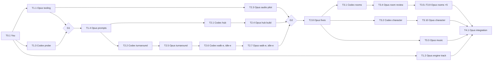

# Art spec and asset pipeline

This is the asset side of [the expansion plan](expansion-plan.md), MVP feature 9. It's written to be executed by agents: section [Execution plan](#execution-plan) splits the work into task cards, each marked as sequential or parallel, which you hand off one card at a time.

## Who does what

| Actor                    | Does                                                                                                                                                                      | Never does                                                     |
| ------------------------ | ------------------------------------------------------------------------------------------------------------------------------------------------------------------------- | -------------------------------------------------------------- |
| **Opus** (Claude Code)   | Tooling, palette, the prompt files Codex runs, pixelizing, pixel cleanup, layer cutouts, scene data, character packing, music and sound effects, engine work, integration | Generate images                                                |
| **Codex** (ChatGPT plan) | Runs prompt files with its built-in image tool (`image_gen` / `$imagegen`) and saves the candidates into the repo                                                         | Edit code, docs, `src/`, or anything outside its output folder |
| **You**                  | Housekeeping, choosing candidates, approving gates, merging PRs                                                                                                           | —                                                              |

No task calls a model API. Image generation happens only inside Codex sessions, driven by prompts and billed to your ChatGPT plan. This is a one-off batch of about 20 generated images, not a pipeline that keeps running. The scripts exist to turn each generated image into real pixel art and keep it that way.

## How an asset gets made

```
Opus writes      Codex runs it,     Opus pixelizes     You pick    Opus cleans up,     validate
prompt file  ─▶  saves candidates ─▶ all candidates ─▶  one     ─▶  cuts layers,    ─▶  (CI)
                 into exchange/      + review sheet               writes scene data
```

1. **Prompt file.** Opus writes a self-contained prompt file in `assets-src/prompts/`. It's the handoff to Codex.
2. **Generate.** Codex runs it and copies each candidate into `assets-src/exchange/raw/<asset-id>/`.
3. **Pixelize.** Opus crops each candidate, downscales it by area-averaging to native size, and maps every pixel to the nearest palette colour in OKLab with no dithering. Magenta backgrounds become transparent.
4. **Pick.** Opus shows you a review sheet of all pixelized candidates side by side, and you choose one. Judge at native size: a beautiful raw image can pixelize into mush.
5. **Clean up.** Opus edits regions as palette-index text grids, renders an 8× preview, looks at it, and repeats.
6. **Validate.** A script checks palette, size, alpha, naming, and provenance, as part of `npm run lint`.

Opus draws some assets directly, with no generation: object cutouts, clean plates, door `@open` states, and talk heads.

## Art rules

### Resolution and coordinates

- Native scene size is **320×160**, displayed at 4× (1280×640) with `image-rendering: pixelated`. The logical viewport, toolbar, and tests keep working in 1280×640.
- All art-side coordinates (walkboxes, hotspots, object positions) are **native pixels with a top-left origin**. The engine multiplies by 4 and converts to its own bottom-based Y for the character (see `WALKABLE_AREA` in `src/config/scene.ts`).
- In the hub, the wall meets the floor at native **y ≈ 110**, matching today's background. Other rooms may move it, but the floor must stay at least 40 native px deep for depth scaling.

### Palette

The master palette is version-controlled at `assets-src/palette/master.hex`. Each colour has a single-character index, used by the text grids. `.` is transparent.

Seed palette v0 comes from the current `background.png` and `retro-daniele.png`. Task T1.1 checks it, and gate G1 freezes it as v1. After v1 the palette is **append-only**: never renumber or recolour an index, because grids and PNGs depend on it.

| Idx | Hex       | Ramp    | Typical use               |
| --- | --------- | ------- | ------------------------- |
| `0` | `#0f0d12` | neutral | outlines, deepest shadow  |
| `1` | `#2a2328` | neutral | shadow                    |
| `2` | `#4a4046` | neutral | metal, dark trim          |
| `3` | `#7a6e6c` | neutral | mid grey                  |
| `4` | `#b0a49a` | neutral | light grey                |
| `5` | `#e8dcc8` | neutral | paper, highlights         |
| `6` | `#13262b` | teal    | wall shadow               |
| `7` | `#1c3339` | teal    | hub wall base             |
| `8` | `#214042` | teal    | wall                      |
| `9` | `#2f5752` | teal    | wall lit                  |
| `A` | `#3d6e64` | teal    | wall highlight            |
| `B` | `#3a2220` | wood    | wood shadow               |
| `C` | `#49322d` | wood    | wood dark                 |
| `D` | `#6d3f31` | wood    | wood, doors               |
| `E` | `#90583d` | wood    | wood lit, dark floor tile |
| `F` | `#a1603f` | wood    | wood highlight            |
| `G` | `#a17853` | tan     | floor shadow              |
| `H` | `#cb9562` | tan     | floor                     |
| `I` | `#daa76a` | tan     | light floor tile          |
| `J` | `#ecc488` | tan     | floor highlight           |
| `K` | `#5a1e1e` | red     | red shadow                |
| `L` | `#9b3d34` | red     | vending machine, pennant  |
| `M` | `#c8483a` | red     | red lit                   |
| `N` | `#e8735a` | red     | red highlight             |
| `O` | `#5c3b33` | skin    | skin shadow, beard        |
| `P` | `#9a7860` | skin    | skin mid                  |
| `Q` | `#bf987d` | skin    | skin                      |
| `R` | `#e7bd98` | skin    | skin highlight            |
| `S` | `#161c2f` | navy    | sweater shadow            |
| `T` | `#21283c` | navy    | sweater                   |
| `U` | `#2f3f66` | navy    | jeans                     |
| `V` | `#466394` | navy    | jeans highlight           |
| `W` | `#8a6420` | brass   | brass shadow              |
| `X` | `#e0b040` | brass   | brass, lamp light, clock  |
| `Y` | `#4f7a3a` | green   | plants, bottles           |
| `Z` | `#7fae52` | green   | green highlight           |

That's 36 colours, exactly the number of index characters in `0–9A–Z`. If the palette grows, continue in lowercase (`a–z`). Pure magenta `#ff00ff` is reserved as the chroma key and must never enter the palette.

### Style

- **Reference games:** _Monkey Island 2_, _Day of the Tentacle_, _Indiana Jones and the Fate of Atlantis_ (VGA era).
- **Pixels:** hard edges and flat colour fills. No anti-aliasing, blur, glow, bloom, or lens effects. The glow on the current `daniele-moving.png` is the opposite of the target.
- **Shading:** 2–4 steps per ramp. Dithering only by hand, as a 2-colour checker, and only on large background surfaces. Never on sprites.
- **Light:** key light from the **upper left** unless the room card says otherwise. Shadows fall down and to the right.
- **Outlines:** sprites use a selective 1px outline: the darkest colour of the local ramp on the lit side, `0` on the shadow side. Background props have no outline, only ramp contrast.
- **No text in generated art.** Objects are named on hover in the sentence line, as SCUMM did. Tiny diegetic text (for example "CV" on a sheet of paper) may be hand-pixelled during cleanup, and only if it reads cleanly at native size.
- **Perspective:** side-on, slight 3/4 view from standing eye height. Floor tiles recede towards the horizon.
- **Voice:** pick props that invite a joke. Every object gets a "look at" line in the LucasArts voice in `src/config/dialogTrees.ts`.

### Character (Daniele)

- **Cell:** 32×64. Feet rest on **row 61** (0-indexed), horizontally centred. Figure height **56–58 px**, head about a fifth of body height.
- **Origin:** bottom centre `(16, 61)`, matching today's centre-bottom positioning.
- **Look:** short brown hair, full beard, navy crew-neck sweater, blue jeans, brown shoes, as in `retro-daniele.png`.
- **Facing:** east, south (towards the viewer), and north (away). West is east mirrored at runtime, as LucasArts did.
- **Depth scaling:** the engine scales the sprite between 0.7 and 1.0 with nearest-neighbour. The uneven pixels are accepted: _Monkey Island 2_ scaled the same way.

| Tag                | Frames | Source      | Timing                                                                      |
| ------------------ | ------ | ----------- | --------------------------------------------------------------------------- |
| `walk-e`           | 8      | Codex sheet | Advance by distance moved, not time: one frame every `stride / 8` native px |
| `walk-s`, `walk-n` | 6 each | Codex sheet | Same distance rule                                                          |
| `idle-e`, `idle-s` | 3 each | Codex sheet | Hold 2–4 s, then blink for 120 ms                                           |
| `idle-n`           | 1      | Codex sheet | Static                                                                      |
| `use-e`, `use-n`   | 2 each | Codex sheet | Reach out for 150 ms, hold while the action runs, then return               |
| `talk-e`, `talk-s` | 3 each | Opus draws  | 16×16 head overlay, random mouth frame every 100–140 ms, only while idle    |

That's 37 body frames plus 6 talk heads. The stride is how far a foot travels during one `walk-e` cycle. T2.7 measures it and records it in `daniele.json`, so the engine can sync the feet to movement and avoid sliding.

### Layers and depth

- `bg.png`: 320×160, opaque. No interactive objects, no characters.
- `fg.png` (optional): 320×160, transparent, always drawn above the character. For pillars, front-corner plants, and the like.
- `obj-<id>.png`: an interactive object, cut to its bounding box. With an optional `baselineY`, it's drawn above the character while the character's feet are above that line (behind the object), and below otherwise. That's how the character walks both behind and in front of a desk.
- `obj-<id>@<state>.png`: an alternative state such as `@open` or `@on`, at the same size and position as the default.
- **Alpha:** every pixel is fully transparent or fully opaque (0 or 255). No partial alpha.

## File layout

```
assets-src/
  palette/master.hex            # "idx hex" per line (committed)
  palette/master.gpl            # same palette for Aseprite / GIMP users (committed)
  prompts/scenes/<scene>.md     # Codex prompt files (committed)
  prompts/character/<tag>.md
  refs/                         # references Opus prepares for Codex, e.g. hub-bg@8x.png (committed)
  provenance/<asset-id>.json    # one record per final asset (committed)
  approved/<asset-id>.webp      # the chosen raw candidate, lossless WebP (committed)
  audio/music/<scene>.ts        # MIDI source written as code (committed)
  exchange/                     # Codex → Opus handoff (gitignored, main checkout only)
    probe/                      #   T1.3 outputs and FINDINGS.md
    raw/<asset-id>/NN.png       #   candidates
    raw/<asset-id>/NOTES.md     #   exact prompt text used and any deviations
  review/                       # Opus previews and review sheets (gitignored)
src/assets/scenes/<scene>/      # bg.png, fg.png, obj-*.png (final, native size)
src/assets/character/           # daniele.png (sheet) + daniele.json (frames, tags, stride)
src/config/scenes/<scene>.ts    # scene data (see Scene data contract)
public/audio/music/<scene>.mp3
public/audio/sfx/<name>.mp3
scripts/assets/                 # tooling (T1.1)
```

- **Scene ids:** `hub`, `about`, `skills`, `experience`, `contact`, `resume`.
- **Asset ids:** `<scene>-bg`, `<scene>-fg`, `<scene>-obj-<id>`, `<scene>-obj-<id>@<state>`, `char-turnaround`, `char-<tag>`, `char-talk-<facing>`, `music-<scene>`, `sfx-<name>`. All kebab-case.

### How files move between agents

- **`v2` is the trunk.** All work branches from `v2` and every PR targets `v2`, never `main` (see [Where to work](expansion-plan.md#where-to-work)).
- **Codex always works in the main checkout** (the first entry in `git worktree list`), with `v2` checked out, and writes only to `assets-src/exchange/`. That folder is gitignored, so candidates never enter git history.
- **Opus agents work in their own worktrees**, branched from `origin/v2`. They read candidates by absolute path from `<main checkout>/assets-src/exchange/`, then copy the chosen one into their worktree as `assets-src/approved/<asset-id>.webp`.
- **Opus → Codex handoffs** (prompt files, references) are committed and merged to `v2` before the Codex task that needs them starts. Before each task, Codex runs `git pull` on `v2` in the main checkout.
- **Every Opus task ends with one PR against `v2`.** Merge it before starting any task that lists it under "After".

### Provenance record

Models get retired, so the approved raw candidate is the only thing an asset can be regenerated from. Write one record per final asset:

```json
{
  "id": "hub-bg",
  "output": "src/assets/scenes/hub/bg.png",
  "task": "T2.4",
  "source": "codex",
  "prompt": "assets-src/prompts/scenes/hub.md",
  "candidate": "03",
  "references": [],
  "approvedRaw": "assets-src/approved/hub-bg.webp",
  "palette": "v1",
  "cleanup": "Removed floor noise, re-drew door frame edges, hand-pixelled clock hands.",
  "approvedBy": "daniele",
  "date": "2026-10-01"
}
```

For assets Opus draws directly (cutouts, clean plates, `@open` states, talk heads), set `"source": "opus"`. Leave out `prompt`, `candidate`, and `approvedRaw`, and add `"derivedFrom"` with the asset id it was drawn from.

## Scene data contract

The engine (expansion plan items 1–4) and the art tasks both use this shape. Art tasks write it and the engine reads it. Coordinates are native px with a top-left origin.

```ts
export const HUB_SCENE: SceneData = {
  id: "hub",
  background: hubBg,
  foreground: hubFg, // optional
  music: "/audio/music/hub.mp3",
  walkbox: [
    [4, 112],
    [316, 112],
    [316, 156],
    [4, 156],
  ], // polygon
  depth: { farY: 112, nearY: 156, farScale: 0.7, nearScale: 1.0 },
  entryPoints: { default: { x: 160, y: 140, facing: "s" } },
  objects: [
    {
      id: "clock",
      sprite: hubObjClock,
      x: 124,
      y: 32,
      hotspot: { x: 124, y: 32, w: 22, h: 22 }, // defaults to the sprite's alpha bounding box
      interactionPoint: { x: 132, y: 118, facing: "n" },
      baselineY: undefined,
      action: undefined, // or a section id such as "about"
    },
  ],
  exits: [
    {
      id: "door-experience",
      to: "experience",
      entry: "default",
      sprite: hubObjDoorExperience, // optional; states: "@open"
      hotspot: { x: 154, y: 38, w: 38, h: 72 },
      interactionPoint: { x: 172, y: 114, facing: "n" },
    },
  ],
};
```

`cutout.ts` and `pack.ts` print each sprite's position and alpha bounding box, so hotspots can be copied rather than measured.

## Tooling

T1.1 builds these in `scripts/assets/`. They're TypeScript run with `tsx`, like the existing `scripts/*.ts`. PNG and WebP input and output use `sharp` (a new dev dependency). The resampling and palette code is written by hand in `lib.ts`, because `sharp` has no area-average kernel and its palette mode quantizes on its own. ImageMagick and Aseprite are not required.

| Script            | npm script            | Does                                                                                                                                                                                                                                                                                                                                                 |
| ----------------- | --------------------- | ---------------------------------------------------------------------------------------------------------------------------------------------------------------------------------------------------------------------------------------------------------------------------------------------------------------------------------------------------- |
| `lib.ts`          | —                     | PNG/WebP input and output, area-average downscale for any ratio, OKLab nearest-palette remap, chroma key, alpha threshold, palette loading                                                                                                                                                                                                           |
| `pixelize.ts`     | `assets:pixelize`     | Raw candidate → native image. Crops to the target aspect (`--crop auto` centres; `--crop x,y,w,h` in raw px), downscales, remaps. With `--key ff00ff`, magenta becomes transparent. With `--sprites 32x64`, it finds each figure by bounding box, scales them all by one factor, and puts each in its own cell with feet on row 61, in reading order |
| `review.ts`       | `assets:review`       | Pixelizes every candidate in an `exchange/raw/<asset-id>/` folder and builds one numbered review sheet at 4× for choosing                                                                                                                                                                                                                            |
| `grid.ts`         | `assets:grid`         | PNG ↔ palette-index text grid. `--region x,y,w,h` extracts or patches a region of a larger image                                                                                                                                                                                                                                                     |
| `preview.ts`      | `assets:preview`      | 8× nearest-neighbour upscale, contact sheet, onion skin (frame n over n−1 at 50%), and a local HTML page that plays animations for you to review                                                                                                                                                                                                     |
| `cutout.ts`       | `assets:cutout`       | Polygon (native px) → object sprite cut from a composite, plus its position and bounding box                                                                                                                                                                                                                                                         |
| `pack.ts`         | `assets:pack`         | Frames → `daniele.png` sheet + `daniele.json` (frames, tags, durations, origin, stride)                                                                                                                                                                                                                                                              |
| `refs.ts`         | `assets:refs`         | Native image → 8× reference PNG in `assets-src/refs/` for Codex                                                                                                                                                                                                                                                                                      |
| `validate.ts`     | `lint:assets`         | Fails if any file in `src/assets/scenes/` or `src/assets/character/` is off-palette, has partial alpha, is the wrong size, is badly named, or has no provenance record                                                                                                                                                                               |
| `placeholders.ts` | `assets:placeholders` | Flat-colour placeholder scenes and a box-figure character sheet that pass the validator, so the engine track isn't blocked                                                                                                                                                                                                                           |
| `music.ts`        | `assets:music`        | T2.3: MIDI source → `.mid` → FluidSynth → MP3                                                                                                                                                                                                                                                                                                        |
| `sfx.ts`          | `assets:sfx`          | T2.3: synthesises sound effects from code to WAV, then MP3                                                                                                                                                                                                                                                                                           |

Because `lint:assets` runs inside `npm run lint`, the PR workflow picks it up with no workflow change. Vitest's unit project only includes `src/**`, so add `scripts/**/*.test.ts` to it for the tooling tests. Check that `knip` treats `scripts/assets/*` as entry points.

### Grid format

```
# asset: char-walk-e  frame: 00  palette: v1  size: 32x64
................................
..............000000............
.............0OOOO000...........
```

- One character per pixel, one row per line, exact width on every line. `grid.ts` rejects ragged rows.
- When editing, replace whole rows and say which rows changed. Never retype an unchanged grid, since that's where copying errors creep in.

## Codex image generation

These are the constraints of Codex's built-in image tool as far as they're known. T1.3 checks them, and T1.4 adjusts the prompt files to what it finds.

- **No size parameter.** Codex App's built-in path doesn't take explicit dimensions (openai/codex issue 19175). So prompts ask for an orientation and a safe composition band, and `pixelize --crop` does the rest.
- **No transparency setting.** Sprites are generated on a flat pure-magenta `#FF00FF` background and keyed out by `pixelize`.
- **Editing may redraw the whole image.** Don't rely on edits to keep the layout. Opus cuts objects out and draws clean plates at native size instead.
- **Reference images** are passed as file paths in the workspace.
- **Output location:** generated images land in `~/.codex/generated_images/` by default, so every prompt file tells Codex to copy them into the repo.
- **Usage:** image turns use up ChatGPT plan limits several times faster than text turns. Candidate counts in each prompt file are hard limits.

### Prompt file format

Opus writes every prompt file like this. It's complete in itself: Codex doesn't combine it with anything else.

```md
---
asset: hub-bg
task: T2.1
candidates: 4
references: []
output: assets-src/exchange/raw/hub-bg/
---

<full prompt text, with the style preamble already written in>
```

### Rules for Codex tasks

1. Run `git pull` on `v2` in the main checkout. Read this section and the prompt files your task names.
2. For each prompt file, generate exactly `candidates` images, using the references listed. Use the prompt text as written. Don't embellish it.
3. Copy each image to `<output>/NN.png` (`01`, `02`, …). Append the exact prompt text you used, plus anything that went wrong, to `<output>/NOTES.md`.
4. If an output breaks an obvious rule (visible text, a gradient background instead of flat magenta, the wrong subject), you may replace it once. Record that in `NOTES.md`.
5. Don't edit, commit, or delete anything outside `assets-src/exchange/`. Don't open PRs.
6. Finish by listing each asset id with the number of candidates saved, then stop.

## Prompts

T1.4 writes the prompt files from these templates. Prompts never include hex codes: the model won't follow them, and the remap step enforces the palette anyway. Instead, they ask for output that remaps cleanly.

### Style preamble (written into every prompt)

> 1990s LucasArts SCUMM point-and-click adventure game art, VGA era, in the style of Monkey Island 2 and Day of the Tentacle. Pixel art made of large, flat colour areas with crisp hard edges. No anti-aliasing, no gradients, no dithering, no noise or grain texture, no blur, no glow, no bloom, no lens effects. No text, letters, numbers, signage, logos, or watermarks anywhere. Muted warm palette: deep teal walls, warm browns and tans, a few red and brass accents. Key light from the upper left, shadows falling down and to the right. Slightly exaggerated cartoon proportions and bold, readable silhouettes.

### Room composite template

> {preamble} Wide landscape image. Side-on interior view of {room concept}, with a slight 3/4 view from standing eye height. Compose for a 2:1 crop: all important content sits between one sixth and five sixths of the image height, and the areas above and below are plain ceiling and floor. The back wall meets the floor about two thirds of the way down that band. Left to right: {props with approximate horizontal positions}. The floor across the bottom third of the band is open and uncluttered, so a character can walk the full width. Exits: {exits}. Foreground: {foreground element, partly cropped by the frame edge}. The room is empty of people.

For rooms other than the hub, add the reference `assets-src/refs/hub-bg@8x.png` and this line: "Match the reference image's pixel density, palette, outline style, and lighting exactly; only the room's contents change."

### Character templates

- **Turnaround** (references: `src/assets/retro-daniele.png`, `src/assets/daniele-static.png`):

  > {preamble} Character turnaround sheet of the same man as the reference images, on a flat, solid, pure magenta (#FF00FF) background with no shadow and no gradient. Front view, side view facing right, and back view, left to right, in a neutral standing pose. Short brown hair, full brown beard, navy crew-neck sweater, blue jeans, brown shoes. Same height, same scale, feet on one shared baseline, figures well apart and not touching. No ground shadow, no glow, no rim light.

- **Animation sheet** (references: `assets-src/refs/char-turnaround@8x.png`, plus `assets-src/refs/char-walk-e@8x.png` for Stage 3 sheets):

  > {preamble} Sprite sheet on a flat, solid, pure magenta (#FF00FF) background with no shadow and no gradient. {N} figures in {layout}, read left to right, top to bottom, evenly spaced and not touching. The same character as the reference in every figure, at identical scale, with feet on the same baseline in each row. {Animation}: {pose list}. No ground shadow, no motion lines.

  | Tag      | N   | Layout        | Animation and pose list                                                                                             |
  | -------- | --- | ------------- | ------------------------------------------------------------------------------------------------------------------- |
  | `walk-e` | 8   | 2 rows of 4   | "walk cycle facing right: contact, down, passing, up, then contact, down, passing, up with the other leg forward"   |
  | `walk-s` | 6   | 2 rows of 3   | "walk cycle towards the viewer: contact, down, passing, then the same with the other leg"                           |
  | `walk-n` | 6   | 2 rows of 3   | "walk cycle away from the viewer, back visible, same structure as the south cycle"                                  |
  | `idle-e` | 3   | 1 row of 3    | "standing idle facing right: neutral, slight breath in, eyes closed (blink)"                                        |
  | `idle-s` | 3   | 1 row of 3    | "standing idle facing the viewer: neutral, slight breath in, eyes closed (blink)"                                   |
  | `idle-n` | 1   | single figure | "standing idle, back to the viewer"                                                                                 |
  | `use-e`  | 2   | 1 row of 2    | "facing right, reaching one hand forward to touch an object at chest height: arm half extended, arm fully extended" |
  | `use-n`  | 2   | 1 row of 2    | "back to the viewer, reaching one hand up to an object on the wall: arm half extended, arm fully extended"          |

### Opus cleanup brief

Every Opus build task follows this for each asset:

> Read Art rules in `docs/art-spec.md` and `assets-src/palette/master.hex`. Work in the palette-index grid via `npm run assets:grid`. For each pass: fix stray single pixels, broken outlines, colour banding from the remap, and drift from the references (for the character: head size, beard shape, sweater colour); then render `npm run assets:preview` and look at the 8× output. Crop to regions when the whole image is too small to judge. Stop when a pass changes nothing meaningful. Replace whole rows only. Record what changed in the provenance record's `cleanup` field.

## Room cards

The concepts are defaults. You confirm or change each one when you pick its composite. Every room has an exit back to the hub. The **primary object** opens the section's content (the target of the verb shortcut). The other props are "look at" flavour.

| Scene        | Concept                                                     | Primary object                 | Other props                                                                       | Foreground                 | Light                       |
| ------------ | ----------------------------------------------------------- | ------------------------------ | --------------------------------------------------------------------------------- | -------------------------- | --------------------------- |
| `hub`        | Today's hallway, redrawn: teal panelled wall, checker floor | Five doors (exits), no content | Clock, framed map, pennant                                                        | Potted plant, front left   | Upper left, window shaft    |
| `about`      | Cosy 90s bedroom-study                                      | Framed portrait                | Bookshelf with psychology books, Swiss Alps poster, beige PC with a retro console | Armchair edge, front right | Warm desk lamp, upper left  |
| `skills`     | Garage workshop                                             | The vending machine (callback) | Pegboard tool wall, humming server rack, crystal ball on a workbench (AI)         | Workbench corner           | Hanging bulb, centre        |
| `experience` | Small museum hall                                           | Display case (current role)    | 5 framed plaques for past roles, velvet rope, bench                               | Rope stanchion             | Gallery spotlights, top     |
| `contact`    | Radio shack                                                 | Rotary phone (email)           | Ham radio (LinkedIn), pigeon coop (GitHub), mailbox                               | Coil of cable              | Radio dial glow, upper left |
| `resume`     | Print shop                                                  | Dot-matrix printer             | Paper stacks, guillotine cutter, "wet ink" sign (hand-pixelled)                   | Paper stack                | Fluorescent strip, top      |

Use generic props, not brand logos. The GitHub and LinkedIn names appear in the hover text and content, not in the art.

## Audio

Audio is written entirely as code by Opus. It needs no generated images and no model API.

- **Music:** one General MIDI track per scene, written as code with `midi-writer-js` in `assets-src/audio/music/<scene>.ts`. Each is 60–90 s, loops seamlessly, and is instrumented like iMUSE-era LucasArts: sparse and in character, with a bass line and a clear motif. The rooms share a motif, like iMUSE variations on a theme. The hub may keep the existing `public/theme.mp3`.
- **Rendering:** FluidSynth with a free General MIDI soundfont (for example FluidR3_GM, MIT licence), then ffmpeg to MP3. Commit the MP3s and MIDI sources. Leave rendered WAVs uncommitted.
- **Looping:** MP3 encoder padding breaks `<audio loop>`. Decode with Web Audio and loop with `loopStart`/`loopEnd`. Record the loop points in the provenance record.
- **Sound effects:** `sfx.ts` synthesises them from noise, envelopes, and filters: footsteps (3 variants), door open, door close, transition whoosh, and a UI blip. If the synthesised door creak sounds fake, one CC0 sample from Freesound is acceptable. Record its URL and licence.
- **Levels:** music about −20 LUFS, sound effects peaking at −3 dBFS. The existing sound toggle controls everything.

## Execution plan

### Execution map

**Run** says how a task relates to others: **sequential** tasks start only after everything under **After** is done and merged, and **parallel** tasks can run at the same time as the tasks listed. Gates (G) are approvals only you can give. Agents stop and wait at them.

**Status** is one of `todo`, `in progress`, or `done`. A task is `done` once its PR is merged to `v2`, or once you've passed the gate. You keep this column up to date on `v2`. Agents read it but never edit it, so parallel PRs don't conflict on this table.

| Task        | Status | Agent | Run                                         | After                   | What                                                       |
| ----------- | ------ | ----- | ------------------------------------------- | ----------------------- | ---------------------------------------------------------- |
| T0.1        | done   | You   | sequential                                  | —                       | Housekeeping                                               |
| T1.1        | todo   | Opus  | parallel with T1.2, T1.3                    | T0.1                    | Tooling, palette, placeholders                             |
| T1.2        | todo   | Opus  | parallel with everything until T4.1         | T0.1                    | Engine track (expansion plan items 1–8)                    |
| T1.3        | todo   | Codex | parallel with T1.1, T1.2                    | T0.1                    | Probe the image tool                                       |
| **G1**      | todo   | You   | gate                                        | T1.1, T1.3              | Freeze palette v1, read probe findings                     |
| T1.4        | todo   | Opus  | sequential                                  | G1                      | Adjust tooling to findings, write all prompt files         |
| T2.1        | todo   | Codex | parallel with T2.2, T2.3                    | T1.4                    | Hub composite candidates                                   |
| T2.2        | todo   | Codex | parallel with T2.1, T2.3                    | T1.4                    | Turnaround candidates                                      |
| T2.3        | todo   | Opus  | parallel with all of Stage 2                | T1.1                    | Audio pilot: tools, hub music, all sound effects           |
| T2.4        | todo   | Opus  | parallel with T2.5                          | T2.1                    | Build the hub (includes pick **G2a**)                      |
| T2.5        | todo   | Opus  | parallel with T2.4                          | T2.2                    | Clean up the turnaround (includes pick and **G2b**)        |
| T2.6        | todo   | Codex | sequential                                  | T2.5                    | `walk-e` and `idle-e` sheets                               |
| T2.7        | todo   | Opus  | sequential                                  | T2.6                    | Clean up and pack `walk-e`, `idle-e`                       |
| **G2**      | todo   | You   | gate                                        | T2.3, T2.4, T2.7        | Vertical slice review                                      |
| T2.8        | todo   | Opus  | sequential                                  | G2                      | Apply fixes from G2 to tooling and prompt files            |
| T3.1        | todo   | Codex | parallel with T3.2, T3.3                    | T2.8                    | Five room composites                                       |
| T3.2        | todo   | Codex | parallel with T3.1, T3.3                    | T2.8                    | Remaining character sheets                                 |
| T3.3        | todo   | Opus  | parallel with all of Stage 3                | T2.8                    | Five room music tracks                                     |
| T3.4        | todo   | Opus  | sequential                                  | T3.1                    | Review candidates for all five rooms (**G3a**)             |
| T3.5 – T3.9 | todo   | Opus  | **parallel with each other** and with T3.10 | T3.4                    | Build `about`, `skills`, `experience`, `contact`, `resume` |
| T3.10       | todo   | Opus  | parallel with T3.5 – T3.9                   | T3.2                    | Remaining character frames, talk heads, repack             |
| T4.1        | todo   | Opus  | sequential                                  | all Stage 3 tasks, T1.2 | Cohesion, integration, baselines (ends at **G4**)          |



**How much parallelism is worth it:** your gates are the bottleneck, not agent time. T3.1 does all five rooms in one Codex session and T3.4 puts them on one review sheet, so you choose them in a single sitting. If your plan's usage runs low, run T3.2 after T3.1 instead of alongside it.

### Handing off a task

Start each agent with a fresh session and this prompt:

- **Opus:** "Execute task {ID} from `docs/art-spec.md`. Follow 'Rules for Opus tasks'. Stop at any gate in the card and ask me."
- **Codex:** "Execute task {ID} from `docs/art-spec.md`. Follow 'Rules for Codex tasks' exactly."

### Rules for Opus tasks

- **Isolation.** Work in your own worktree on a branch named `assets/<task-id>` (for example `assets/t2-4-hub`), created from `origin/v2`. Write only to the paths in your card's **Owns** line. The palette, this spec, and `scripts/assets/lib.ts` are read-only after T1.1. If one needs to change, stop and propose the change to the user.
- **Codex output.** Read it from the main checkout's `assets-src/exchange/` by absolute path. Never write there.
- **Choosing candidates.** Run `assets:review`, send the user the review sheet, and wait for their choice. Never choose for them.
- **Reviewing images.** Large raw images are downsampled when you view them. Judge detail from 8× crops made with `assets:preview`.
- **Before handing off:** `npm run lint` passes (it includes `lint:assets`), every new asset has a provenance record, and you've sent the user the final previews. Run `npm run format`, check the diff, and open one PR for the task against `v2`.
- **Gates.** Stop at a gate and ask the user. Never approve your own gate.

### Stage 0 — Prep

#### T0.1 Housekeeping

- **Agent:** you. **Run:** sequential, first.
- **Steps:**
  1. Keep `v2` checked out in the main checkout. Codex works there.
  2. Sign Codex in with your ChatGPT plan and check that `$imagegen` is available.

### Stage 1 — Foundations

#### T1.1 Tooling, palette, placeholders

- **Agent:** Opus. **Run:** parallel with T1.2 and T1.3. **After:** T0.1.
- **Owns:** `scripts/assets/`, `assets-src/palette/`, `assets-src/provenance/` (schema only), `src/assets/scenes/` and `src/assets/character/` (placeholders only), `.gitignore`, `package.json`, `vitest.config.ts`, knip config.
- **Steps:**
  1. Add `sharp`. Build every script in the Tooling table except `music.ts` and `sfx.ts`, with unit tests for area downscale, OKLab remap, chroma key, alpha threshold, sprite slicing, and grid round-trip.
  2. Write `master.hex` and `master.gpl` from the seed palette. Test it by pixelizing `src/assets/background.png` and `src/assets/retro-daniele.png`. Tune colours until both read well at 8×. Save before/after previews to `assets-src/review/palette/`.
  3. Add `assets-src/exchange/` and `assets-src/review/` to `.gitignore`. Wire `lint:assets` into `npm run lint`.
  4. Generate placeholders for all six scenes and the character sheet, with provenance records (`"source": "opus"`).
- **Done when:** `npm run lint`, `npm run test:unit`, and `npm run build` pass. The palette previews are ready for G1.

#### T1.2 Engine track

- **Agent:** Opus (one or more sessions, in the expansion plan's own order). **Run:** parallel with everything until T4.1. **After:** T0.1.
- **Owns:** everything in `src/` except `src/assets/scenes/`, `src/assets/character/`, and `src/config/scenes/`.
- **Steps:** implement expansion plan items 1–8 against the scene data contract and the `daniele.json` format. Start with the current background, and switch to T1.1's placeholders once they land. Include a dev-only overlay (for example `?debug=scene`) that draws walkboxes, hotspots, interaction points, and baselines. The build tasks rely on it.
- **Done when:** the expansion plan's MVP features work with placeholder assets.

#### T1.3 Probe the image tool

- **Agent:** Codex. **Run:** parallel with T1.1 and T1.2. **After:** T0.1.
- **Owns:** `assets-src/exchange/probe/`.
- **Steps:** generate each of these once, save them as `01.png`–`04.png` in `assets-src/exchange/probe/`, and record findings in `assets-src/exchange/probe/FINDINGS.md`:
  1. The hub, using the room composite template with the hub row of the room cards. Record the actual pixel dimensions.
  2. A turnaround, using the turnaround template and its references. Record the dimensions, and whether the background is flat pure magenta or has gradients or shadows.
  3. An edit of `01.png`: "Same image; remove only the clock from the wall. Change nothing else." Record whether the tool offered a mask or region option.
  4. The same as 1, but asking for "a very wide panoramic image". Record whether the dimensions changed.
  5. In `FINDINGS.md`, also note which options the image tool exposes (size, quality, transparency, masks), and roughly how much of your usage the four images took.
- **Done when:** four images and `FINDINGS.md` exist. Codex stops.

#### G1 — Palette and findings (you)

1. Approve palette v1 from `assets-src/review/palette/`.
2. Read `FINDINGS.md` and ask Opus to compare `03.png` with `01.png`.
3. Record any decisions for T1.4, for example "outputs are 1536×1024, keep the composition band".

#### T1.4 Adjust tooling, write prompt files

- **Agent:** Opus. **Run:** sequential. **After:** G1.
- **Owns:** `assets-src/prompts/`, `scripts/assets/` (adjustments only).
- **Steps:**
  1. Pixelize the probe images. Adjust the `pixelize` crop and slicing defaults to the real output sizes and background quality.
  2. If the magenta background came back with gradients, widen the chroma-key tolerance, or add a flood fill from the image edges.
  3. Write every prompt file from the templates: 6 scenes and 9 character files (turnaround plus 8 tags). Candidate counts: 4 per scene, 4 for the turnaround, 3 per animation sheet.
  4. Adjust the wording where the probe showed problems.
- **Done when:** all 15 prompt files are merged to `v2`.

### Stage 2 — Vertical slice

#### T2.1 Hub composite candidates

- **Agent:** Codex. **Run:** parallel with T2.2 and T2.3. **After:** T1.4.
- **Steps:** run `assets-src/prompts/scenes/hub.md` following the Codex rules.

#### T2.2 Turnaround candidates

- **Agent:** Codex. **Run:** parallel with T2.1 and T2.3. **After:** T1.4.
- **Steps:** run `assets-src/prompts/character/turnaround.md` following the Codex rules.

#### T2.3 Audio pilot

- **Agent:** Opus. **Run:** parallel with all of Stage 2. **After:** T1.1.
- **Owns:** `scripts/assets/music.ts`, `scripts/assets/sfx.ts`, `assets-src/audio/`, `public/audio/`, audio provenance records.
- **Steps:**
  1. Build both scripts.
  2. Ask the user whether the hub keeps `theme.mp3`. If not, compose the hub track.
  3. Synthesise all six sound effects.
  4. Check loop seams and loudness, and send the user the MP3s.
- **Done when:** the hub music (or the decision to keep `theme.mp3`) and all sound effects are merged.

#### T2.4 Build the hub

- **Agent:** Opus. **Run:** parallel with T2.5. **After:** T2.1.
- **Owns:** `src/assets/scenes/hub/`, `src/config/scenes/hub.ts`, `assets-src/approved/hub-*`, `assets-src/provenance/hub-*`, `assets-src/refs/hub-*`.
- **Steps:**
  1. `assets:review hub-bg`. **G2a:** the user picks a candidate and confirms the room card.
  2. Pixelize the chosen candidate and run the cleanup brief on the whole image.
  3. Cut out the doors, clock, map, pennant, and plant with `assets:cutout`. The plant becomes `fg.png`.
  4. Draw the clean plate behind each cutout at native size. The panelled wall and checker floor are regular patterns, so continue them procedurally.
  5. Draw an `@open` state for each of the 5 doors.
  6. Write `hub.ts` (walkbox, depth, exits, objects, `baselineY`) and check it in the dev overlay.
  7. Export `assets-src/refs/hub-bg@8x.png` with `assets:refs`.
- **Done when:** the hub renders with placeholders in the dev overlay, `lint` passes, and the PR is merged.

#### T2.5 Clean up the turnaround

- **Agent:** Opus. **Run:** parallel with T2.4. **After:** T2.2.
- **Owns:** `assets-src/approved/char-*`, `assets-src/provenance/char-*`, `assets-src/refs/char-*`, `assets-src/review/char-*`.
- **Steps:**
  1. `assets:review char-turnaround`, and the user picks one.
  2. Slice it into three 32×64 frames with `pixelize --sprites 32x64 --key ff00ff`.
  3. Run the cleanup brief until the frames are on-model.
  4. **G2b:** the user approves the turnaround. It anchors every later frame.
  5. Export `assets-src/refs/char-turnaround@8x.png`.
- **Done when:** the approved turnaround and its reference are merged.

#### T2.6 `walk-e` and `idle-e` sheets

- **Agent:** Codex. **Run:** sequential. **After:** T2.5 merged.
- **Steps:** run `assets-src/prompts/character/walk-e.md` and `idle-e.md` following the Codex rules.

#### T2.7 Clean up and pack `walk-e`, `idle-e`

- **Agent:** Opus. **Run:** sequential. **After:** T2.6.
- **Owns:** `src/assets/character/`, plus T2.5's paths.
- **Steps:**
  1. Review and pick one candidate per tag (the user chooses).
  2. Slice, then line up the feet on row 61 and lock the head size to the turnaround.
  3. Run the cleanup brief, with onion-skin checks between frames.
  4. **Fallback:** if the frames still drift too far after 2 cleanup passes, build them from parts instead. Reuse the head and torso with a 1px bob, and draw only the legs and arms per frame. Tell the user when you switch.
  5. Measure the stride. Run `assets:pack`, and export `assets-src/refs/char-walk-e@8x.png`.
- **Done when:** `daniele.png` and `daniele.json` (with the stride) are merged, and the HTML preview plays both animations.

#### G2 — Vertical slice (you)

Review the hub at 4× with the real walk cycle: in the running app if T1.2 is far enough along, otherwise in the `assets:preview` HTML page. Listen to the audio. Decide whether the pipeline, the cleanup quality, and the fallback are good enough to fan out. List every change you want.

#### T2.8 Apply G2 fixes

- **Agent:** Opus. **Run:** sequential. **After:** G2.
- **Owns:** `assets-src/prompts/`, `scripts/assets/`.
- **Steps:** apply your G2 list to the prompt files and tooling. Re-run anything in Stage 2 that the fixes invalidate.
- **Done when:** merged. Pipeline problems get fixed here, not during Stage 3.

### Stage 3 — Fan-out

#### T3.1 Five room composites

- **Agent:** Codex, one session. **Run:** parallel with T3.2 and T3.3. **After:** T2.8.
- **Steps:** run the prompt files for `about`, `skills`, `experience`, `contact`, and `resume`, in that order, following the Codex rules. Each uses `refs/hub-bg@8x.png`.

#### T3.2 Remaining character sheets

- **Agent:** Codex, a separate session. **Run:** parallel with T3.1 and T3.3. If usage is tight, run it after T3.1 instead. **After:** T2.8.
- **Steps:** run the prompt files for `walk-s`, `walk-n`, `idle-s`, `idle-n`, `use-e`, and `use-n` following the Codex rules.

#### T3.3 Room music

- **Agent:** Opus. **Run:** parallel with all of Stage 3. **After:** T2.8.
- **Owns:** `assets-src/audio/music/`, `public/audio/music/`, music provenance records.
- **Steps:** compose the five room tracks with the T2.3 pipeline, sharing the hub's motif. Send them to the user.

#### T3.4 Room candidate review

- **Agent:** Opus. **Run:** sequential. **After:** T3.1.
- **Owns:** `assets-src/review/`.
- **Steps:** run `assets:review` for all five rooms and send them as one set. **G3a:** the user picks one candidate per room and confirms or edits each room card. Record the choices in the PR description of each build task, or as a note for the user to paste into the hand-off prompt.

#### T3.5 – T3.9 Build `about`, `skills`, `experience`, `contact`, `resume`

- **Agent:** Opus, **one agent per room, in parallel**. **Run:** parallel with each other and with T3.10. **After:** T3.4.
- **Owns:** only that room's paths: `src/assets/scenes/<room>/`, `src/config/scenes/<room>.ts`, `assets-src/approved/<room>-*`, `assets-src/provenance/<room>-*`.
- **Steps:** T2.4 steps 2–6 for the room chosen at G3a, following its room card. Where a background isn't a regular pattern, a clean plate may use one Codex edit. Ask the user to run it, with the exact prompt, rather than doing it yourself.
- **Hand-off prompt addition:** "Room: {room}. Chosen candidate: {NN}. Room card changes: {…}."

#### T3.10 Remaining character frames

- **Agent:** Opus, one agent (consistency matters more than speed here). **Run:** parallel with T3.5 – T3.9. **After:** T3.2.
- **Owns:** `src/assets/character/`, `assets-src/*/char-*`.
- **Steps:**
  1. T2.7 steps 1–4 for each tag.
  2. Draw the `talk-e` and `talk-s` heads (3 mouth frames each) from the idle heads.
  3. Repack the sheet.
- **Done when:** all 37 frames and 6 heads are packed and play correctly in the HTML preview.

### Stage 4 — Integration

#### T4.1 Cohesion, integration, baselines

- **Agent:** Opus. **Run:** sequential. **After:** all Stage 3 tasks and T1.2.
- **Owns:** everything. This is the only task allowed to touch every scene.
- **Steps:**
  1. Put all six scenes and the character on one contact sheet. Fix mismatches in outline weight, shading steps, ramp use, and light direction.
  2. Check each scene with the real character: scale at the near and far walkbox edges, `baselineY` occlusion, interaction points.
  3. Check that preloading adjacent scenes stops transitions from flashing.
  4. Regenerate the OG image with `npm run generate:og-image`. Confirm the Game Boy view and the SEO HTML are unchanged.
  5. Update the E2E baselines with `npm run test:e2e:docker:update`, adding one per scene, and inspect every changed `*-linux.png`.
  6. **G4:** final review by the user.

## Done when

- Every asset in `src/assets/scenes/` and `src/assets/character/` passes `lint:assets` and has a provenance record. Generated ones also have their approved raw.
- Every scene has a walkbox, depth data, an exit back to the hub, and a primary object that opens its section.
- The character has all 37 frames and 6 talk heads, and the feet don't slide at `CHARACTER_SPEED` or at shortcut speeds.
- Music loops without a gap, and the sound toggle mutes everything.
- Each section is reachable in two clicks or fewer from any room (expansion plan, Testing).
