> **Editor's note: refresh prompt. Remove before publishing.**
>
> **Last refreshed against:** `origin/V2.1` at `acc62ce` (2026-10-01, 11:49). The trunk moved from `origin/v2` to `origin/V2.1` on 2026-09-30; `origin/v2` stops at `69464ea`.
>
> To bring this post up to date after more commits land, paste the prompt below into Codex or Claude Code, from a checkout of this repository. It works from git and GitHub alone, so it gives the same result in either tool.

```text
Refresh the engineering blog post docs/blog/v2-revamp.md with everything that has
landed on the trunk since it was last refreshed. The trunk is the branch named in
the "Last refreshed against" line (origin/V2.1 at the last refresh; origin/v2
before that). Work from git history first.

1. Find the baseline. Run `git fetch origin`. Read the "Last refreshed against"
   line at the top of docs/blog/v2-revamp.md; that SHA is the baseline. If it is
   missing, use the newest SHA named in the Changelog.

2. Collect the history since the baseline, oldest first:
   - git log --reverse --format='%h %ad %an %s%n%b%n%(trailers)' \
       --date=format:'%Y-%m-%d %H:%M' <baseline>..origin/<trunk>
   - git diff --stat <baseline> origin/<trunk>
   - Plan changes: git log -p <baseline>..origin/<trunk> -- docs/art-spec.md \
       docs/expansion-plan.md docs/encoded-images.md AGENTS.md
   - For every merged PR number in a subject: gh pr view <n> --json title,body,mergedAt,files
     (if gh is unavailable, use the commit bodies and say so).
   Times in the post are local (UTC+2).

3. Classify each change as one of: a new task or fix; a plan or policy change
   (gates, delegation, lanes, rules); a change of creative direction; a reversal of
   something the post describes; or a failure and how it was handled.

4. Update the post:
   - Integrate each change where it belongs, or add a dated section before the
     Changelog if it does not fit. Keep the existing voice: plain, specific,
     candid about what went wrong, for an engineering audience.
   - Correct any earlier claim the new history contradicts, and say that it is a
     correction. Do not quietly rewrite old numbers; state the new ones with the
     SHA they were counted at.
   - Keep these distinct: what Daniele requested, what an agent proposed, what
     merged into the trunk, what exists only locally or on unmerged branches, and
     what is still undecided.
   - Model attribution: a Co-authored-by trailer is the agent's own declaration,
     and a model named in a recommendation proves nothing. Name a model only when
     a runtime record or the person confirms it; otherwise say it is unknown.
   - Commits made outside the orchestrators (no trailer, direct pushes, other
     tools) are part of the history too. Describe what they changed, not who you
     guess made them.
   - If conversation transcripts are available to you, you may use them to add
     intent and corrections, cited by session and time. Git remains the record of
     what shipped. If you have none, say the refresh is git-only.

5. Update the "Last refreshed against" line to the trunk SHA you covered, and
   add a dated Changelog entry at the top of the Changelog naming the SHA range and
   the PRs covered.

6. Work on a docs/blog-* branch based on the trunk. Change only files under
   docs/blog/. Run `npm run format`, review the diff, and make one conventional
   commit (docs(blog): ...). Do not push or merge until Daniele approves the exact
   diff. Report anything you could not check.
```

# Rebuilding a retro portfolio with two AI orchestrators

_What one developer, two model families, and about seventy pull requests taught us about planning work for agents, including the parts that went wrong._

> **Status: living post.** The main narrative below is a snapshot of `origin/v2` at `1d7b716` (2026-09-30, 00:56 local time), when the branch reached Daniele's G4 review. It was drafted by an AI agent (Sonnet) from the plan, git history and pull request descriptions. A [September 30 addendum](#september-30-addendum-codex-work-and-new-review-directions) records later commits and Daniele's direct Codex conversations without forcing them into that earlier narrative yet. A [Claude Code history review](#september-30-history-review-the-claude-code-conversations) then checks the earlier narrative against the Claude Code transcripts and lists the corrections it found. An [October 1 update](#october-1-update-v21-on-the-desktop) covers the move to a `V2.1` branch: the creative review closed, a fourth art direction (a remaster of the same paintings), a Windows 98 desktop, E2E running at last, and faster loading. Daniele describes the desktop as about 95% done; the mobile redesign is still in progress and is not covered. Treat its open decisions as open, and its local-only work as distinct from merged PRs.

## TL;DR

- **The project:** Daniele Tortora's portfolio is a React and TypeScript site dressed as a LucasArts point-and-click adventure, running inside a working Windows 95 desktop (and a Game Boy on mobile). Version 1 was one painted background with five hotspots. Version 2 turns it into a small world: an airport hall and three rooms, one per country he has lived in.
- **The method:** a written plan on a long-lived `v2` branch, read by every agent from `origin/v2`. Two orchestrators, one per model family: a Claude Code (Opus) orchestrator that spawns one sub-agent per task (on Sonnet from 21:46), and a Codex orchestrator that only generates images. The two never share a working tree. They exchange files through a gitignored folder and `DONE` marker files.
- **The pace:** every commit on the revamp falls between 10:00 on 2026-09-29 and 00:56 on the 30th. The plan landed at 10:00 and the last commit at the time of writing is 00:56. In between, 69 pull requests were merged into `v2` (71 were opened, two were throwaway tests), by agents that merged their own work.
- **What went wrong:** the art direction changed three times, and each change was a human looking at the running game, not a failed check. About three hours of pixel-art work (Phase R) was superseded within minutes of being finished. A smooth-rendering path and a smooth font were built in about half an hour and then abandoned, and the font was rebuilt from scratch 45 minutes later. The orchestrator also kept making Daniele's picks for him after he was back at the keyboard, until he asked why, and then, 14 minutes after the plan said the picks were his, he handed them back. Since the last update the pattern repeated at a smaller scale: one shared world scale made Daniele taller than the Hall's gate doors, and every agent's checks passed on art that a screenshot review then rejected (a posterized window view, colour fringes, a clipped CRT word, a label hanging off its card). The character then took two more review rounds before he read as a person and not a paper doll (a screenshot review by Daniele, then the orchestrator's own), and the last three PRs cleared the dead code and the open questions the earlier updates had listed. And there were the usual operational papercuts of running many agents at once.
- **What held up:** the scene data contract, the plan-as-single-source-of-truth rules, the lane boundary between the model families, the tooling that measures things (colour contrast, scale, loudness, "is every 2×2 block one colour") instead of asking anyone's opinion, and treating every visual decision as reversible. The corrected direction now shows end to end: the text is a bitmap serif on the art's own pixel grid, the toolbar is a painted travel trunk, all four rooms and the travel map are painted from generated layers with a cut-out Daniele walking in them, and conversations work the way they do in _The Curse of Monkey Island_. The cut-out rig needed no engine change when its art arrived, because its contract had been merged first. What also held up was the habit of measuring the world (doors, counters, floor patterns) instead of trusting a constant, and, once Daniele asked for it, the orchestrator screenshotting the running game after every merge. The last one paid off twice at the end: the puppet was polished from a screenshot review, and the "two clicks to any section" promise became a script that checks all 28 cases.
- **Since then, on `V2.1` (to `acc62ce`, 2026-10-01):** Daniele took the open creative review to Codex and closed it in one evening. Content now opens in painted object close-ups instead of a terminal, the duty-free shop sells souvenirs instead of shortcuts, Zurich is an Alpine chalet, and Sorrento's labels became props. Then came a fourth art direction, and the cheapest so far: a remaster that re-exports the same approved paintings at 1280×640 with smooth rendering and generates no new art. A Windows 98 desktop followed. The E2E suite now runs in Docker and CI (255 tests, 213 Linux baselines). A Claude Code PR cut the shipped images from 19.3 MB to 2.6 MB and put a real loading dialog in front of them. The plan files were not updated for any of it, and one font change went in without anyone asking him. The desktop is, in his words, about 95% done; mobile is in progress.

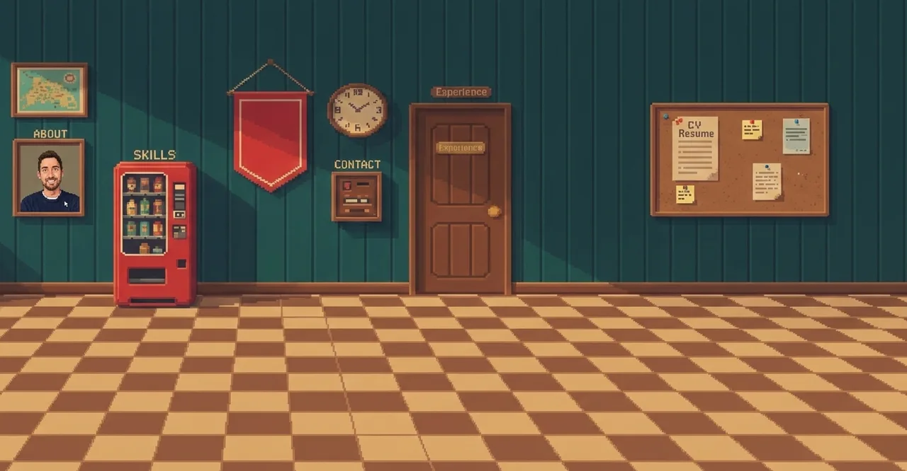

_Version 1: one AI-painted background, five hotspots placed as percentages._

## Contents

1. [The starting point](#the-starting-point)
2. [Framing before building](#framing-before-building)
3. [Creative direction](#creative-direction)
4. [The plan as a spec for agents](#the-plan-as-a-spec-for-agents)
5. [Two model families, two orchestrators](#two-model-families-two-orchestrators)
6. [Git and worktrees](#git-and-worktrees)
7. [Removing friction on purpose](#removing-friction-on-purpose)
8. [The asset pipeline, and three art directions](#the-asset-pipeline-and-three-art-directions)
9. [Engine highlights](#engine-highlights)
10. [Audio no one can hear](#audio-no-one-can-hear)
11. [What went wrong](#what-went-wrong)
12. [The numbers](#the-numbers)
13. [Lessons](#lessons)
14. [What's next](#whats-next)
15. [September 30 addendum: Codex work and new review directions](#september-30-addendum-codex-work-and-new-review-directions)
16. [September 30 history review: the Claude Code conversations](#september-30-history-review-the-claude-code-conversations)
17. [October 1 update: V2.1 on the desktop](#october-1-update-v21-on-the-desktop)
18. [Changelog](#changelog)

## The starting point

Version 1 shipped in February 2026 (the first commit is a Vite starter dated January 31). On desktop it is a fake Windows 95 desktop with a terminal, a Recycle Bin, and a game window. On mobile it becomes a Game Boy. The game window shows a single painted scene: a pixel-art Daniele walks around a room, and clicking one of five objects opens a section (About, Skills, Experience, Contact, Resume) as a terminal-style overlay.

It works, and it is charming, but it is one picture. Everything a visitor can do happens in the same room, the objects are percentage rectangles laid over a JPEG-shaped background, and the "world" has no depth. The goal for v2 was to keep the concept and deepen it: each section gets its own scene, built from separate assets, connected by exits. The Win95 shell, the Game Boy view, the character as a guide, and the SCUMM-style verb toolbar all stay. Inventory and puzzles are explicitly out of scope.

## Framing before building

Before any code, three things happened, and most of them are not in git.

**Rewrite `AGENTS.md` first.** `AGENTS.md` was rewritten to capture what the project _is_, and every agent reads it. It states the audience (recruiters, hiring managers, engineering peers), and three principles that every change must preserve:

- **Information stays reachable.** A visitor who won't play can still reach contact, resume, and experience within one or two clicks. When immersion and access conflict, access wins.
- **Period authenticity.** Win95 chrome and SCUMM scenes should look and behave like the real thing, not a generic "retro" look.
- **Humor and personality.** The copy uses the self-aware LucasArts voice, never résumé-speak.

The rewrite of its opening sections (premise, audience, principles, direction) landed in the same commit as the first draft of the plan (`14c05cf`, 10:00), which also carries a `Co-authored-by: Cursor` trailer, so part of that draft was made in another tool.

**Agree the creative direction by structured Q&A.** The assistant and Daniele went through the open questions one at a time (what is the entry point, what are the rooms, how does a visitor know where each section lives, how do you travel between rooms). The answers became the plan's decision log: twelve creative decisions (Hall style, London setting, section mapping, exits through the Hall only, one palette with per-scene ramps, and so on). A thirteenth, "visual fidelity", was added when the art direction changed. It briefly went stale (it said 1280×640 after the art spec had moved to 640×320) until the plan commit `469e208` fixed the resolution drift at 21:51.

**Throw away a prototype.** Style questions that cannot be settled on paper were answered with a canvas prototype of one room, in three structural variants: a scrolling corridor, a single-screen office, and a depth-sorted museum. Daniele chose "B's vibe with C's depth": the office mood, but with free-standing objects that the character walks in front of and behind. The prototype was then parked on a branch (`prototype/multi-scene`, 1,949 lines across five files) and never merged. Its Zurich office screenshot survived as a layout reference for the first image prompts:

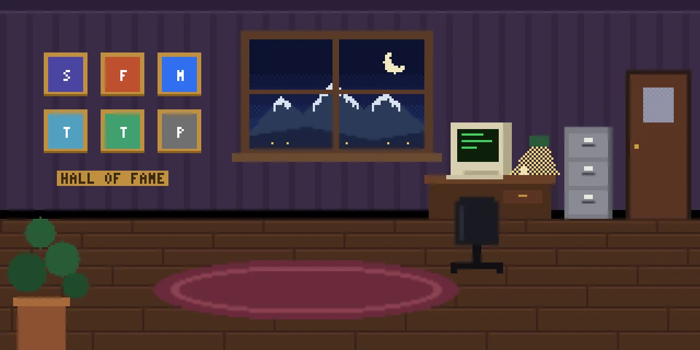

_Prototype B, upscaled. It is rough, and it even had text painted into the art, which the plan later banned._

The prototype paid for itself by producing a rule rather than code: **the art provides containers and `profile.ts` fills them.** More on that below.

## Creative direction

The portfolio became a journey through the three countries Daniele has lived in, with Italy standing for "now and next" because he is moving there:

| Scene    | Setting                                                            | Sections           |
| -------- | ------------------------------------------------------------------ | ------------------ |
| Hall     | A 1990s airport terminal: gates and a duty-free shop               | Jumps to all       |
| London   | A pub on a rainy evening, the City skyline in the window           | Skills             |
| Zurich   | A night office overlooking the lake, with the Alps behind          | Experience, Resume |
| Sorrento | A kitchen looking across the Gulf of Naples to Vesuvius and Ischia | About, Contact     |

The Hall is the entry point. Daniele greets you there. Three gates fly you to a country with a _Fate of Atlantis_-style travel-map transition (a sepia map of Europe, a small plane, a red line, a click to skip). A duty-free shelf sells one product per section ("Eau de Résumé"), which jumps straight to the content without the trip. That last part is the "information stays reachable" principle wearing a costume. The toolbar reaches any section in one click from anywhere, and a later hand walk of every scene-to-section combination checked 20 of 20.

### Extensibility: art as containers

Skills and jobs will change. So nothing that changes is painted into the art:

- Content is data. Primary objects only open content screens that read `profile.ts`.
- Collections are **slot rows**: the art supplies one generic sprite (a beer tap, a photo frame, a fridge magnet) and the scene data defines a row of positions. The engine fills one slot per entry in `profile.ts` and folds the oldest into an "and more" object (a cask, a shoebox) when the row is full.
- Each job records a `country`, which decides which room shows its memento. A unit test fails if a job has no country or a row overflows without folding.
- **No text in the art, ever.** Signs, the chalkboard, and the departures board are drawn by the engine, so renaming a job never touches an image.

Adding a skill, a job, or an Italian employer is a data change. That constraint also protects the generated art: image models are bad at text, so removing text from the prompts removed a whole class of defects.

## The plan as a spec for agents

Two files, `docs/expansion-plan.md` (what the world is) and `docs/art-spec.md` (how every asset is made, in what order, by whom), are the whole interface between Daniele and the agents. They are about 1,200 lines together, and the art spec is written like an API document:

- **Task cards** with a lane, an `After` dependency list, an `Owns` line (the only paths that task may write), steps, and a `Done when` check.
- **Status comes from git, not from a table.** An Opus task is done once a PR from its branch is merged into `v2`; a Codex task is done once its `DONE` files exist. The Status column records only gates.
- **Contracts, not prose.** The scene data format is a TypeScript type (`src/engine/types.ts`). The art spec carries a sketch and says outright that where the sketch and the code differ, the code wins. This is a trimmed version of the sketch:

```ts
export const ZURICH_SCENE: SceneData = {
  id: "zurich",
  background: zurichBg,
  walkbox: [
    [8, 108],
    [304, 108],
    [304, 156],
    [8, 156],
  ],
  depth: { farY: 108, nearY: 156, farScale: 0.7, nearScale: 1.0 },
  entryPoints: { fromHall: { x: 296, y: 120, facing: "w" } },
  objects: [
    {
      id: "crt",
      sprite: zurichObjDesk,
      hotspot: { x: 204, y: 56, w: 30, h: 26 },
      interactionPoint: { x: 220, y: 108, facing: "n" },
      baselineY: 100, // character is drawn behind this object while his feet are above the line
      action: "experience", // a section id, or undefined for flavour
    },
  ],
  slots: [
    {
      id: "job-photos",
      kind: "photo-frame",
      source: "jobs:switzerland",
      positions: [
        /* 6 */
      ],
      fold: "slot-photo-frame-more",
    },
  ],
  labels: [{ id: "cabinet", source: "section:resume", x: 262, y: 54 }], // engine-drawn text
  exits: [{ id: "door-hall", to: "hall", entry: "fromZurich" /* ... */ }],
};
```

Coordinates are logical pixels on a 320×160 grid with a top-left origin, and stayed that way through every art change. That single decision is why the art could be redrawn twice without rewriting scene data: the 2× rebuild PRs moved positions by at most a logical pixel or two.

- **The plan lives on `origin/v2` only.** Agents read it with `git show origin/v2:docs/art-spec.md`, never from their own branch, at the start of every task, before every gate, and before opening a PR. Every PR description says `Plan read at <sha>`. Only Daniele edits the plan, directly on `v2`, in small `docs:` commits. An agent that thinks the plan is wrong proposes a change through its orchestrator and keeps following the plan as written. The one exception is this post: at 21:40 (`2d06f64`) the plan gained an "Engineering blog" section that makes keeping `docs/blog/v2-revamp.md` current a requirement, with task card BL. After every gate, direction change, and landed phase the orchestrator dispatches an update, and the blog writer is the only agent allowed to edit `docs/blog/` (on `docs/blog-*` branches, which the plan guard allows). It never edits the plan files.
- **A CI "plan guard"** (`scripts/ci/plan-guard.sh`, task T0.3) fails a PR that edits `docs/` from a non-`docs/*` branch, or whose branch predates the latest plan commit on `v2`. It was tested with two throwaway PRs (#11 and #12), one to fail each rule, then closed. CI ended up advisory for `v2`, so the guard's real job was documentation: the rebase in the merge loop is what actually kept branches current.

Reading the plan back, the sections that earned their keep were the ones that closed loopholes: **Owns lines** (the PR descriptions mention plenty of rebases and almost no conflicts), **"Keeping the plan in sync"** (a stale plan is expensive when a dozen agents act on it at once), and the **Gate log** (below).

## Two model families, two orchestrators

The art spec is written for two orchestrators, one per model family, because the two tools can do different things:

| Actor                                 | Runs                                                                                              | Never does                                                  |
| ------------------------------------- | ------------------------------------------------------------------------------------------------- | ----------------------------------------------------------- |
| **Opus orchestrator** (Claude Code)   | Tooling, palette, prompt files, image processing, cleanup, scene data, audio, engine, integration | Generate images                                             |
| **Codex orchestrator** (OpenAI Codex) | Runs prompt files with its built-in image tool and saves candidates                               | Edit code, docs, or anything outside `assets-src/exchange/` |
| **Daniele**                           | Gates: picks, approvals, the final review                                                         | —                                                           |

A note on the table: "Opus" names the orchestrator's lane, not the model behind every agent. At 21:46 (`718d0f5`) the plan recorded that the orchestrator spawns every sub-agent on **Sonnet 5.5** unless Daniele names another model for a task. The commit does not give a reason. The first two versions of this post added that git does not record which model built which PR, and that was wrong: commit messages carry `Co-authored-by` trailers, and 119 of the 120 commits on the revamp have one. 104 name Claude Opus 5.5, 13 name Sonnet 5.5, and two (the plan's first commits) name Cursor. The Sonnet trailers are exactly this post's two earlier PRs (#58 and #63), the layer prompts (#61), and the HB builds and the E5 speed change (#62, #64 to #68 and #70 to #73). Every other task PR carries the Opus trailer, including the two orchestrator QA fixes (#69 and #75). The switch shows in the history between #60 (Opus, 22:02) and #61 (Sonnet, 22:05), roughly when the plan said it would, since agents already running kept their model. Only UI2 (#74) has no trailer. A trailer is the agent's own declaration, so it is evidence and not proof. This post's own author is one of the Sonnet sub-agents.

Two reasons for the split. First, only one of the tools generates images (the Codex image tool, billed to a ChatGPT plan), and the plan's rule is that no task ever calls a model API. Second, keeping generation out of the coding agents' worktrees makes the boundary physical: Codex writes only to a **gitignored exchange folder** in its own checkout, so candidates never enter history. A candidate reaches `v2` only when an Opus task commits the approved raw as a lossless WebP next to a provenance record.

**The handoff protocol is deliberately dull.** An Opus agent writes a self-contained prompt file:

```md
---
asset: london-bg
task: C2
candidates: 4
references: [assets-src/refs/style-anchor@8x.png]
output: assets-src/exchange/raw/london-bg/
transparent_background: false
---

## Prompt

<full prompt text, style preamble already written in>

## For Codex

<call settings, where to copy outputs from, NOTES.md and DONE>
```

Codex generates exactly `candidates` images, copies them to `output/NN.png`, appends the exact prompt and any deviation to `NOTES.md`, and writes an empty `DONE` file last. Opus agents read candidates by absolute path from the Codex checkout, only once `DONE` exists, and never write there. The Codex orchestrator does not receive events. It **polls**: every few minutes it fetches `origin` and reads the status tables in the plan, and starts anything whose dependencies are met. Its own worktree is detached at `origin/v2` and is refreshed before each batch.

A later prompt file (for the Zurich layers) shows how the format grew: one file, many `items:`, each with its own asset id, references, and a `transparent_background` setting.

**Front-loading foundations.** The reason the fan-out could run in parallel is that the risky, serial work was lifted to the front. Phase 1 built the tooling, froze the palette, wrote all 14 prompt files at once (so no one would wait on prompts), and produced two _anchors_: the approved Zurich composite (the style anchor) and the character turnaround. Every later image referenced those two files. Style drift across independently generated images is the classic failure mode of AI art pipelines, and anchors are the cheap fix.

**A probe first.** Task F2 asked Codex to generate four throwaway images and write down what the tool actually did, and the Gate log records the findings that shaped every later prompt: composites arrive at 1774×887 (already 2:1, and asking for a wider image changes nothing), character sheets at 1536×1024; the "magenta" background is never exactly `#FF00FF` (mostly `#FA03FA`), so keying needs an OKLab tolerance and a flood fill from the edges; the model paints slot items (taps, picture frames) even when told not to, so prompts leave those areas as bare wall; there is more soft lighting than asked for; and edits mostly preserve layout but drift subtly. The probe also found that four images cost about 0.15% of the plan's limit, so candidate counts went up.

## Git and worktrees

`v2` is a long-lived trunk. `main` stays on v1 until `v2` is ready, and **agents never touch `main`** (no branches from it, no commits, no PRs, no merges). One worktree per agent, one per orchestrator:

| Worktree            | Branch                                   | Who                                      | Commits?                                             |
| ------------------- | ---------------------------------------- | ---------------------------------------- | ---------------------------------------------------- |
| main checkout       | `v2`                                     | Daniele only: reviewing, recording gates | Daniele only                                         |
| `../rgp-codex/`     | detached at `origin/v2`                  | Codex orchestrator and its sessions      | Never; writes only to the gitignored exchange folder |
| `../rgp-opus/`      | detached at `origin/v2`                  | Opus orchestrator, for coordinating      | Never                                                |
| `../rgp-<task-id>/` | `assets/<task-id>` or `engine/<task-id>` | One Opus agent per task                  | Yes: one PR per task                                 |

Orchestrators sit on _detached_ heads because a branch can be checked out in only one worktree, and Daniele's main checkout owns `v2`.

**The agents merge their own work.** There is no human approval step for a task PR. The loop, from the plan:

1. Finish the task, `git fetch origin && git rebase origin/v2`, resolving conflicts by rule.
2. Re-run the card's `Done when` checks locally, then `git push --force-with-lease`.
3. `gh pr merge --squash --delete-branch`, immediately. Do not wait for CI.
4. If the merge is refused because `v2` moved, go back to step 1. After three failed attempts, stop and report to the orchestrator.

The conflict rules are unambiguous and fit on one screen. In the task's own paths, keep both sides' intent and re-test. In another task's paths, keep `v2`'s version (and escalate if the task really needs a change there). For `package-lock.json`, keep `v2`'s and re-run `npm install`. For binary files, the owning task wins, and never merge by line. For `docs/`, always keep `v2`'s. Only the final integration task may touch every scene.

One side effect of using the developer's own git identity: all 120 commits on the revamp show a single author, Daniele Tortora. The author field cannot tell you who did what. The trailers and the PR descriptions can, with their model names, their `Plan read at` lines and their "Generated with Claude Code" footers. One more thing the trailers show: 53 of the 55 `docs:` commits are trailed Opus. The rule that only Daniele edits the plan holds for the git identity, and in practice the orchestrator drafts the plan updates and commits them from his checkout.

## Removing friction on purpose

Two decisions traded safety for throughput, on purpose:

**CI and E2E were declared advisory for `v2`.** GitHub checks and the Playwright suite belong to v1 on `main`. On `v2`, the only verification is each task card's local `Done when` (typically `npm run lint`, `npm run test:unit`, `npm run build`). The alternative was every agent waiting on a slow CI run on a branch that changed every few minutes. The cost is real and is discussed under [What went wrong](#what-went-wrong).

**Gates were delegated.** Daniele's picks are the actual bottleneck in a pipeline like this, so when he stepped away, the Opus orchestrator was authorised to pass the palette, anchor, and audio gates and to make every candidate pick. Each decision and its reasoning goes in the plan's **Gate log**, and Daniele can overturn any of them. The final review before `v2` merges into `main` (G4) stays with him.

This delegation came with a flaw that only showed later, and it is covered under [What went wrong](#what-went-wrong): it was written as "until he says otherwise", and nothing said what should happen when he came back.

The Gate log has 24 rows. Seventeen were decided by the orchestrator: fourteen before Phase H, and the layer picks for the Hall, London and Sorrento. Six are Daniele's: the Phase H checkpoint (HG1); from 22:03, the four Phase H scene and map picks, recorded as "Daniele (on the orchestrator's recommendation)"; and the Zurich layer picks. The 24th row is not a gate at all: three later picks (Sorrento's lemon tree and ferry, London's bus) were made by build agents when the candidates arrived, and until 00:21 (`c96b0d8`) they lived only in PR descriptions and provenance records (`approvedBy: "orchestrator"`). The plan now logs them as a row "decided by" the build agents, delegated by the orchestrator. Some entries are worth quoting for the reasoning quality. On the character turnaround: candidate 06 won because "it has the cleanest remap: the least brass on the skin, the lowest noise, a strong silhouette with arms clear of the torso", and the jeans were recoloured to denim during cleanup, "which is cheaper than cleaning 02's noise to get its denim". On audio, the orchestrator wrote that it "can't hear audio" and approved the motif "on objective evidence only: Daniele to listen".

## The asset pipeline, and three art directions

This is the honest part of the story. The pipeline is what makes a generated image usable in a game; the art direction is what moved.

### Direction 1: pixel art at 320×160 (Phase 1 and 2)

Generated images are not pixel art. They are images of pixel art. Phase 1's pipeline, built as a set of TypeScript scripts under `scripts/assets/`:

1. **Generate.** Codex makes 4 to 6 candidates per composite from a prompt file.
2. **Pixelize.** Crop, area-average downscale to 320×160, then map every pixel to the nearest allowed palette colour **in OKLab** (a perceptual colour space, so "nearest" means "looks nearest") with no dithering. The palette is 26 core colours plus a 9-colour ramp per scene, and a validator enforces that each scene uses only the core plus its own ramp.
3. **Review.** A numbered review sheet at native size ("judge at native size: a beautiful raw image can pixelize into mush").
4. **Clean up** in palette-index text grids: the image as one character per pixel, patched by region, so an agent that cannot "see" can still edit an image with exact, diffable text.
5. **Validate.** `lint:assets` fails on off-palette pixels, partial alpha, wrong sizes, bad names, and a missing provenance record.

Every shipped file has a provenance JSON (which prompt, which candidate, which references, which cleanup, who approved), because "models get retired, so the approved raw candidate is the only thing an asset can be regenerated from".

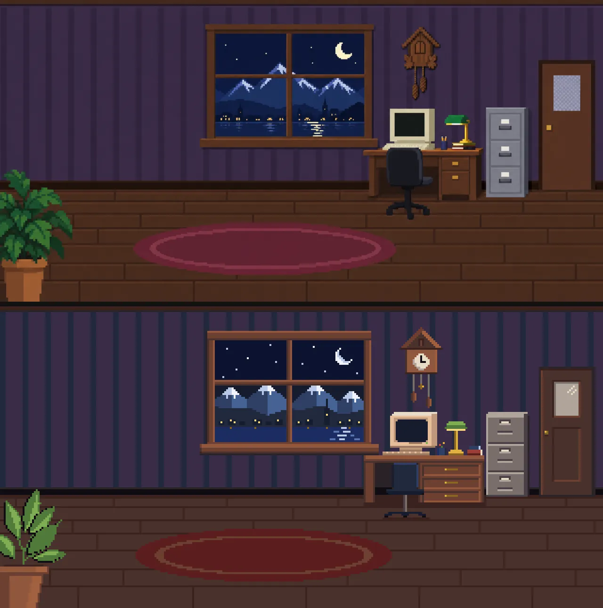

_Top: a raw Codex candidate for the Zurich style anchor. Bottom: the anchor after pixelizing and grid cleanup._

Between 13:58 and 15:53 that afternoon, 20 PRs merged: the tooling, all five scenes, the shared slot sprites, the character sheet, 29 audio files, and the engine (scene loading, multi-scene rendering, travel map, terminal routing, audio playback, a dev overlay).

**What the builders learned that the plan did not know.** The agents building scenes hit the limits of the generated art, and their PR descriptions are the best source of what actually happened:

- The London build (#30) says the remap "was too mushy to clean pixel by pixel: the door was nearly black, the panelling noisy, and the lamps cast light cones", so the room shell was **repainted procedurally** on the candidate's layout. The Hall build (#29) did the same for most of the room, because the gate signs needed far more room than the candidate left for them.
- The character (#28) was supposed to come from Codex animation sheets. Only one walk sheet was usable, and "at native size, 03's own pixels were too noisy and bulky", so the frames were rebuilt from the approved turnaround, keeping only the generated poses and timing. Five of the eight tags were built directly from the anchor.
- Sorrento's chosen candidate had a fridge and door "more than twice the character's height at the back wall", so they were redrawn smaller. A world scale problem, noted and fixed locally, and (spoiler) it came back as a global rule later.
- Three rules for the scene contract came out of the Zurich build (#24): walkboxes have no holes, so free-standing furniture needs "keyhole" slits from the back edge; hotspots hit-test in list order, not by depth; animation strips must be 320 px or narrower. Each was added to the plan and to the engine's overlay warnings.

Then Daniele played it.

### Direction 2: the 2× remaster (Phase R)

His review of the running game said: the proportions were off, the text was hard to read, and it was still too low-resolution. In his words, Monkey Island 2, not 3. Git shows the review as a 1 hour 42 minute gap with no merges (15:53 to 17:35), followed by a new plan section.

Phase R kept everything (scenes, layouts, objects, moods) and redrew it at **2× pixel density**: 640×320 backgrounds, a 64×128 character cell, a palette extended by 24 colours (the original 62 indices were frozen by a test, and the new ones took punctuation characters as indices). It also added a rule born of a bug that Phase 2 had exposed: in the Hall, the carpet used the same navy as Daniele's sweater, so his torso vanished. The fix was made a measurable invariant:

> No floor, rug, or large surface behind the character may use a colour within **0.08 OKLab** of the character's clothing and hair colours.

Then a contrast-walk tool (I2, #44) rendered every scene with the real character at every walkbox point on a 5-pixel grid, in five poses, 2,603 positions per run, and measured the OKLab distance between the character's outline and the pixel next to it. The results were not a clean pass. Zurich's hair edge was under the threshold 69.8% of the time before the fix and 23.3% after; some remaining failures were left in place with a written reason (thin dark baseboards and dark wood behind a navy sweater, where the hue differs).

Phase R ran from 17:35 to about 20:36: 14 PRs, including the engine's density support (#33), the tooling (#32), and a rebuild of every scene, the character, and the shared sprites at 2×. Picks for the rebuilds were delegated to the build agents on objective criteria: layout fidelity measured region by region, in mean OKLab distance at the best offset within ±8 pixels, surface cleanliness, and the contrast rule. The Hall PR (#40) has a 15-row table of those measurements, and its chosen candidate (04) was the one with the smallest mean offset (7.0 versus 9.7 to 10.7 px).

Those are good measurements of the wrong thing. They measured how faithfully a candidate reproduced the _previous_ layout, and the target was about to move.


_Daniele's screenshot of the 2× Sorrento, sent with his feedback: the text is hard to read (here it sits over the window), the proportions are off, and it still reads as low resolution._

### Direction 3: Phase H, and a correction to the correction

Phase H's first version, committed at 20:46, listed his complaints in the commit message: "still too low-res, character proportions off, text unreadable". The new target was _The Curse of Monkey Island_ (MI3): hand-painted cartoon art, with bold ink outlines, at 1280×640 with **no visible pixels**, a cut-out-puppet Daniele, layered generated assets instead of hand-cleaned pixels, and a smooth font (Fredoka). Then the developer looked at the game again, this time with an MI3 screenshot next to it, and the plan changed again 29 minutes later. From the commit message at 21:15:

> Daniele: the smooth font breaks the style; The Curse of Monkey Island is the reference for both image pixel sharpness and text. Painted full-colour art on a 640x320 grid displayed with hard pixels, and an MI3-style serif bitmap font.

MI3 is 640×480 hand-painted art on a crisp pixel grid, shown at 2× with hard pixels. So the reference for _sharpness_ and for _text_ was hard pixels, and "HD" was the wrong reading of "better". The final Phase H rules:

- **Art at 640×320, displayed at 2× with nearest-neighbour.** That is the same density as Phase R, but painted full colour, at most 256 colours per scene, with no dithering noise and hard alpha. No master palette.
- **A serif bitmap font** on the same grid (white letters, hard 1px black outline, no anti-aliasing), rasterised from an openly licensed serif typeface. (Task T3, which landed at 21:55. See [Text, twice](#text-twice-from-smooth-to-a-bitmap-serif).)
- **A world scale sheet.** Daniele is 72 logical pixels tall (45% of the scene height) at the front of the walkbox and 58 at the back, and everything else is a ratio of his back-of-room height: doors 1.3×, a fridge or filing cabinet about 0.95×, a table 0.45×, a chair back 0.55×, a bar counter 0.6×. Every prompt includes the sheet as a reference image.
- **A cut-out puppet Daniele:** one drawing per facing, split into ten parts (torso, head, upper arms, forearms, thighs, shins), with head variants for mouth shapes and blinks, animated in-engine by keyframed poses. His likeness is identical in every frame because it is the same drawing.
- **Generated layers, not hand-cleaned pixels.** For each scene, Codex makes a full composite (for the pick and as the layout reference), an empty-room plate made by editing out the furniture, each free-standing object separately on transparency, and each moving prop separately. Opus crops, keys, aligns, and writes scene data, but "doesn't paint pixels".
- **Effects are procedural:** rain, steam, stars, sea glints, the split-flap flutter, and fruit-machine lights are code, not sprite strips.
- **A human checkpoint.** Daniele would pick the HD anchors himself.

The correction also needed its own tooling, and it arrived as H0b (#56, merged 21:31, +1,629 lines) about a quarter of an hour after the plan changed. The 1280×640 tooling (H0) had been built for a target that no longer existed, so H0b added a **painted** mode to the same pipeline (`assets:prepare --painted`, `assets:quantize`, `assets:rig --density 2`):

- A scene comes out at 640×320 with **hard alpha** and at most **256 colours**, with no dithering, so gradients become bands instead of noise. The palette is quantised in OKLab with a weighted median cut, refined by k-means. Resampling defaults to Lanczos because it keeps ink lines crisper.
- **Joint per-scene palettes.** `assets:quantize` builds one palette for all of a scene's layers together (or `--palette-from` pins the colours of one file and adds new ones only up to the budget), so an object cut out of a scene does not shift colour against the plate behind it.
- The validator learned `"density": 2, "style": "painted"`. It drops the master-palette rules and checks instead that scenes are 640×320, sprites have even sides, alpha is hard, each scene folder stays within 256 colours across all its painted files, and a scene never mixes painted and pixel art. Phase R's pixel-art rules still apply to anything without `style`.

At the checkpoint (gate HG1), the orchestrator had recommended Zurich candidate 01. Daniele picked 04, the one with diagonal moonlight across the wall. For the character he picked candidate 01, "the clearest cartoon likeness". The candidates he saw had been put through the corrected pipeline first (640×320, 256 colours, shown at 2× nearest), so he was judging what would actually ship, not a raw generation.


_The four Zurich HD candidates, as shown at the checkpoint. The orchestrator recommended 01; Daniele picked 04._

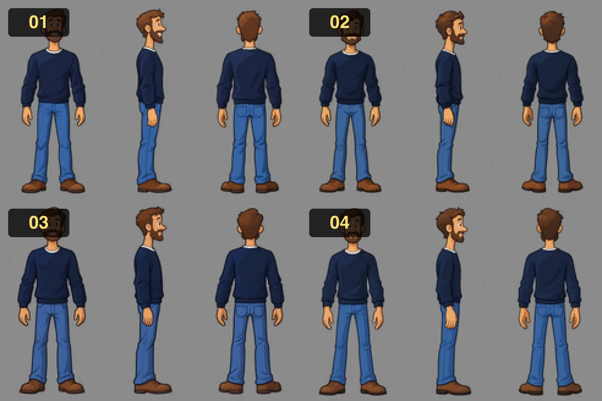

_The four Daniele candidates. He picked 01._

To prove the world scale before committing to it, an agent composited the approved Zurich anchor with the approved character at three positions and measured the result: the door is 1.3× his back-of-room height, and he stands 288 display pixels tall at the front.

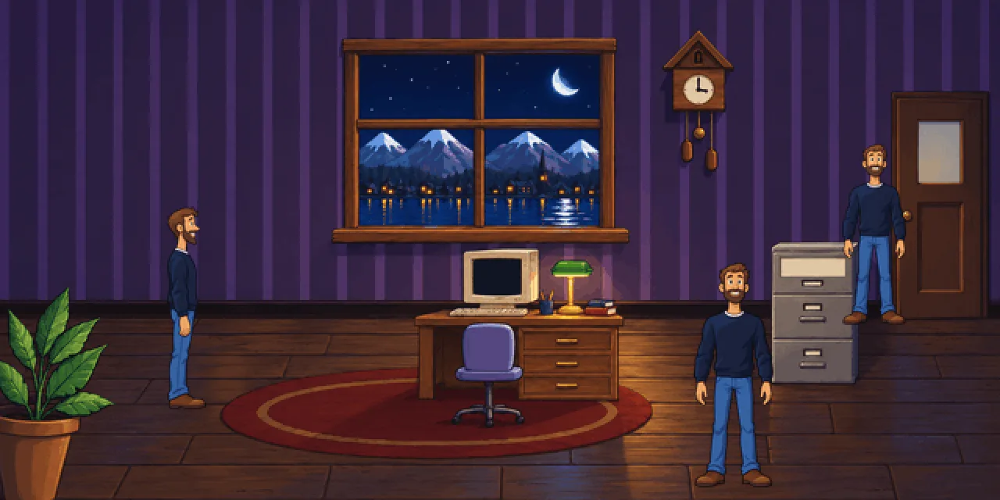

_The scale composite that fixed the world scale._

HG1 passed at 21:30 (#55), and the fan-out followed within minutes. Codex ran HC2 to HC4 (the Hall, London, Sorrento, and the travel map; the character's parts and mouth shapes; the shared sprites). The layer prompts were next: HL-zurich (#57, `layers-zurich.md`) asks for nine items at three candidates each, an empty-room plate made by _editing_ the chosen composite (desk, chair, cabinet, plant and door removed) and then each object and the cuckoo as separate sprites on transparency, with the stars, lake glints, and CRT cursor left out because the engine draws them. Codex has since finished all nine (the exchange folder has a `DONE` file in each), which by the plan's own rule makes HC5-zurich done (the status table has since caught up). It was the first test of the layered approach, and the result is under [Four rooms from layers](#four-rooms-from-layers-hb1-to-hb5). The other three scenes' layer prompts followed at 22:05 (#61: five items for the Hall, eight for London, nine for Sorrento, each with its chosen composite committed as a lossless reference), so all four rooms now have prompts and 31 layer items are queued or generated in total.

**The cost of getting the direction wrong twice.** Two engineering artefacts of the first Phase H reading became dead code, which is worth being honest about:

- The **density-4 smooth rendering path** (#47, 415 added lines) was merged at 20:57. After the 21:15 correction, its own follow-up PR (#52) says the density-4 stand-ins now need a `&smooth` flag and "that path stays merged and unused". It stayed there until I3a (#79, 00:53) removed it, about four hours later (see [Closing the loop](#closing-the-loop-i3a-and-what-is-left-for-g4)).
- **T1 (#50)** built crisp display-resolution text in Fredoka, and deleted the engine's pixel-font glyph tables in the same PR (+733 / −2,448 lines). Five minutes after it merged (21:10), the plan said the text should be a pixel font again. The replacement, T3, could not resurrect the old glyphs and built a new face (below). This one _is_ cleaned up now: the toolbar rebuild (UI1) removed the last user of Fredoka, and its font files, `@font-face`, and preload went with it.

Neither blocked anything else, and the whole detour lasted less than an hour of wall-clock time. But this is exactly the kind of work that a person's five-second look at a reference screenshot would have prevented.

### Minimal in-world text

One more correction came from the Hall. Daniele's review of it was an "overdose of text" (his words as relayed to the writer, not visible in git): his screenshot showed a departures board listing every section, gate signs listing sections, shelf labels, and a four-line greeting, all at once. The scene was legible in isolation and useless as a place. The fix was a plan-level rule (commit `d86395c`) and a matching PR (#51, T2, 21:19):

- In-world text is at most one word or a city name per object. The Hall's gate signs now say only "GATE 1 / LONDON", the departures board lists three city names, the duty-free shelf labels are gone (hovering still says "Open Resume: Eau de Résumé"), and the greeting is "Welcome aboard! Pick a gate, or use the toolbar."
- Spoken lines are 12 words or fewer, enforced by a unit test that walks every scene. Label tests enforce "a word or two".
- The **toolbar** carries the mapping instead. In T2's version every section button got a small country badge (Big Ben, an Alp, a lemon), hovering said "Skills, in London", and in a country scene that scene's buttons lit up. T2 checked the result with Playwright: every section opens in one toolbar click from each of the four scenes, 20 of 20.
- The Hall's HD prompt was rewritten in the same PR to ask for small, slim gate panels, a small three-row board and an unlabelled shelf, so the next round of art is built for less text.

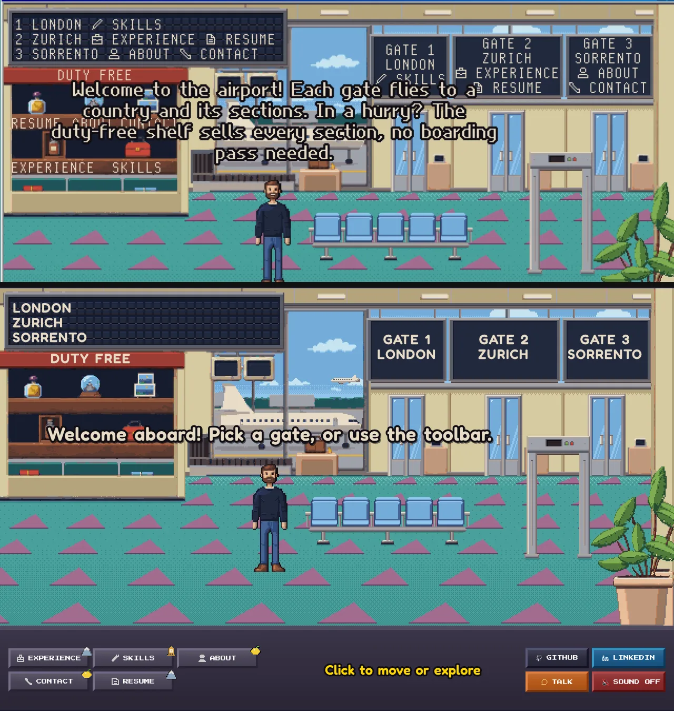

_The Hall before and after "minimal in-world text"._

The badges lasted about 40 minutes. A screenshot Daniele took at 21:34 shows the T2-era buttons and the status line, and by 21:35 the plan had a new task (UI1) to redesign it for the MI3 look, with his review note attached: "the toolbar looks awful".

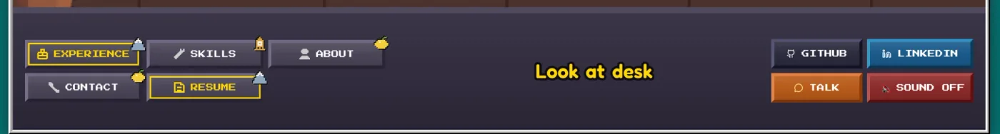

_The toolbar before UI1._

### Text, twice: from smooth to a bitmap serif

The text went through two versions in 45 minutes, and the second one is the one that finally looks like the reference.

**T1 (#50, 21:10): smooth text.** A second canvas over the scene, sized to the on-screen size times `devicePixelRatio` (never below 1280×640), with Fredoka SemiBold drawn with a round dark outline and a soft shadow. It was crisp, big, and readable, and it answered the complaint that the text was hard to read (the Sorrento screenshot earlier in this post). Then Daniele put an MI3 screenshot next to it. In the plan commit's words (`d2452d8`), "the smooth font breaks the style": it looked like a modern UI laid over pixel art, the kind of modern flourish `AGENTS.md` says to leave out. He pointed to _The Curse of Monkey Island_ as the reference for both the sharpness of the art and the text.

**T3 (#59, 21:55): an MI3-style serif bitmap font.** The agent worked from the reference at every step:

- **Typeface.** Libre Caslon Text (SIL OFL 1.1). The agent compared it with Crimson Pro, EB Garamond, Alegreya, Cardo, Gentium and Spectral against the MI3 reference, and it was the closest. The licence file ships with the atlases.
- **Rasterizer.** `scripts/fonts/rasterize.py` (Pillow and fontTools, run once, output committed) instances the font at one weight, renders every glyph **1-bit** with FreeType's autohinter (no anti-aliasing), spaces glyphs by their ink, and turns the font's kerning into whole pixels. The output is a set of text-grid atlases, `serif-regular.txt`, `serif-small.txt`, and `serif-tiny.txt`, the same "an image as characters in a file" trick used for palette grids. A few glyphs did not survive automatic hinting and are **hand-tuned overrides** (regular `s`, small `S`, tiny `A`, `S`, `I`) that the script re-applies whenever it runs.
- **Three sizes on the 640×320 grid.** Regular (cap height 12 art pixels, 19 per line) for speech, small capitals (cap height 8) for signs, the board, the map and captions, and a tiny size used only as a fallback.
- **MI3's look.** Each line is composed as 1-bit masks: the letters, a hard 1-pixel outline grown on four sides, and for speech a 1-pixel drop shadow down and to the right, as in the reference. Speech is white with a black outline and shadow. The text canvas is a fixed 640×320 drawn pixelated, so text pixels and art pixels are the same size.
- **Fitting.** A bitmap cannot scale, so a label that is too wide is fitted by steps: wrap first, then close the letters up by one pixel, then drop to the next size, and every line of a sign gets the same setting.

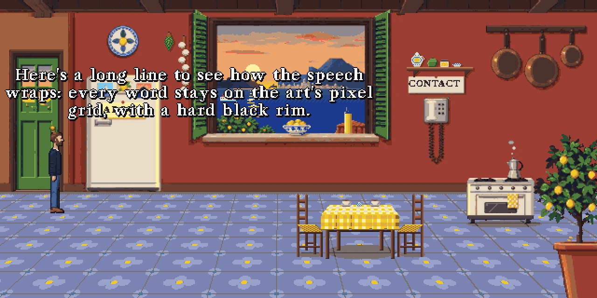

_The Sorrento kitchen with T3's speech: a white bitmap serif on the art's own grid._

The PR is +16,984 / −325 lines, and about 15,800 of them are the glyph atlases, which is why `src/` in [The numbers](#the-numbers) looks so much bigger than it did in the first version of this post. The engine surface is small: `font.ts` exposes `measureText`, `wrapText`, `fitText`, `drawText` and a helper to render lines onto a canvas of their own, and it was written for the next task to reuse.

### The toolbar becomes a travel trunk (UI1)

UI1 (#60, merged 22:02, +1,509 / −800 lines across 26 files) is the first task where the agent was told to _propose_ before building. The PR opens with three concepts:

1. **A slim painted interface strip** of wood, brass and parchment. Period-right, but on its own just the old toolbar reskinned; the country mapping would still hang off a corner badge.
2. **A travel kit on a trunk:** boarding passes, destination stamps and luggage-tag sections. Diegetic, and it fits an airport story.
3. **An MI3 verb coin.** The most authentic, but it is hidden until you press and hold, so it fails one-click reach and discoverability and could not be the whole interface. (The `AGENTS.md` principle "information stays reachable" rules it out.)

The choice was 2, painted in the style of 1: a **travel trunk**. A wooden lid with a brass edge runs under the scene:

- A **sentence line** in a dark groove along the top, as in SCUMM. It says "Walk to" when idle, "Look at desk" or "Skills, in London" on hover or keyboard focus, "Off to Zurich: Experience, Resume" in flight, and "Click to skip" during a trip.
- **One boarding pass per city**, in journey order (London, Zurich, Sorrento), with a torn-off stub carrying the city's emblem (Big Ben, the Alps over the lake, a lemon), a header in the city's colour, and one row per section that lives there. The grouping teaches the mapping: a section sits on its city's ticket, so the corner badges and any extra in-world text are not needed.
- **A passport stamp for "you are here".** The current city's ticket gets a gold rim and a red entry stamp with a plane in it. During the travel map the destination's ticket is already stamped, and the Hall stamps none.
- **Four brass fittings**, two by two: Talk, Sound, GitHub and LinkedIn.


_The control bar before and after UI1, in the Zurich room._

A few details worth keeping. The trunk is drawn **entirely in code**: emblems and fitting icons are small ink-outlined sprites in `sprites.ts`, laid out in art pixels by `layout.ts`, and painted by `paint.ts` onto one 1280×160 canvas. The PR notes that no Codex prompt was needed. The text is T3's bitmap serif, and a browser test asserts that **every 2×2 block of the whole canvas, text included, is a single colour**, the same "measure it" reflex applied to the pixel grid. Over the canvas sit real `<button>` and `<a>` elements, so the keyboard and screen readers get the same trunk: each ticket is a group named after its city, each row is labelled "Resume, in Zurich" (plus "(you are here)"), Sound is `aria-pressed`, and Tab walks London, Zurich, Sorrento, then Talk, Sound, GitHub and LinkedIn.

It also deleted a lot: the old `ActionGrid`, `IconGrid` and `CountryBadge`, the `lucide-react` dependency, and the Fredoka font. The store, the verb-shortcut flow and the Game Boy view were left alone, and the E2E selectors moved from `getByTitle` to `getByRole` names. The PR was checked with 503 unit tests and 25 browser tests; the E2E suite has still not been run on `v2` (see [Debts](#debts)).

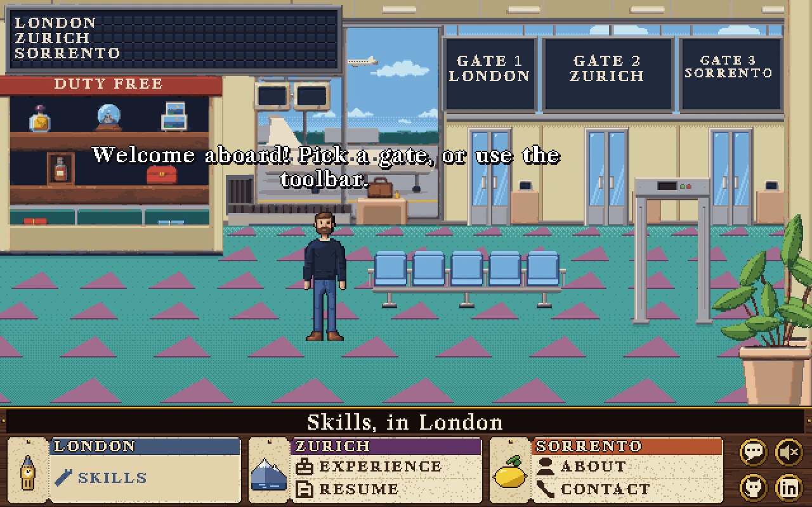

_The Hall after T2, T3 and UI1 together, hovering "Skills". The art underneath is still the Phase R pixel-art version._

The travel-map transition is the scene most likely to keep its mechanism through all three directions, though not its picture: Daniele picked a new, painted map (candidate 03), and HB5 re-registered its markers and routes to the new coastline (see [Four rooms from layers](#four-rooms-from-layers-hb1-to-hb5)).

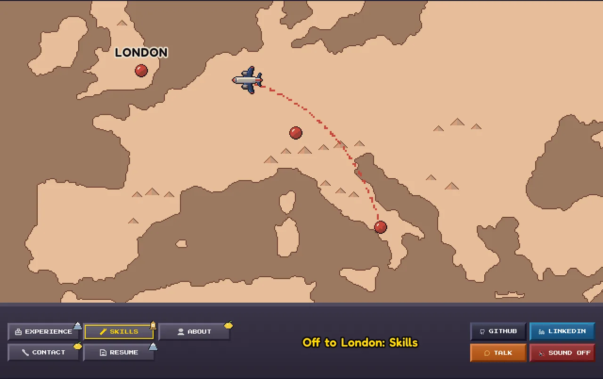

_The travel map mid-flight, with the engine-drawn label and the old toolbar's status line reading "Off to London: Skills"._

### The Phase H scene picks, and who was picking

The four remaining Phase H scene and map candidates were picked after HG1 and logged at 21:58: Hall **02** (the only candidate whose gate boards are big enough for "GATE 1 · LONDON" in the bitmap font), London **02** (the clearest chalkboard, a readable skyline, the fruit machine fully in frame), Sorrento **01** (the sun setting over Ischia, Vesuvius, the Naples shore), and the travel map **03** (the cleanest two-tone sepia with no painted markers or text). The reasoning is in the Gate log. What is worth telling is the attribution: the plan commit that logged them at 21:58 (`1f50c55`) recorded the orchestrator as the decider, and the next one at 22:03 (`c872bcb`) changed the same four rows to "Daniele (on the orchestrator's recommendation)". The candidates did not change, only who they belong to, and the PR that wrote the next layer prompts (#61) says the picks "were confirmed by Daniele". [What went wrong](#what-went-wrong) says why.

The new rule was exercised within ten minutes. The next task, HB6 (#62, merged 22:12), turned the shared sprites (beer tap, photo frame, fridge magnet, their "and more" fold objects, the map marker and the plane) into painted density-2 art, and its PR says "Daniele chose the recommended mix from the HC4 sheet": the build agent stopped at the pick, Daniele made it, and the provenance records say `approvedBy: "daniele"`. It is also the first output of the painted pipeline: cut from the raw sheet, `assets:prepare --painted`, a 1-pixel ink edge added to each silhouette because the downscale loses the painted outline, and one joint 256-colour palette for all eight files. The plane is rotated to eight headings and mirrored across its own axis for four of them so the light stays top-left.

That rule lasted 14 minutes. The second update of this post went out at 22:14 saying the picks were Daniele's. At 22:16 the plan logged his Zurich layer picks (plate 02, desk 01, cabinet 01 and so on, again on the orchestrator's recommendation), and at 22:17 (`4e376e4`) it reversed the rule, quoting him: "I will delegate control and choices of artwork back to you, just let me review the finished application after you are done." Build agents no longer stop at the pick, and G4 is his only gate. It is a different answer to the question this post keeps asking. The question is not which gates are delegated but how often the human looks, and at what. He moved from reviewing candidate sheets to reviewing the running game.

The change showed up in the schedule within half an hour. At 22:41 (`18241eb`) the orchestrator picked the Hall, London and Sorrento layers from the candidates that had already arrived and started HB2, HB3 and HB4 alongside HB1, so four scene builds ran in parallel. Daniele had asked it not to wait for Codex's last few layer candidates (his request as relayed to the writer of this post, so not visible in git; the commit message says the builds start "without waiting on the last Codex items"). It also told Codex which items to skip (the London stool, the second Sorrento chair) and which were still wanted (the London bus, the Sorrento lemon tree and ferry). Some of those stragglers made it. The lemon tree (02) and ferry (01) arrived before HB4 rebased and shipped. The bus (03) arrived after the picks were logged, and the HB3 agent picked it itself.

### Four rooms from layers (HB1 to HB5)

This was the test of Phase H's central bet, that generated layers plus code beat hand-cleaned pixels. Between 23:05 and 23:38 the builds landed: Zurich (HB1, #66, 23:05), Sorrento (HB4, #67, 23:07), the Hall (HB2, #68, 23:21) and London (HB3, #71, 23:38), after the travel map (HB5, #64, 22:15). The plan marked HB2 to HB4 in progress at 22:41, so they took 26 (Sorrento), 40 (Hall) and 57 (London) minutes from that mark to merge. HB1 had started at 22:16 and took 49. All five were built by Sonnet agents, and none of them touched engine code beyond tests: the changes are scene data, images and provenance records. They are each a plate at 640×320, depth-sorted sprites with baselines, a walkbox with keyhole slits, and a set of engine effects and moving props, with one palette of at most 256 colours across the scene's folder.


_Sorrento (HB4) as it runs: a generated plate, separate sprites for the door, table, chairs, stove and lemon tree, a ferry crossing the window every 70 seconds, and the puppet. ABOUT and CONTACT are engine-drawn. The 1280×640 game canvas, shown at 2× nearest._

What the builds have in common is that the effects and props let the scenes move without any animation sheets. Zurich's cuckoo grows out of the gable door, bobs twice, and goes back in every 20 seconds. Sorrento's ferry crosses the window in a 70-second pass. The Hall's plane climbs, shrinks, and is clipped at the window mullion so it never crosses in front. The departures board's three rows flutter for 1.6 seconds every 12. Across the four scene builds, ten animation strips and all four old foreground layers were deleted: stars, glints, rain, steam, lamps and the board are engine effects now, and the props are moving sprites. The builds also share a set of small findings, each written down in the PR that made it:

- **Sprites arrive with no shadow, and the wrong size.** HB1 multiplied soft two-step ellipses onto the plate's floor under the furniture, HB4 baked in hard-edged two-step contact shadows, and HB3 painted none. London's sprites came in three times too large in their raw canvas and were registered to the chosen composite with `assets:prepare --align`.
- **Open and closed states are not the same size.** Zurich's open door was 9% shorter than the closed one, Sorrento's needed a 3.6% stretch and an 11% squeeze, and the open cabinet was 12% bigger than the closed one. Each pair is forced onto one canvas and one origin so the swap does not jump.
- **The walkbox follows the contrast walk.** HB3 first cut keyhole slits so Daniele could stand behind the whole bar like a barman, then removed them: the walk showed his navy sweater sinking into the dark window, shelves and chalkboard behind it.
- **The travel map** (HB5) keeps its mechanism through three art directions. Candidate 03's markers were re-registered to the new coastline (London at 70,33, Zurich 158,58, Sorrento 204,114, and the Hall start 110,76 in logical pixels), each with at least four pixels of land around it, and the routes bow at least 18 pixels away from any marker they do not join. All nine flights were flown with Playwright, and the frames match the background at 99% of pixels.

### The giant in the Hall: one world scale, four cameras

The plan's world scale is a single rule: Daniele is 58 logical pixels tall at the back of the walkbox and 72 at the front, and a door is 1.3 times his back-of-room height. Every prompt included the scale sheet. It worked in Zurich (the door is 70 px, 1.2×) and Sorrento (1.3×). It failed in the Hall, and every check passed while it did.

HB2 (#68) built the Hall to the plan. Its PR describes the problem under "Scale mismatch to know about": the chosen composite's gate doors are about 42 logical pixels tall, 0.7× Daniele's back-of-room height and not 1.3×, so he is taller than the doors when he stands at the gates. It kept `HD_WORLD_SCALE` "as the brief says" and left the call to the orchestrator. That is the right behaviour for a build agent, and it merged a giant at 23:21. The cause is that each generated plate has its own camera. The scale sheet is a reference image, and the Hall plate came back as a much wider, deeper shot than the others. Two minutes after the merge (23:23, `c8c7fd1`) the plan gained the rule that came out of the orchestrator's review of #68: when a plate's own perspective disagrees with the scale by more than about 10%, the scene gets its own `depth`, with `farHeight` and `nearHeight` measured from the painted doors, furniture and floor pattern, and the measurement goes in a comment in the scene file.

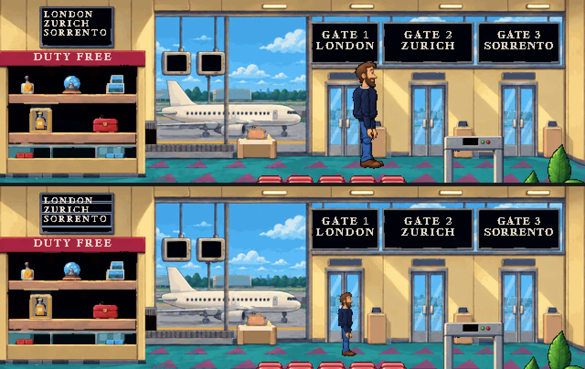

_The Hall at the London gate, before (#68) and after (#70). Top: the shared scale makes him taller than the door. Bottom: the Hall's own perspective, 34 to 64 px. The departures board is mid-flutter in the second shot. Crops of the top 400 rows of the 1280×640 game canvas._

HB2b (#70, merged 23:36, two files) is that measurement. Doors are 41 px tall on a wall at y 85.5, so a 1.8 m man is about 33 px at the wall, and at the walk-to points a step in front he is 34 to 36 px, 0.83 to 0.88 of the door. The carpet's triangles fit a width of 0.261 × (y − 49.5) to within 0.7 px, which makes the front 2.6 times wider than the back, but the carpet is steeper than the objects. The arch (49 px at its baseline) and the seats would need Daniele 1.3 times taller at the front than the doors allow. The agent's own summary is the useful sentence: the carpet gives the direction and the objects set the size. The seats are 27 px, about 0.85 m, and beside them he is 52 px. The arch leaves 44 px clear under its beam, and at the posts he is 44 px, so he just fits. The result is `{ farHeight: 34, nearHeight: 64 }`, and 64 px is 0.89 of the rig's native size, so nothing is scaled up. London (#71) got the same treatment with a table of measurements: a door of 67 px (taken as 2.1 m) is 31.9 px per metre, the counter 30.9, the table top 34.7 and the fruit machine 30.0, so a 1.8 m man is 54 to 62 px, roughly flat with depth. It uses `55` to `66`, within 10% of every measurement where the shared scale would have been off by up to 17%. Zurich and Sorrento keep the shared scale, and a new `OWN_PERSPECTIVE` list in `worldScale.test.ts` exempts only the scenes on it, so Zurich and Sorrento still have to use the shared scale.

Shrinking him to 34 px at the back exposed the next problem, which HB2b measured and left alone because it was engine code. Walk speed was constant at 87.5 px per second, so a smaller Daniele crossed more of his own body every second: at the Hall's gates that is 3.0 walk cycles and 2.6 body-heights a second, against 1.6 and 1.4 at the front. The feet did not slide, because stride scales with depth, but he scurried. E5 (#72, 23:51, +471 / −28 lines in six files) makes speed follow his height at his feet, and front-edge speed is unchanged. The test asserts body-heights per second at the back and front are within 10%, and the measured values are 1.361 against 1.366 in the Hall and 1.206 against 1.210 in Zurich. Vertical movement is now 0.7× horizontal, as in SCUMM, which the PR justifies with the Hall's front-to-gate walk (1.7 s at 1.0, 2.0 s at 0.7, 2.2 s at 0.6). The verb-shortcut pace boost had to be rewritten as walking time over a cap, because speed now varies along a path. E5 also fixed a bug that only depth-varying scale could reveal: the sprite animator divided a pixel total by a per-frame length that shrinks with depth, and skipped ahead in its cycle.

### Contrast, in practice

The Phase R rule (nothing behind Daniele within 0.08 OKLab of his clothes or hair) came along to the painted scenes, and each build agent walked the real puppet across its whole walkbox to check it. What the rule did to the art is the useful part.

- **Zurich (HB1)** was the hardest. The candidate's dull plum wall, brown wood and dark navy view sat 0.03 to 0.08 from the sweater, jeans and hair, and Daniele sank into the room. Worst before the fixes: 100% of his hair pixels over the door and 77% of the sweater over the baseboard and window. The agent's observation was that every rig colour has a chroma of 0.09 or less, so a chroma-rich plum (0.115 to 0.15) is at least 0.09 from all of them at any lightness. That kept the night mood, where lightening the wall had turned the room into a daylight lilac. The wood became honey oak, the door Swiss red and the lake ultramarine. Result: 0 conflicting pixels across 4,042 positions.
- **The Hall (HB2)** failed in 450 of 3,333 poses before any fix, with up to 38% of his clothing camouflaged against the near-black-navy duty-free shop and the blue seat cushions. The seats went from blue to red (a hue rotation, visible in the screenshots above), the awning from brick to crimson, and the large navy-black surfaces to near black. After that, 0 of 3,333 poses fail. The teal carpet is 0.10 from the jeans, which passes, and a global pass on it made blotches, so it was left.
- **Hair against wood cannot pass.** London's floor, wainscot and bar sit 0.02 to 0.08 from the three hair shades, and Sorrento's terracotta wall sits 0.053 to 0.062 from the three brightest of about 40 hair shades (7% of hair pixels; the dominant shades are 0.13 to 0.19 away). You cannot recolour a pub or a kitchen away from brown. Both PRs say the same thing: the puppet's near-black ink outline is what keeps the head readable, and they measure it. In London 95.2% of silhouette-edge pairs are at least 0.08 apart, and the worst pose has 12.6% under. Sorrento's wall is flagged for I3 as it stands. In London the sweater is under 15% in 89% of poses (62 of 1,722 are over 30%, near thin dark shelf bases and stool legs).

Two caveats belong here. First, the hair findings lean on the puppet's outline, and the puppet was recut afterwards (HR1 and HR2, below). That was this post's inference, and HB3 says something close to it ("hair edges without ink are the rig's weak spot"). HR1 and HR2 did re-measure, on an edge metric of their own (below). Second, three agents wrote three versions of the walk: pixels under each body part (HB1), solid 5×5 blocks (HB2), and percentages per body band (HB3). None of the four PRs added a script, and neither did HR1, HR2 or I3a, so the tree still has no single contrast-walk tool to run.

### Review before merge: the orchestrator's screenshots

Every one of these PRs reported green: lint, unit tests, build and the contrast walk. What found the problems was looking at the picture, at ship size, in the running game. The first case is the giant above. The second is the Zurich office, where the orchestrator found four defects in HB1 and HB1b (#73, merged 23:52) fixed them:

- **A posterized window view.** HB1 had recoloured the view with hard lightness and hue thresholds and then pushed remaining pixels out of the contrast ball, so gradients turned into bands and edges into stair-steps. HB1b re-derived the view from the raw plate with a smooth grade, with narrow smoothsteps placed in the gaps of the raw lightness histogram. The sky and lake go to a hue of 272, "the only blue that clears them by more than 0.10 OKLab", and the view now takes about 145 colours where HB1 had given it 90.
- **Dark red and purple fringes.** The raw ink-edge pixels sat inside the hair colour ball, so the wall retint saturated them to magenta and the repel pushed them to red or purple. It was the contrast fix that caused the fringes, not the keying. HB1b gave every object a clean one-pixel ink edge, in a dark shade of the local colour.
- **The CRT word was clipped.** The marquee word is 74 art pixels wide at the smallest size on a 33 px screen, so any moment of the scroll showed fragments. The screen now reads `EXP`, 27 px wide.
- **RESUME overhung its card.** The word is 46 px at the smallest size and the card was 39, and HB1's own PR had listed a 2 px overhang on each side as a judgement call. The reviewer disagreed. The cabinet was rebuilt larger (74×94, and closer to the 0.95× the scale sheet asks for) so the card is about 51 px.

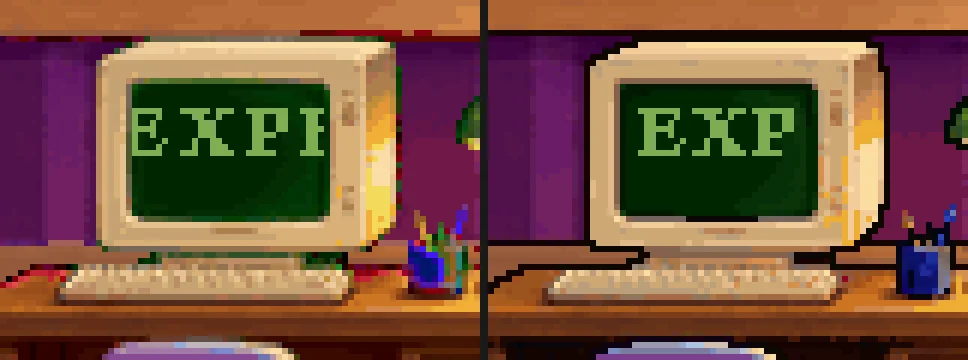

_The Zurich CRT before and after HB1b, at 3× nearest. Left: the marquee word does not fit, so a scroll shows fragments (here `EXPI`), and the retint left colour fringes. Right: `EXP`, with a clean ink edge._

The lesson in the first case is that the metric was satisfied by damaging the picture. "0 conflicting pixels" was true both before and after HB1b. Daniele caught a fifth case himself, the puppet's cut-out seams, and by 23:25 the plan had HR1 in progress with his note ("issues with the character to fix"): seams at every joint, pauldron-like front arms, limb thickness that changes between facings, a small head, merged back legs and a ragged outline. HB7's PR had said the clips "read well on the real parts" and the planted heel slide was 0.00, which is true, and measures feet and not seams. The fix was one silhouette outline, joint caps and recut parts, and it turned out to be the first of two rounds (see [The puppet, in two rounds](#the-puppet-in-two-rounds-hr1-and-hr2)).

Daniele then asked the orchestrator to run its own screenshot QA after every merge. That is his request as relayed to the writer, and it is not visible in git. The trace in git is the wording: from 23:34 on, PR descriptions and plan rows say "orchestrator QA" and "checked in the orchestrator's QA", and a plan commit at 23:35 adds an "Orchestrator QA findings" list. As it was described to the writer, the QA is a Playwright script that runs through the title card, the intro, every scene, every flight, 66 hotspots, the mobile Game Boy view and the console, and takes screenshots for the orchestrator to read. The writer did not see the script and cannot verify the count. Of this update's 13 PRs, four are direct products of review: #69 (a React warning, `disableResize` is not a DOM prop and react-rnd's prop is `enableResizing`, a one-line fix), #70, #73, and #75. The QA also found that a stale generated `index.html` was still preloading the Fredoka font that UI1 deleted, and it was regenerated.

### Conversations, MI3-style (UI2)

Version 1's dialogue was a dark modal box with monospace text, a photo portrait of Daniele, and a strip of key hints (`AdventureDialog`, `DialogOptions`, `DialogPortrait`). The QA pass found that the conversation screen and the welcome screen were still in that look, in a game whose text, art and controls had all moved. UI2 (#74, merged 00:03, +1,883 / −1,406 lines in 34 files) rebuilds both, and it opens with a proposal, as UI1 did.

- **Spoken lines** are overhead text above Daniele in the T3 serif, with the outline and the drop shadow, like the Hall's greeting, and his talk animation plays while he says them. The line stays up until the conversation moves on. It is not split into timed beats, so a slow reader loses nothing. The longest line wraps to three.
- **Choices replace the trunk** in the bottom panel while a conversation runs, as MI3's choices replace its verbs: lines of serif text on a leather page, one colour normally and brighter gold under the pointer or keyboard. They appear when he finishes speaking, or at once if the visitor clicks or presses Enter or Space to skip. The trunk comes back when the conversation ends.
- **Keyboard.** Up and Down move, Enter or Space chooses, 1 to 4 choose outright, Escape leaves. The choices are also real buttons in Tab order, and after a keyboard-only conversation focus goes back to Talk. There is no portrait, no modal box and no key-hint strip. The only hints are a dim "Click to skip" while he talks and a small "ESC LEAVES".
- **The title card** is a boarding pass on the trunk lid. The PR weighed a painted frame, a luggage label and a boarding pass, and picked the pass: the Hall is an airport, the trunk's controls are already boarding passes, and it gives the bitmap serif a natural job at 3× as the logo. The whole pass is the start button. The stub says "PRESS", a space bar that presses itself (steady under `prefers-reduced-motion`), and "to start". The rest of the copy follows the site's voice: the passenger is "YOU (PROBABLY)" and the seat is 1A. It is drawn in code on the 2× art grid, so no image prompt was needed.


_UI2: the boarding-pass title card, and a conversation in the Hall with the second choice under the pointer._

The dialogue copy did not change, and the PR checked it by walking all 37 options of the 22 reachable nodes through the real UI, with no failures. The Game Boy view at 375×812 was pixel-identical before and after in three states. The tests grew to 578 unit and 49 browser tests. One browser test ("hovering a control fills the sentence line") failed once on the first run after `npm ci` and passed on three re-runs, and the PR says so.

Then the QA found what all of that missed. Four minutes after the merge, #75 (an 18-line fix) records that `[data-e2e=dialog-options]` measured 0×0. The choices' rows are absolutely positioned, so the group had no box, and Playwright's visibility check, and the E2E helper built on it, never saw the choices. The rows worked fine when clicked, which is why the browser tests and the walk of 37 options passed. The group now spans the panel with `pointer-events: none`, and only its rows take clicks. The E2E suite has not been run on `v2` since it forked, so this is the kind of bug it would have found, at the very end.

### The puppet, in two rounds (HR1 and HR2)

The cut-out puppet from HB7 took two more rounds of review, and they found different things. The first was Daniele's, from a screenshot of the running game. The second was the orchestrator's, from the fix for the first.

**Round one: seams (HR1, #76, merged 00:13, +2,393 / −885 lines in 52 files).** The diagnosis in the PR is that the seams were not a rendering bug but a consequence of how the parts were made. HB7 (#65) had cut each part out of the generated sheet as its own downscaled crop with an outline all the way round, so wherever two parts met, two ink lines met with them. The cuts also inherited the sheet's noise (pauldron-like shoulder balls, a bulge under the torso, claw hands), and the three facings were cut from three separate drawings, so an arm could be a different thickness from the front and the side. The fix went at the cause:

- **Paint the parts, don't crop them.** `assets:rigcut` now paints each part straight in the drawing's own pixels (`scripts/assets/rigpaint.ts`, +703 lines): limbs are tubes with round joint caps sampled from the clean shaft rows of the sheet. Each part gets a one-pixel ink ring _except at its joint ends_ (shoulder, elbow, hip, knee), where it blends into its neighbour.
- **Ink the union once, at runtime.** The renderer draws the posed figure and then turns every pixel on the edge of the whole silhouette into one solid ink colour (`src/engine/rig/outline.ts`, `RIG_INK`), one art pixel wide at every depth scale and never anti-aliased. A bent knee or a figure scaled down to 34 px keeps one continuous line, and nothing crosses a joint.
- **One body model for all three facings.** A single set of measurements drives the front, back and side, so limb thickness is the same from every direction (there is a test). The proportions moved to what the reference measures: a head of 25.5 of 144 art pixels (1/5.65, where the sheet had roughly 1/7, and bigger in the side view than the front), the hem at half his height, separate back legs 12 px wide with a 2 px gap, and hand-drawn mittens instead of downscaled claws.

The tests are the interesting part, because they measure seams and not feet: every clip is rasterised at 16 phases and the figure must stay one connected piece with each joint inside its parent's image, and no ink line may cross an elbow, a knee or a shoulder. HB7's own check had been a planted-heel slide of 0.00, which was true and said nothing about the thing Daniele had seen. And the contrast rule survived: the share of edge pixels at least 0.08 OKLab from what is behind them went from 0.921 to 0.945 in London and stayed at 0.96 to 0.99 in the other rooms, and the fill colours moved by 0.014 OKLab at most, so no scene needed retuning. That closes the caveat this post raised earlier, that the hair-against-wood findings leaned on an outline that was about to be replaced.

**Round two: "a stiff paper doll" (HR2, #78, merged 00:45, +1,025 / −328 lines in 59 files).** HR1 did what its brief said, and it was still not a character. The orchestrator looked at the merged result in the running game, in all four rooms and at the Hall's far scale, and judged it a stiff paper doll: correct outline, no weight. The plan's character decision now carries a bullet headed "Reads as a character, not a paper doll (HR2)". Whether it does is a judgement from a screenshot, and this post has no way to check it; the PR's own evidence is a set of before and after sheets at ship size and at 6×. The changes:

- **A contour where a limb crosses the body.** An arm in front of a navy sweater used to vanish into it, because both were navy and the ink ring is only on the outside. Each arm now has a sleeve 1.22× lighter than the torso and a lit rim (1.75×) on its left edge, inside the ring and not drawn at the open joint ends, so no seam returns.
- **Proportions and shoulders.** The hem moved from 46.5% to 45% of his height, the torso got longer (54 px), the shin taper lost two of its three steps, the shoulders slope at 45 degrees, the chest narrowed and the hem bloused. The arms leave the shoulders 1 to 2 px clear of the torso, leaning out (forwards in the side view). Height and head are unchanged.
- **Hands are 9×12** where HR1's were 7×9.
- **A living idle.** The idle breathes one pixel over a 3.6 s cycle with the feet planted, the elbows hang 4 to 9 degrees bent (differently on each side), and the weight sways.
- **Pupils stay dark at any scale.** This is the follow-up to Daniele's earlier request that pupils "read black at ship size". Each head's pupils and mouth lines are lifted into an `-ink` twin frame of the atlas (one per mouth shape). The renderer draws the twin into a second scratch canvas, and the outline pass sets whatever it covers to solid ink, the way it finishes the outline. A one-pixel pupil no longer smears over two pixels when the head tilts a degree, and at the Hall's far scale it is still caught.

The breathing turned up a bug. A `stretch` in the rig is inherited by everything hanging from a part, so stretching the torso to make the chest rise moved the feet by up to 1.6 px, and the talk clip's forward lean needed the same fix. The legs and head are now counter-scaled, and torso sways hold the legs upright. The planted-heel check that had read 0.00 for every walk clip would not have seen it. This post's reading is that a walk does not stretch the torso, so the walk clips had nothing to show.


_The front idle in Zurich, before and after. Left: the crop Daniele reviewed (HB7's cut-out). Right: after HR1 and HR2 together, from a 4× capture scaled down to match. The intermediate HR1 state is not shown._

**The contrast trade-off.** Ink colour was the one open decision, and the PR states it plainly. The near-black ink (`[6, 5, 12]`) gains London edge contrast, because a dark outline against a warm brown pub is what keeps the hair readable. It loses a little in Zurich: every edge pair that fails there is ink against the near-black night window. Zurich's all-pairs edge share is 0.958 after HR2 and 0.995 where the scene behind is not near-black, and the arm gap and bigger hands add 18% more edge pixels to fail with. A lighter ink fixes the window and costs London about 6 points. HR2 kept the dark ink. Measured, it was the better half of the trade, and it is a judgement about which room matters more, which nothing in the metric decides. The same metric across the four rooms, before and after HR2, was 0.970 to 0.973 (Hall), 0.922 to 0.931 (London), 0.959 to 0.958 (Zurich) and 0.990 to 0.991 (Sorrento), each from three runs of 15 positions by 13 poses. The Hall's own figure moves between runs, since its plane flies behind him.

### Closing the loop (I3a) and what is left for G4

I3a (#79, merged 00:53, +661 / −1,010 lines in 29 files) is the first half of the final integration task. The other half was the orchestrator's final QA pass, which the plan records as clean. It did four things.

**It paid the debts the earlier updates listed.** The density-4 smooth rendering path is gone from the engine: the display-resolution canvas backing (`backing.ts` and its test), the `Density` 4 value, the smooth iris and dashed route in the renderer, and `data-smooth` in the styles. It was merged at 20:57 (#47), its own follow-up (#52) called it "merged and unused", and it was removed about four hours later. The whole of I3a's cleanup is −1,010 lines. One remnant is left on purpose: the density-4 rules in the asset tooling and the rig packer, because HR2 was still working in those files. The dev-only `?hd=<scene>` preview, its effects demo and the `dev-hd/` stand-ins are gone too. That preview forced the shared world scale onto any scene, so it had been overriding the measured perspectives of the Hall and London, and with it removed the debug overlay shows the Hall at 34 px far and 64 px near again. Two unreferenced images went (v1's 1.4 MB background and a 2.1 MB image nothing referenced). `?debug=scene` and `?rig=placeholder` stay because they are how a person tells an art problem from an engine one.

**The OG image now comes from the real game.** The old script screenshotted the v1 card after a 500 ms sleep, against a hard-coded port. The new one builds into a temporary folder, serves it on a free port, and plays the start of the game in Chromium: title card, Space, wait for the Hall to draw, the intro conversation, Escape, and wait until Daniele stops talking. It waits on the page and not on the clock. Two small hooks were added for this, `data-drawn="hall"` (set by the renderer once every image has loaded) and `data-speaking="false"`. It then screenshots the game window at its full 1292×838 on a 1600×1000 viewport, so the art stays on the 2× grid, and resizes once with Lanczos to 1200×630. The old card component and the config that fed it are deleted. The generated `index.html` is byte-identical to the one before apart from the image's cache-busting hash.


_The new `og-image.png`, generated from the running game (shown here as a lossy WebP, to fit the post's image budget). The puppet in it is HR2's._

**Reachability became a script.** "Information stays reachable" had been checked by hand and in Playwright: 20 of 20 in T2, and again by a later walk. `npm run check:reachability` (`scripts/check-reachability.ts`, +239 lines) now runs it from a fresh page per case: four scenes by seven targets (five sections, GitHub and LinkedIn), 28 in all, and every one is a single click. A section's button walks Daniele to the object, flies him if the section lives in another country, and opens the content by itself, in 0.2 to 3.9 s; a second click during the trip skips to the content in about 0.8 s. The regression checks around it are prose in the PR and not committed scripts: the generated HTML and SEO tags against `profile.ts`, the Game Boy view at 375×812 through every menu entry, and the Win95 shell (every terminal command, `fly` to each room, the Recycle Bin, dragging, minimising and restoring both windows). One finding came out of them that is older than the revamp: `exit` prints nothing wrong but does not close the MS-DOS window, because the Win95 window keeps its own local state that the store never touches. `main` does the same. It was left alone.

**The title card stopped eating the first Space.** A report that the first press of Space sometimes did nothing was chased down properly: pressing at intervals from 0 to 1,000 ms after the card appears always dismissed it. Two real problems were found instead. With slow art, Space dismissed the card into a black scene where Daniele's intro typed over nothing. The card now queues an early start, shows "HOLD ON ... loading..." on the space bar, and starts the moment the art is in (with a 12 s cap so a stalled download cannot lock anyone out). And clicking the sound fitting and then pressing Space toggled the sound instead of starting the game, because the fitting kept focus. A mouse click now blurs it, and keyboard use is unchanged. A third case, Space during the fake Win95 loading bar, is ignored because there is no card yet to start. Three browser tests cover it, taking the count to 52.

**What is left for G4.** The plan closes with a checklist for Daniele, and each item is one that an agent cannot do:

- **Listen to the audio.** Nobody has. Loudness and loop seams were measured, and that is all.
- **Regenerate the E2E baselines.** The plan requires Docker-made Linux snapshots, and none of the machines the agents ran on has Docker, so `npm run test:e2e:docker:update` has not run. It is the last piece of the advisory-CI loan, and it must happen before `v2` merges into `main`, where CI does run E2E. Several PRs from #33 on have said "baselines will change".
- **One content question.** The copy says he is "based in Switzerland" (`profile.ts`, `dialogTrees.ts`), and the Sorrento kitchen is framed as the move to Italy. It is his call, and nobody changed it.
- **A leftovers list** from #79 that it did not delete because something still mentions them or it could not be certain: `public/resume.pdf` (nothing references it), `daniele-static.png` (used only as a reference image in the turnaround prompt), `retro-daniele.png` (650 KB, used only for the 48 px desktop icon and the README banner), the sprite-sheet character and its fallback code path, the v1 and Phase R approved raws and prompts, and `mobile-view-og.png`.
- **Review the branch itself:** the title card, the intro, all four rooms, the flights, every section, and the Game Boy view.

## Engine highlights

The engine work (`src/engine/`; `src/` as a whole grew by about 34,000 lines, of which roughly 15,800 are the font atlases) was the most stable lane, and largely because of two decisions.

**A pure, declarative scene contract.** The engine reads `SceneData` and renders. It does not know what a "pub" is. Scenes are data files owned by build tasks, and the contract tests check every scene: exits point at real entry keys, stand points are on the walkbox, every primary object exists, and every string fits.

**Density as a detected property, not a switch.** When Phase R doubled the pixel density, the engine did not change scene data at all. Positions stay in logical 320×160 pixels. Each image draws at its own density, detected from its size against a table, and objects take their density from their scene's background, so a scene can be switched to 2× in one PR while the others stay at 1×. That is how nine rebuild PRs could land in a row without breaking the game. It also is why the third art direction (640×320 painted) reused the same code path, with only new validator rules (`"style": "painted"`). The exception was the density-4 path built for the first Phase H reading, which added a fourth density value and a display-resolution canvas. It was unused for four hours and then removed (see above); the rig packer and the asset tooling still carry its density rules.

Other pieces worth noting:

- **Slots and folding.** Rows of taps, photo frames and magnets are filled from `profile.ts` at runtime, with a fold sprite in the last slot when entries exceed the capacity.
- **A cut-out rig.** The contract between the packer (`assets:rig`) and the renderer is a single TypeScript file (`src/engine/rigTypes.ts`), merged _before_ the renderer (H0, #46), so both sides could be built in parallel. The renderer (E4 part 3, #52, +2,620 lines) does a joint chain with per-part pivots, then named pose clips (`walk-side/front/back`, `idle-*`, `use-e`, `use-n`, `talk-*`) keyed on angles, stretch and root offset, with **Catmull-Rom interpolation** between keys. Walks advance by distance, one cycle per the rig's measured stride, so the feet do not slide: a `groundLock` keeps the lowest sole on the floor and a `footLock` pins the planted heel exactly through its stance (unit tested, with a slide readout on a clip preview page). Blinks are a 120 ms head swap every two to four seconds, and lip sync swaps mouth-shape heads from the letters of the spoken line (vowels open, o/u round, m/b/p closed). Parts are rasterised on the 640×320 grid with hardened alpha and stamped on whole grid pixels, so the CSS 2× upscale stays crisp. The art arrived with HB7 (#65, 22:30, +2,084 lines in 50 files), and the payoff of merging the contract first is in its description: "No engine changes were needed." Daniele picked candidate 01 of all five part and head sheets. A new `assets:rigcut` splits them into parts, cuts the torso's placeholder neck peg so the head's own neck shows through the collar, finds each limb's joints from its painted cap seams, and scales each facing to stand exactly 144 art px (72 logical). The result is one 208×218 atlas of at most 256 colours and 38 frames, and the planted heel slide is 0.00 in every clip. One request from Daniele shaped the tool: he asked for the pupils to read black at ship size, and the downscale had turned pupils and outlines grey, so `rigcut` sets any output pixel whose source footprint is mostly near-black ink back to solid ink. It touches no other colour. Whether the result is good is a separate question, and HR1 and HR2 (above) exist because the answer was not yet.
- **World scale in data.** Scenes say how tall Daniele is at the far and near edges of the walkbox in logical pixels (`farHeight: 58`, `nearHeight: 72`, E4 part 2, #48), not a scale factor, so the puppet, the sprite sheet, and the art all agree. Since the Hall and London, the numbers can also be the scene's own, measured from its painted furniture (34 to 64 px and 55 to 66 px), and a test keeps every other scene on the shared scale. All four rooms now use the rig, and walk speed follows the same height (E5).
- **Procedural effects and moving props** (E4 part 4, #54). Rain, steam, stars, glints, lamps (chase, alternate, random), and a split-flap flutter are functions of a deterministic hash of the effect's id and index, never `Math.random`, so a scene looks identical on every visit and can be unit tested. Shapes snap to whole grid pixels. Moving props (the bus, the ferry, planes taking off, the cuckoo popping out of its door) are ordinary sprites sliding along keyed paths on a schedule, with easing and a sound played as each pass starts. Because the art is now layered, these are what let the room move without animation sheets.
- **A shared bitmap-font module** (`font.ts`, from T3): `measureText`, `wrapText`, `fitText`, and `drawText` in logical pixels, used by the world text and by the control bar's sentence line, so there is one text renderer for both.
- **No flash on load.** Image preloading starts while the welcome screen is up, and the renderer holds the last frame until the next one's images are loaded (or have failed, so a missing file cannot freeze the game).
- **A dev overlay** (`?debug=scene`) that draws walkboxes, hotspots, interaction points, baselines, slot positions and label anchors, with live warnings and shift-click to copy coordinates. Every build task relied on it, and several PRs mention checking their work there.

## Audio no one can hear

Music is code. Each track is MIDI written as a phrase notation in TypeScript (`A4:.5 C5:.5 F5:1@96 | Bb4+D5:2 r:2`, where each `|` is a checked bar line), rendered by FluidSynth with a MIT-licensed General MIDI soundfont, and encoded to MP3. All four room tracks share one motif, "the boarding call", varied per country: a bossa-nova Hall theme in F major, a music-hall bounce in London, a music-box waltz in Zurich, and a 6/8 Neapolitan tarantella in Sorrento. Sorrento was later re-rendered with the soundfont's real mandolin and Italian accordion (a bank-select patch in the renderer) instead of the General MIDI stand-ins. Ambience and 20 sound effects are synthesised from code by a seeded, deterministic toolkit, and re-rendering yields byte-identical files.

No agent can hear the results, and the plan says so. So the gates were passed on objective evidence:

- **Loudness:** every track measures −20.0 LUFS integrated (ambience −28), and effects are capped at −16 LUFS on playback by a gain table in the engine, with a unit test that fails if the table drifts from the provenance records. The cap exists because a measurement showed the fruit machine at about −8 LUFS and the cuckoo at −10, several dB above the music.
- **Loop seams:** MP3 encoder padding breaks `<audio loop>`, so the engine decodes with Web Audio and loops with `loopStart`/`loopEnd`. Each render folds the reverb tail back onto the start of the loop. The Hall theme is sample-identical across the seam in the WAV, and in the MP3 the seam difference is −33 dB against −23 dB of codec noise. Two different decoders (ffmpeg and CoreAudio) give matching figures.

That is real evidence that the audio is technically correct. It is not evidence that it is good. Daniele has not yet listened to it, and the Gate log says so.

## What went wrong

### Design and direction

- **Three art directions in one day.** The first two came from a human looking at the running game (not from a failing check), and the second was itself corrected by a screenshot of a commercial game. Text and the control bar followed the same pattern on a smaller scale: the Hall's text was cut after a review (T2), the smooth font was replaced after a side-by-side with the reference (T1 to T3), and the toolbar's corner badges were replaced by a new design within 45 minutes of being merged (T2 to UI1). All the agent-side verification, including the review sheets, the OKLab picks, and the contrast walk, passed the whole time. Objective gates are excellent at "is it correct" and silent about "is it right".
- **Delegated picks measured the wrong thing.** See above: layout fidelity to the previous scene is a fine tie-breaker and a poor stand-in for taste. The one gate Daniele kept for himself, HG1, produced the one place the orchestrator's recommendation was overruled.
- **Delegated authority went stale.** The picks were delegated in the morning with the words "until he says otherwise", because Daniele had stepped away. He came back, made the HG1 pick himself at 21:30, and the orchestrator kept picking everything else. It was following the plan as written: the Phase H section said the checkpoint was the exception and "every other gate stays delegated to the Opus orchestrator". So at 21:58 the log has the orchestrator choosing the Hall, London, Sorrento and travel-map candidates for a person who had already returned to the loop. Daniele's reaction, as relayed to the writer (not visible in git), was "shouldn't I decide the picks?" The plan commit at 22:03 says he should: every Phase H pick (scenes, character parts and heads, shared props, UI art) goes to him, with the orchestrator's recommendation and candidates rendered as they will ship, and build agents **stop at the pick and wait**. The delegation had a reason but no expiry and no trigger. Nothing told anyone to re-check it when the person it stood in for returned, and the plan is a document that only changes when someone edits it. It happened to cost nothing, since Daniele kept all four recommendations, but that is luck, not process. And then it went round again: at 22:17 he handed the picks back, in his own words, and the plan was edited to say so. The "Delegated gates" paragraph that the last update called incomplete was rewritten in the same commit, and the old rule is kept in the plan, labelled as the rule it replaces. What he asked for, in his words, is the picks delegated plus a review of the running application. It took two edits of the plan and a wrong claim in this post to get there.
- **Generated art needed more human-scale rescue than the plan assumed.** Multiple build PRs repainted large parts of scenes procedurally, and the character was rebuilt from the anchor. Phase H was a bet that changing the lane (layers and procedural effects instead of pixel cleanup) fixes this. It half paid off. All four rooms were assembled from layers in about 80 minutes (22:16 to 23:38) with no hand-painted pixels, but not without rescue: every build recoloured its plate to meet the contrast rule, resized and re-registered its sprites, and (Zurich) needed a second pass after review to undo what the first pass did to the picture. The work moved from cleaning pixels to grading colour, and the amount of judgement did not go down.
- **One world scale, four cameras.** A single scale constant made Daniele taller than the Hall's gate doors, because a generated plate has its own perspective, and the Hall plate did not follow the scale sheet in its prompt. The agent that built it saw the mismatch and reported it, and followed the plan. The plan was the bug. See [The giant in the Hall](#the-giant-in-the-hall-one-world-scale-four-cameras).
- **Green checks, wrong picture.** Every HB build reported passing lint, tests, build and the contrast walk. Zurich's first build reached "0 conflicting pixels" by posterizing the window view and fringing the edges, and the metric could not say so. The reviewer that caught it was the orchestrator, looking at screenshots. See [Review before merge](#review-before-merge-the-orchestrators-screenshots).
- **The plan's own files drift, every time it moves.** The first version of this post reported that decision 13 and the "Resolution" note in the expansion plan still said 1280×640 while the art spec had moved on. A plan commit fixed that at 21:51 (`469e208`), and the same kind of gap reopens within minutes: the art spec's status tables showed UI1 as `todo` after it had merged, and the blog task and HC5-zurich as `todo` while their work existed. Those were fixed by the next few plan commits, and new ones appeared: the HB2 agent noticed that the plan's example greeting still said "toolbar" (fixed at 23:23), and this post's own paragraph about the picks was out of date three minutes after it was published. The tables are meant to be read against git, and the plan says so, but a reader who stops at a table gets a wrong answer. Every change of direction is a cross-file edit, and cross-file edits get missed.
- **Scope changed under a running agent.** The I1 agent was told mid-task that Phase R was redrawing every asset, so its art items moved to I2, and "an art branch I had started was dropped unmerged" (#43).

### Process and operations

These are from the working sessions rather than from git, so they are reported, not proven by the repo:

- **Agents killed each other's dev servers.** With many agents running `npm run dev` on shared ports, one agent's cleanup could take down another agent's server. The fix was a port policy, plus the standing rule never to stop a process you did not start.
- **File watchers missed events.** Agents that relied on a watcher to notice new files were switched to direct checks (for example, testing for the `DONE` file).
- **`gh pr merge` failed its local cleanup** because `v2` was checked out in the main checkout, which stops `gh` from switching to it after the merge. The merge itself had gone through, so agents learned to verify the merge and delete the remote branch rather than retry.
- **Parallel doc commits forced rebases.** Every agent's PR is rebased onto `v2` before merging, and a plan commit landing in the middle of a batch invalidates every open branch (that is what the plan guard checks). The fix was to batch plan updates: the git log shows single `docs:` commits carrying several changes ("pass G2a; unlocks C1–C4, B1, B6").
- **The Codex orchestrator stopped polling once** and had to be restarted. Long-lived agents that wait are the least reliable kind.
- **A permission check blocked sub-agent merges early on,** which meant a human had to step in until it was sorted out.

### Debts

- **`v2` has not been through E2E since it forked.** Advisory CI was the right call for speed, but PRs #33, #50, and #59 all note that "E2E snapshots will change", #60 changed the E2E selectors, #74 changed the E2E dialog helper, and no baseline has been regenerated. The project's own rules require Docker-generated Linux baselines, so this is a known chunk of work before `v2` can merge into `main`. The 0×0 dialogue group (#75) is a bug that a suite like that would have found. (Correction, October 1: paid on `V2.1`, where 255 E2E tests run in CI against 213 Linux baselines. It is still true of `origin/v2`. See [E2E, finally](#e2e-finally).)
- **Dead code: paid.** The density-4 smooth rendering path, the dev-only `?hd=<scene>` preview (which forced the shared world scale onto a scene and so overrode the Hall's and London's measured perspectives), and the Fredoka text layer are all gone; I3a (#79) removed the first two. What is left of density 4 is its rules in the rig packer and the asset tooling. The leftovers list for G4 (unreferenced files, old raws) is not dead code so much as undecided files.
- **The puppet: paid, in two rounds.** HR1 (#76) fixed what Daniele's review found (seams, pauldrons, limb thickness, head size, back legs, ragged outline) and HR2 (#78) fixed what the orchestrator found next (no contour where limbs cross the body, stiff shoulders, small hands, a static idle, pupils that blurred).
- **Hair contrast leans on the puppet's ink outline** in London and Sorrento. The outline was recut and the edge metric re-measured (London 0.922 to 0.931, Sorrento 0.990 to 0.991 after HR2), but there is still no single contrast-walk script in the tree, and Sorrento's terracotta wall (0.053 to 0.062 OKLab from the brightest hair shades) is still on the QA list with no decision to repaint it.
- **In the Hall, the use-n reach** (towards the duty-free shelf) is not visible in the running game, per HB7's report.
- **Nobody has listened to the music.**
- **The Game Boy view is untouched.** UI2 checked it pixel-identical at three states at 375×812, but it is not part of the redesign, so it will not have the new look.

## The numbers

All from git and the PR list at `1d7b716`, unless stated. Time is local (UTC+2). Where a number changed since the third version of this post (written at `4c1e683`), the old value is in brackets. Commits made after `1d7b716` are not counted.

| What                                                                        | Number                                                                                                                                                        |
| --------------------------------------------------------------------------- | ------------------------------------------------------------------------------------------------------------------------------------------------------------- |
| Commits on `v2` since the v1 merge point (`f5c5897`)                        | 128, all under one author identity [120]                                                                                                                      |
| ... of which carry a `Co-authored-by` model trailer                         | 127: 108 Opus 5.5, 17 Sonnet 5.5, 2 Cursor (UI2 has none) [119: 104, 13, 2]                                                                                   |
| ... of which plan/doc commits (`docs` subject)                              | 62 (59 `docs:` and the 3 blog commits) [57]                                                                                                                   |
| PRs merged into `v2`                                                        | 69 (#9 to #79, excluding two closed test PRs) [65]                                                                                                            |
| PRs per phase                                                               | 20 (foundations and fan-out), 14 (Phase R and integration), 35 (Phase H, including the blog's PRs) [20, 14, 31]                                               |
| PRs in this update (#76 to #79), and how long they took                     | 4, merged between 00:13 and 00:53 (40 minutes); with the plan commits, 8 commits since `4c1e683`: 100 files, +3,929 / −1,971 lines                            |
| Distinct task cards behind them                                             | about 55 (adds HR1, HR2 and I3) plus two unnumbered fixes (#69, #75) [about 52]                                                                               |
| Files changed / lines added / lines removed                                 | 595 / 59,607 / 3,812 [570 / 57,336 / 3,499]                                                                                                                   |
| ... in `src/`                                                               | 179 files, +34,254 / −3,690 (about 15,800 of the added lines are the T3 font atlases) [175 files, +34,063 / −3,447]                                           |
| ... in `scripts/` (asset tooling)                                           | 43 files, +15,528 / −70 (HR1's `rigpaint.ts` and the reworked `rigcut.ts` are most of the growth) [38 files, +13,629]                                         |
| ... in `assets-src/` (prompts, palette, provenance, audio source; ex-audio) | 280 files, +4,032 [269 files, +3,953]                                                                                                                         |
| ... in test files (`*.test.ts`, `*.test.tsx`)                               | 39 files, +8,332 / −389 [37 files, +7,714 / −389]                                                                                                             |
| Unit tests                                                                  | 123 (F1) growing to 606 (HR2's PR), then 598 (re-run for this update, after I3a deleted the density-4 tests), plus 52 browser tests (from #79) [578, plus 49] |
| Provenance records                                                          | 82 (unchanged; checked by `lint:assets`)                                                                                                                      |
| Audio files                                                                 | 29: 5 music, 4 ambience, 20 sound effects (unchanged)                                                                                                         |
| Rows in the Gate log                                                        | 24 (17 orchestrator, 6 Daniele, 1 for the build agents' late-arrival picks) [23]                                                                              |
| Image files in Codex's exchange folder (not in git)                         | not recounted for this update; Codex has nothing left in the plan's tables                                                                                    |
| Wall-clock from first plan commit to last                                   | 14 hours 56 minutes (10:00 to 00:56) [14 hours 8 minutes]                                                                                                     |
| First PR merged (#9) / twentieth (#30)                                      | 13:58 / 15:53 (unchanged)                                                                                                                                     |

Two things to read carefully. First, the tooling (13,000+ lines of TypeScript that turns generated images into shippable assets, measures them, and validates them) was about as large as all the new code under `src/` in the first version of this post. It no longer is: without the 15,800 lines of glyph grids, `src/` has grown by about 18,500 lines, and that includes the scene data, the rig and effects renderers, the trunk, and UI2. Since the last update the tooling has grown while the game got smaller: `src/` changed by +1,117 / −1,169 lines (a net loss of 52, since I3a deleted more than HR1 and HR2 added), and `scripts/` by +2,417 / −588, because the puppet is made by tooling and not by code. Second, "agents" cannot be counted from git: a task card is at least one agent run, but sessions restart, sub-agents get spawned inside sub-agents, and the Codex sessions leave nothing in history at all. Count the 55 task cards as a floor. The trailer counts are what the agents declared, not what git can prove.

## Lessons

**1. Make the plan the API.** Owns lines, `After` lists, `Done when` checks, and a contract in code made most of the parallelism safe. When a task needed something outside its Owns line (`package.json` for a `tsc -b` fix, `knip.json`), the PR said so in one line. The rule "the code wins over the spec sketch" prevented a class of stale-doc bugs.

**2. Make lane boundaries physical.** The Codex lane writes to a gitignored folder and a `DONE` file. It cannot commit, so it cannot break anything. This is much stronger than "please only edit these files".

**3. Front-load the risky serial work, then fan out.** Anchors, a probe, all the prompts up front, and placeholders so the engine lane could start on day zero. The engine ran on box-figure placeholders for the first hour or so, before any real art existed, and then met the real art with the fixes listed above rather than a rewrite.

**4. Delegate objective gates, keep taste gates, and give every delegation an expiry.** The orchestrator's picks were well reasoned and mostly right about what it could measure. It could not see that the whole direction was wrong. The one gate that Daniele reinstated for himself (the HD anchors) defined the final look, and after he came back the rest of the Phase H picks followed, for 14 minutes, until he handed them back. Two rules would have avoided the detour. Make the human taste checkpoint earlier and cheaper: one screenshot of the running game against the reference, at the first Phase 2 merge, would have been enough. And write a delegation as a time-boxed grant that names its end ("until Daniele is back, and the orchestrator asks when it is unsure"), because a plain "until he says otherwise" puts the burden of noticing on the one person who has no reason to check. What he handed back at 22:17 was the picks, and not the looking: "just let me review the finished application". In the two hours that followed, the checks that found the most were reviews of the running game, first the orchestrator's screenshots and then Daniele's own look at the puppet.

**5. Measure, don't argue.** OKLab contrast, layout offsets, loudness in LUFS, seam differences, and a "no text is wider than its panel" test replaced opinions with numbers. The 0.08 rule was written down after a bug, and then a tool was written that found the remaining bugs.

**6. Put the reference in the loop early.** The second correction came when Daniele put a screenshot of the actual reference next to the game, and a reference like that would probably have caught the first one too. It belongs in the plan from day one, in the same folder as the scale sheet. T3 shows the payoff of doing it: the font agent compared seven typefaces against the MI3 crop and hand-tuned individual glyphs, so its output was judged against the reference and not against the agent's reading of it. Whether it passes Daniele's eye is not yet on record.

**7. Don't delete what a human might send back.** T1 removed a pixel font, and the next review asked for a pixel font. T3 then had to build a new one from scratch. Prefer retiring behind a flag until the direction has survived a review. The inverse lesson is in the density-4 path: it was kept "merged and unused" and now sits in the tree as debt, so a flag needs a removal date too. It took about four hours to get rid of.

**8. One writer for the plan, and batch its changes.** Every plan commit invalidates every open branch. The rule "only Daniele changes the plan" (and, later, "the blog writer edits only `docs/blog/`") kept the truth in one place. Batching kept the rebase load down.

**9. Advisory CI is a loan.** It bought speed, and the interest is E2E baselines and any regression the E2E suite would have caught. Log the loan when you take it.

**10. Ask for a proposal before a build, when the design is subjective.** UI1's agent was told to weigh concepts first, and its PR opens with three (a painted strip, a travel kit, a verb coin), a choice, and the reason: the mapping is carried by the controls' structure, not by extra labels, and the verb coin fails one-click reach. It let a reviewer disagree with a paragraph instead of a set of pixels, and it put the rejected options on the record. The cost was one extra section in the PR. Whether the trunk is the right answer is Daniele's call, and no verdict from him is in git yet.

**11. Agents are excellent at exactness and poor at "does this feel right".** Palette-index text grids, OKLab remaps, keyhole walkboxes, and seam analysis are jobs where an agent that cannot see the image still gets it exactly right, provided you give it a text representation and a metric. For "is it Monkey Island 3", you need a person.

**12. A scale is a property of a picture, not of a project.** The plan's world scale was a reasonable default and a wrong rule. Generated plates each have their own camera, and the Hall's doors were 0.7 of the height the sheet asked for. What worked was measuring the scene: doors, counters, table tops, seats and floor patterns give a number in pixels per metre, the comment in the scene file records how it was measured, and a test lists the scenes that may differ. The general form is to write down a default together with the condition under which it stops applying (here, more than about 10% off), and make the build agent's job to measure and not to obey.

**13. Passing checks and a good picture are different things, so review the picture.** Zurich's first build hit "0 conflicting pixels" by posterizing a window view and fringing its edges. The Hall's build passed everything with a giant standing in front of its doors. A person (or an orchestrator) looking at a screenshot at ship size caught both, and a review by someone other than the builder is cheap next to the cost of the build. Daniele's request that the orchestrator screenshot the game after every merge made this a rule and not a habit: four of the 13 PRs in this update came out of review. A check that can be met by damaging the thing it protects needs a look next to it.

**14. Test the way a visitor sees the page, not only the way a test reaches it.** The dialogue rebuild passed 578 unit tests, 49 browser tests and a walk of all 37 options, and its choices group still measured 0×0, which only a visibility check (the kind an E2E suite makes) can see. Clicking a button by position worked. A visibility assertion in the PR's own browser tests is the sort of check that would have caught it before merge. The wider point is the debt named above: the E2E suite treats the page the way a visitor does, and it has not run on `v2` for the whole revamp.

**15. Budget two rounds for anything subjective, and fix the cause in the first.** The puppet's seams came from how the parts were cut (a ring on every part), so HR1 changed how they are made (paint the parts, ink the union once) and did not patch each joint. That cleared the class of defect Daniele had named, and the follow-up review then found a different class: correct, but no weight. A checked-in metric passed both times. The second round came from the orchestrator looking at the result in four rooms, at ship size and at 6×. Plan for the second look, because the first fix creates the conditions for seeing the next problem.

**16. Turn a hand check into a script when it is a promise.** "A visitor reaches any section in one or two clicks" was in `AGENTS.md` from the start and had been checked by hand, twice. `check:reachability` is 239 lines that run all 28 cases from a fresh page each time and print the trip lengths. It is the check on `v2` that the promise still holds, and it is cheap enough to run before every merge.

The next four come from the [October 1 update](#october-1-update-v21-on-the-desktop).

**17. Keep the sources, and a remaster is just a re-export.** The fourth art direction generated no new art. Every approved asset had been cut from a much larger raw, and the provenance rule ("the approved raw candidate is the only thing an asset can be regenerated from") had kept those raws. Scene data in logical pixels meant the remaster changed no coordinates at all. Two decisions from the first morning, both made for other reasons, turned a new look into a script.

**18. A decision made in a chat has to land in the plan, or the plan stops being true.** The plan's authority came from task cards that agents read before working. When Daniele directed Codex one request at a time, nobody's job was to write the decisions back. On `V2.1` the plan still says "never smooth", the bitmap serif, the night office and Win95. The cheap version of the fix is one plan line per accepted request, or a plan that says which branch it describes.

**19. Show options so the person can choose between them.** Three times the human's time went on how the options were shown, not on choosing: HG1's single image in the side panel, interactive layout studies that could not be clicked, and painted concepts that mixed style with interaction until he asked what the options were. An option should be a labelled picture of the thing as it would ship, with one line on how it differs.

**20. "Skip the tests for now" is a loan with a short term.** It was said twice on September 30 (the scene rollout and Windows 98). The result was one CI run with 42 E2E failures, repaid the next morning in one commit. Lesson 9's advisory CI was a loan for the whole branch. A loan that names its repayment ("until I review it") turned out cheap, and the bill came in one run, not at the end.

## What's next

State of play at `1d7b716`: every task in the plan is done, and the branch is at G4. Title card, Hall, London, Zurich and Sorrento are painted from generated layers at 640×320 shown at 2× with hard pixels. The cut-out Daniele walks in them with one clean outline, at a pace that follows depth, and the painted travel map, the shared sprites, the bitmap serif, the travel-trunk controls and the MI3-style conversations are all in. The dev-only preview and the density-4 render path are gone, the OG image comes from the real game, and every section is one click from every scene (28 of 28 in a script). Codex has nothing left in the plan's tables, and neither does the Opus lane. The plan has no open task left except keeping this post current.

What is left is Daniele's, and it is all in the plan's G4 checklist:

- **Review the running branch** (`npm run dev` on `v2`): title card, intro, all four rooms, the flights, every section, and the Game Boy view. The Game Boy view was not redesigned, and I3a checked it only for regressions.
- **Listen to the audio.** Nobody has.
- **Regenerate the E2E baselines in Docker,** which the agents' machines do not have. This is the one item that blocks merging into `main`, where CI runs E2E. (Done on `V2.1` by October 1; see [E2E, finally](#e2e-finally).)
- **Answer the content question:** "based in Switzerland" against a Sorrento kitchen framed as the move to Italy.
- **Decide the leftovers:** `public/resume.pdf`, `daniele-static.png`, `retro-daniele.png`, the sprite-sheet character fallback, the old remaster raws and prompts, and `mobile-view-og.png`.
- **Known and unfixed, also on `main`:** `exit` does not close the MS-DOS window. Also open from the QA list: the Hall's use-n reach is still not visible in the running game, and Sorrento's wall against the brightest hair shades has no verdict.

This post is meant to be updated after every gate, direction change, and landed phase. The next one is Daniele's G4 verdict. If it is a fourth art direction, it will say so.

## September 30 addendum: Codex work and new review directions

This section is a record for later editing, not a settled account of the final design. The earlier sections describe the first V2 pipeline, in which Codex's assigned lane was image generation and Opus's lane handled code and integration. After that phase, Daniele gave Codex separate, explicit implementation tasks. The lane table above is therefore a historical description of that phase, not a restriction on everything Codex later did. The evidence for this addendum is Daniele's project conversations, the `v2` commit history and Codex's asset handoff reports. Conversation requests establish intent; a commit or an inspected result establishes delivery.

### Which OpenAI model made the artwork?

Before the image campaign, Daniele asked which OpenAI models to use for assets and whether they could be used through Codex. Codex recommended named models for exploration and final artwork, then clarified that its built-in image tool did **not** expose an explicit model selector in that chat. The subsequent V2 asset lane used the built-in tool through Codex, not a separately selected model API. The exact underlying image model for those calls is not established by the project record, so an eventual publication should not attribute the generated assets to a specific named model on the strength of the recommendation alone.

The handoff report for Phase H records **129 required candidates in 41 folders**. Two assets were generated before the plan dropped them, so the preserved exchange contains **135 raw PNG candidates in 43 folders**. Each folder has the prompt, ordered references, notes on deviations and a final `DONE` marker. Codex verified counts, file integrity and provenance, and visually inspected the outputs. This marked **generation complete, not artwork approved**: Opus still chose candidates, prepared the layers and integrated them. The two superseded assets are a small, concrete example of an asynchronous orchestrator discovering a plan change after work had already finished. Source: `assets-src/exchange/HD-COMPLETION.md` in the Codex checkout, especially its summary and inventory.

### G4 became another build loop

Daniele's review did not end at the G4 checklist captured above. The next `v2` changes fixed a Hall plane that disappeared behind the window mullion (#81), made the London chalkboard render skill groups from `profile.ts` (#82), and refined the world text after Daniele asked for roughly 10% more readability (#84 and #86). The text work fitted glyphs to the grid, added an edge tone, reduced visual noise behind the letters and checked letter spacing for holes and touches. These changes are logged in `docs/art-spec.md` under G4-1 and T4, and landed before the larger Codex-directed additions below.

**Character likeness.** Daniele said the new character did not resemble his original implementation closely enough. He asked for new movement assets that retained that likeness, then reviewed the actual front and back assembly: it looked unnatural, the legs were too close, and the face was too low resolution. He approved a revised preview and asked Codex to implement it on a feature branch. PR #83 (`c382110`) merged the portrait-faithful animated character into `v2`. This is a distinct later correction to the puppet work described under HR1 and HR2 above. The user was judging resemblance to a specific earlier character, a requirement that seam, contrast and animation tests could not establish.

**Life in the rooms.** Daniele then asked Codex for a businessman, a mother and child with a trolley, and seated passengers in the Hall. He specified that walking guests only needed side profiles, while seated guests needed small looping movements, including one facing the visitor and two facing the window. He required a feature branch, screenshot review and a merge into `v2`. The ambient-passenger work landed in PR #85 (`f0d0cb7`). In parallel, he asked for a separate worktree and branch for a small crowd sitting and drinking in London, again with screenshot review and a merge. Four animated pub patrons landed in PR #87 (`e2f0a4c`). His next review asked to move the table further into the foreground to create depth and replace the fruit machine with a jukebox; PR #88 (`9262d53`) did that. A separate request raised an airport guest's walking speed by 15% in a feature checkout; its merge into `v2` is not established by the commits reviewed here, so do not count it as shipped without checking again.

There was also a delivery lesson after #87 and #88: Daniele still saw the old London scene in the browser. The Codex chat traced this to the checkout serving `localhost:5180`, which had not received the GitHub merges. Synchronizing that checkout made the patrons, foreground table and jukebox visible. The screenshot feedback was valid; the first cause to check was which worktree the running server actually served.

**The ticket and readability pass.** In another Codex task, Daniele described the text across the scenes as hard to read and asked for the opening ticket to be artwork in its own right, with a dynamic Space control over it. He wanted the result to keep a 1992–1996 game feel, and explicitly asked Codex to progress independently, delegate image generation and text work where useful, inspect screenshots until satisfied, and merge only after its own QA. Commit `3737911` on local `v2` records the illustrated boarding pass and readability work, including cleaner dialogue, choice, toolbar and scene text, plus a Safari rendering fix. Its branch was merged into the **local** `v2` checkout and then reconciled with the pub changes in `29feb39`; this is not the same as saying those two local commits were already on `origin/v2` at the time of this addendum. The ticket prompt is retained at `assets-src/prompts/boarding-pass.md`. The task report records lint and build passing, 625 unit tests, 52 browser tests, and screenshot review at desktop and compact sizes; Docker E2E had one timeout, fixed and then passed in repeated targeted checks. Those are reported task results, not a fresh test run for this addendum.

### The latest review reopens the visual direction

Later on September 30, Daniele reviewed the running Hall, Zurich and Sorrento scenes and the content viewer. These are **new requirements and questions**, not changes already implemented in the commits above:

- **Hall duty-free:** the products are hard to identify and visually weak. Daniele questioned whether a product shelf that shortcuts to the same sections as the toolbar is useful at all. Its function should be reviewed before redrawing it. If it stays, the objects need much more legible artwork. This also reopens the earlier post's claim that the shelf was a settled part of the information-access design.
- **Zurich:** the wallpaper and furnishings do not convey Switzerland strongly enough. Asked what the room should represent, Daniele chose a **traditional Alpine chalet**. He wants the interior, furnishings and palette reconsidered while keeping the existing view. This replaces the earlier night-office interior brief as the current direction for the next design exploration; it does not imply a new scene has been built yet. (Correction, October 1: the chalet was built at 19:50 the same evening, in `c84abf5`.)
- **Sorrento:** the large About and Contact labels placed on scene objects feel out of place. Daniele wants a different way for the objects to communicate their roles within the illustrated world. A follow-up question interpreted his wording as a request for 3D; he explicitly corrected that interpretation, so no 3D direction has been chosen.
- **Content presentation:** clicking these objects still opens a black, green-text terminal-style viewer that Daniele sees as leftover from V1. He wants the information to remain dynamic and easy to update, but presented in a way that belongs to the game. Three initial layout studies were offered: a traveller's journal, illustrated object close-ups and a character-led folio. He rejected that set and pointed to _The Curse of Monkey Island_ for the **style and presentation of information**. Do not write that he chose the object-close-up recommendation. The replacement remains undecided. (Correction, October 1: he chose illustrated object close-ups at 18:37 from a second, painted set of options, and they shipped in `c84abf5`. See [Closing the open creative review](#closing-the-open-creative-review).)

The stable content requirement through all of these changes is that editable portfolio text stays in data, especially `src/config/profile.ts`, instead of being baked into generated art. The tension now worth exploring is how to keep the one-click route to important information while making each visible object feel natural and unmistakable in its scene. The old solution, the duty-free shelf plus terminal-like content overlay, is under review; the desired replacement is not yet selected.

## September 30 history review: the Claude Code conversations

This section is raw material for a later edit, not finished prose. It was written on 2026-09-30 in a separate Claude Code session (Opus 5.5), which read the Claude Code conversation transcripts for this project and compared them with the post above, the plan files, git and the PRs. Earlier sections were drafted from git and PR descriptions, and they marked session details as "relayed to the writer". The transcripts let many of those details be checked, some of them corrected, and a few added. The [September 30 addendum](#september-30-addendum-codex-work-and-new-review-directions) above, drafted from Daniele's Codex conversations, covers the Codex side (the image tool, the Phase H counts, the portrait-faithful character, the passengers, the pub, the boarding pass and the reopened creative review). This section does not repeat it. Where the two meet, it says so.

**Sources and how they are cited.** Times are local (UTC+2), and each source tag names a transcript and a time:

- **[S1]** is the Claude Code orchestrator session (`1afb3160`), from 2026-09-28 18:23 to 2026-09-30 18:51. It was compacted once, at 22:08 on the 29th, but the transcript file keeps the full history from before the compaction. It spawned 59 sub-agents, and each one has its own transcript. For those, this review read the brief and the model the runtime recorded, not the full working log. Their internal findings still come from their PRs.
- **[S2]** is a parallel Claude Code session (`791b70ba`), from 2026-09-28 18:37 to 19:05, about the asset pipeline.
- Git and the PRs, as in the rest of the post.

In [S1], Daniele typed 47 messages (4 of them "Try again") and queued 7 more while the orchestrator was mid-turn. He typed 6 in [S2] and answered 10 batches of multiple-choice questions. Quotes are as he typed them. Each item below says whether a thing was **requested** by Daniele, **proposed** by an agent, **shipped**, or is still **open**.

### What the transcripts correct

These are claims in the sections above that the transcripts contradict or make more precise. They are listed first so an editor can find them.

1. **The trigger for Direction 2 (Phase R).** The post says Phase R followed a review in which Daniele said the proportions were off, the text was hard to read, and it was "Monkey Island 2, not 3". That review came later, at 20:43, after Phase R had finished, and it triggered Phase H, which is why the Phase H commit at 20:46 lists the same three complaints. What started Phase R, at 17:32, was a different request: the style "looks very 89-90s", he was "aiming more at a 'remastered' version of those games, with sharper looks while maintaing the same atmosphere", and "without changing anything about the strategy or the vibe" [S1 29 Sep 17:32]. The 2× Sorrento screenshot in the Phase R section was attached to the 20:43 review. It was his verdict on Phase R, not its cause.
2. **The first art direction was an agent's choice.** On the 28th the orchestrator asked whether to target "a 320×200 look scaled up, or the current 1280×640", and Daniele answered "you decide". The agent chose true 320×160 pixel art on a fixed palette at 4×, arguing that it "forces real pixel art" [S1 28 Sep 18:31–18:32]. Direction 1 came from that delegated decision, not from a brief of his.
3. **The smooth reading of Phase H was a recommended option he accepted.** After the 20:43 review the orchestrator asked three questions. For the look it recommended "HD hand-painted", described as "at the full 1280×640 display resolution. No pixel look, no palette limit", against "very high-res pixel art". For the text it recommended "crisp text at full screen resolution, in a bold, legible font". Daniele took all three recommendations, including the cut-out puppet [S1 29 Sep 20:45]. The two artefacts the post calls dead code (the density-4 path and T1's Fredoka) came from those options. They were not his wording, and 29 minutes later he rejected their result.
4. **"The art provides containers" came from his question, not from the prototype.** The post says the prototype "paid for itself by producing a rule". In the transcript, the rule is the agent's answer to Daniele's question during the asset inventory: "we might need to update the skills, we might need to update with new jobs on our resume. How does this concept allow to easily extend that." He then asked for it to be "embedded in the plan" [S1 29 Sep 12:54–12:57].
5. **"No task ever calls a model API" was his correction.** In [S2] the agent first recommended pixel-art tools (PixelLab, Retro Diffusion). When Daniele said he had "only have access to Anthropic and OpenAI models", it recommended named OpenAI image models called through the API, via an `npm run assets:generate` script. It also said Codex should use only that script and not "a built-in image tool". Daniele replied: "I will not use any openai API, only codex, so I always need a prompt, not a npm script" [S2 28 Sep 18:54]. The agent agreed and rewrote the spec around Codex's built-in tool, prompt files and a one-off batch. Like the Codex addendum, this does not establish which image model Codex's tool used. The models named in [S2] were a recommendation for a route that was then dropped.
6. **The early merge problem was solved by the orchestrator, not a human.** The post says a permission check blocked sub-agent merges "which meant a human had to step in". The orchestrator reported that the foundations agent "was blocked from merging by a permission check, so I merged its three PRs myself" [S1 29 Sep 14:01].
7. **The Sonnet rule was an instruction, and its scope was a correction.** The post says `718d0f5` "does not give a reason". Its source is Daniele: "make it a rule to always use sonnet 5.5 for subagents unless I tell you otherwise" [S1 29 Sep 21:46]. He gave no reason in the transcript either. The orchestrator saved it as a cross-session memory. Daniele corrected it 24 seconds after his own message, while the orchestrator was still working: "no, this preference should be for this plan only". The memory was deleted and the rule kept in the plan. His later request for screenshot QA after every merge was saved as a memory and is still there. So the two standing rules from that evening ended up in different places, on purpose.
8. **Propose-first for UI1 was requested, and so were its concepts.** Daniele asked for the toolbar task "to come up with a proposal and execute it" on "a opus 5.5 subagent" [S1 29 Sep 21:34]. The three concepts at the top of UI1's PR (a painted strip, a travel kit, a verb coin) are the three examples in the orchestrator's brief [S1 29 Sep 21:35]. The agent weighed them and chose, but it did not come up with them. Lesson 10 should credit the brief.
9. **"Pupils that read black" was a recommended option.** The post says Daniele "asked for the pupils to read black at ship size". The orchestrator offered "01 for all, punchier eyes (Recommended)", with "a contrast boost so the pupils read black", and he chose it [S1 29 Sep 22:07].
10. **"Until he says otherwise" was the orchestrator's framing.** Daniele wrote "I want to remove myself from the loop" and "do not wait for my feedback" [S1 29 Sep 13:28]. He said nothing about gates. The orchestrator read that as authority to pass the palette, anchor, motif and pick gates, and wrote the delegation into the plan (`bb880a0`, 13:28). It kept G4 for him on its own initiative. The stale-delegation lesson stands, but the wording that went stale was the agent's.
11. **"Nobody has listened to the music" is out of date.** At 18:24 on the 30th Daniele gave the first recorded human verdict on the audio: "Swiss music needs to be something more recognizable, something like a yodel or something else very Swiss. Also the London music feels very generic and not recognizable." [S1 30 Sep 18:24]. See below for what followed.
12. **The planning began the day before the first commit.** "Every commit falls between 10:00 on 2026-09-29 and 00:56" is true of git. The framing, the prototype and the first asset-pipeline discussion happened on the evening of the 28th, in [S1] and [S2].

### 28 September: framing, the prototype and the pipeline question

- **`AGENTS.md` by questionnaire** [S1 18:23–18:28]. Daniele asked for the essence of the project, concise, gathered "from the code base and from myself". The agent asked two batches of questions with no recommended options. His answers: the audience is recruiters and hiring managers and also engineering peers ("It should show the craft. But also impress with creativity"). When the game gets in the way, "Info reachable, game on top". The non-negotiables are period authenticity and humour. He wrote the goal of the revamp in his own words: separate scenes and real assets instead of "a single background image that contains everything". The agent left out a "built with AI" angle because he had not picked it. He then declared the `AGENTS.md` work done and said not to link the plan from it.
- **The first feature list** [S1 18:29–18:32]. It was proposed by the agent: nine features and three open questions. Daniele answered "you decide" on the verb shortcuts, "no map for the MVP", and "you decide" on resolution (item 2 above).
- **The prototype** [S1 18:33–19:16]. Daniele asked to be shown "a prototype of how a new scene could look like". The agent built it with its prototype skill and tested it in the browser pane, which throttled animation to about 2 frames a second. Daniele asked "so what actions you need from me? just pick a room?", chose "B's vibe, with C's depth", and asked what "depth" meant before agreeing. The agent's answer (draw objects in the order they stand on the floor, by baseline) is the origin of the depth-sorting rule in the plan.
- **The pipeline question, in parallel** [S2 18:37–19:05]. Daniele asked how to run the asset pipeline, which models to use and which prompts to write. The model route is item 5 above. He then asked for the art spec to be written for Opus 5.5, in stages "we can parallelize". Next he asked how to hand it "to both Opus for the Opus parts, and to Codex for the OpenAI parts". After his API correction, he asked for a document that is "executable by agents", with stages "marked explicitly" as parallel or sequential. Two of the agent's suggestions were dropped: an optional `codex exec` shortcut, which it flagged as untested, and Daniele pasting "Execute task {ID}" into a fresh session per task. The orchestrators replaced the second. The two sessions noticed each other: [S1] saw `docs/art-spec.md` appear while it worked and asked whose it was [S1 19:04].

### 29 September, 09:44 to 12:33: a stall, and a plan written elsewhere

Daniele's next message said to settle the creative direction and the scenes first, and only then plan the build and the assets. [S1] answered it with "You've hit your org's monthly spend limit". He tried again at 09:45, 09:56, 10:02 and 12:33, and the session came back at 12:34, nearly three hours later. The first commits on the revamp landed during the stall: `14c05cf` (10:00, the plan and art spec with the `v2` trunk workflow) and `95693b7` (10:02). They were not made in [S1]. When it resumed, [S1] said that "someone else is also editing the prototype files and the plan (the plan now has a `v2` branch workflow)". The `Co-authored-by: Cursor` trailer on `14c05cf` is the only record of how they were made. No Cursor conversation was available to this review, so this section says no more than the trailer does.

### 29 September, 12:34 to 13:02: the creative direction, requested and proposed

- **Rejected: a Swiss home.** The agent's first sketch was "Daniele's home in the Swiss Alps, at night", with three rooms (a living room, the office, a workshop) [S1 12:34]. Daniele replaced it: each scene should be a tribute to one of the three countries he has lived in, in order (London, Switzerland, Italy), because "I'm actually relocating from Switzerland to Italy. So I don't want to create an excessive emphasis on Switzerland" [S1 12:35]. **Requested.**
- **The agent's second sketch** proposed the London pub ("skills on tap", a nod to the SCUMM Bar), the Zurich office, an Italian terrace, and the _Fate of Atlantis_ travel map [S1 12:36]. **Proposed.**
- **The Hall and the kitchen are his.** He added "there should be a 'hall'", the entry point from which you can visit each scene and jump to sections, and replaced the terrace with "a kitchen in Sorrento overlooking naples and ischia". He asked for the decisions to go into `docs/expansion-plan.md` as the source of truth, and for no code yet [S1 12:42]. **Requested.**
- **"No map" was reinterpreted.** To fit the travel map, the agent changed the plan's "no map" line to exclude only a _navigable_ map, and reported the change [S1 12:44]. Daniele did not object, and the map shipped, but his "no map for the MVP" from the day before was narrowed by the agent and not by him.
- **The airport.** The agent offered a railway station, a front hallway, or an airport. Daniele asked to settle it "in writing" without a prototype and suggested the airport himself. The agent then recommended it, reversing its own earlier view that it was the least period-true option, and proposed the duty-free shop and its jokes [S1 12:46]. The airport idea is **requested**, and the duty-free shelf is **proposed**. The Codex addendum records that he has since questioned whether the shelf is useful at all.
- **The section mapping was argued, then confirmed.** Daniele's example was London for skills, Italy for the resume and Switzerland for contact, and he asked for a journey diagram. The agent argued against his example ("the resume is your past, but Italy is your future") and proposed the mapping that shipped, together with five signposting rules: gate signs and map labels that name each country's sections, an arrival line, a prominent primary object, and the toolbar and shelf listing sections [S1 12:48–12:49]. He replied "confirmed". Six hours later, the text those rules put on screen was what he called "an overdose of text" (T2). The rules he confirmed and the text he rejected are the same rules.
- **Where each job lives.** His mid-turn note, "Tray is London, all past experiences are in London", fixed which employers belong to which room. In the same reply the agent flagged that `profile.ts` differed from his LinkedIn profile in two job titles and in his location, and left it alone because no code was to change yet [S1 12:43–12:44]. That is the first appearance of the "based in Switzerland" question that is still open at G4.
- **The decision log.** Of the 19 single-choice questions where an agent marked a recommendation, from this batch through the Zurich layers at 22:14, he took the recommendation 18 times. The exception is HG1's Zurich 04. Where he wrote his own answer instead of choosing, it changed the direction: the country tribute, the Hall, Sorrento, the airport, extensibility, and every art-direction review.

### 29 September, 13:02 to 13:41: the orchestration model came from him

- **Requested:** a rewrite of the art spec "to be handed over to an agent orchestrator", with one orchestrator per model family, so that "we can generate as many assets in parallel", and with anything sequential "lifted up" before the fan-out [S1 13:02]. Then whether the plan makes `v2` clear as the trunk, and a worktree per orchestrator "so they can generate and make modification without potential conflict" [S1 13:12]. Then how to keep the plan in sync, with docs pushed to `v2` and agents pulling first as "our source of truth" [S1 13:14]. Then, mid-turn, an Opus 5.5 sub-agent for the foundations, and automated merges into `v2` that resolve conflicts [S1 13:16].
- **Proposed by the agent:** the five-rule sync protocol (read the plan with `git show origin/v2:`, record `Plan read at <sha>`, a CI plan guard) and a merge strategy with auto-merge, branch protection, required checks and repo settings applied through the GitHub API [S1 13:15–13:18].
- **Rejected by Daniele:** the settings. "I don't want too much friction… the rule is agents never touch or commit to main" [S1 13:24]. The agent changed no repo settings.
- **Requested:** to be taken out of the loop (item 10), and then that the Codex orchestrator should keep polling. The spec at 13:08 had him restarting Codex after each gate, so polling was his change [S1 13:28–13:31]. Then "ignore CI checks and end-to-end tests as they belong to the version if main we are not interested into" [S1 13:39], which became `c3ecbd4`.

### 29 September, 14:00 to 20:12: delegated gates, and what the agents recorded

- **Models, from the runtime.** Every sub-agent the orchestrator spawned before 21:40 was requested as `opus`, and its transcript records `claude-opus-5-5`. From the blog writer at 21:41 on, it requested `sonnet`, and the transcripts record `claude-sonnet-5-5`. The count is 38 Opus and 21 Sonnet sub-agents. This agrees with the `Co-authored-by` trailers wherever both exist. It also fills the one gap: UI2 (#74) has no trailer, and its transcript records Sonnet 5.5. When it launched the blog writer, the orchestrator told Daniele that "the Sonnet available to me is Sonnet 5". He corrected it ("sonnet 5.5 is available"). The orchestrator then said that its tool picks a model family, not a version, and that it could not check which version it got. The transcript shows Sonnet 5.5. A model's statement about its own tools was wrong here, and the runtime record settled it.
- **Its own limits, stated.** Before GA it told Daniele "I can't hear audio", and it logged the motif as "Daniele to listen" [S1 14:01]. It noticed that a watcher had missed events and began checking folders directly [S1 18:53]. It also reported intermittent SSH push errors [S1 15:17].
- **Phase R already named MI3.** When it accepted the remaster, the orchestrator described the target as "closer to _The Curse of Monkey Island_'s hand-crafted 640×480 era" [S1 17:34]. It built it as palette-limited pixel art. So the reference was named in the loop three hours and forty minutes before the correction. What changed at 21:14 was that Daniele put an actual MI3 image next to the game. Lesson 6 could say this: naming the reference was not enough, and seeing it was.
- **The first look was a dead server.** Daniele asked to see the dev server "so I can start peaking arund" [S1 20:08] and four minutes later wrote "its not running". The server had been on port 5173, the port the I2 agent used for its own checks, and the orchestrator concluded that I2 had "almost certainly stopped it as collateral damage". It moved his server to 5180 (the `.claude/launch.json` change still uncommitted in his checkout) and told I2 never to stop a process it did not start [S1 20:13]. This is the "agents killed each other's dev servers" item under Process and operations, as the human saw it.

### 29 September, 20:43 to 21:31: Phase H, the correction, and a checkpoint that nearly failed

- **20:43**, with a screenshot: "two immediate issues: 1. proportion of the characters are off, 2. readability of text is extremely poor", and "I would expect a Monkey Island 3 style not a Monkey Island 2". The orchestrator paused I2 and asked the three questions in item 3.
- **20:57**, with a screenshot: "there is an overdose of text in the airport scene, we need to leverge more the toolbar, and keep text here more minimal". The corner badges and the lit buttons were **proposed** by the orchestrator in reply. This is the source the post described as "relayed to the writer".
- **21:14**, with an MI3 screenshot: "the text is too smoth and breaks the style: curse of monkey island should be your reference in regards of pixel sharpness of images assets and the text". The orchestrator's diagnosis was that MI3 is painted art on a crisp 640×480 grid, and that the remaster "had the right pixel density but the wrong style, flat and palette-limited like MI2" [S1 21:15]. Daniele then asked whether Codex needed new instructions. The answer was no, because only the preparation of the images changed. But the orchestrator also noticed that Codex had not started HC1, and Daniele restarted it: "restarted codex, it's polling again" [S1 21:16–21:19]. That is the "stopped polling once" item.
- **HG1.** The orchestrator's first presentation showed only one of its three images in the side panel. Daniele wrote "not sure I understand what to review as I see only 1 option for zurich and 1 for character" [S1 21:27]. It re-sent labelled sheets and asked. He picked Zurich 04, which the options described as "the most atmospheric, but busiest", over the recommended 01, and Daniele 01. The one gate he kept nearly failed because of how it was shown, not because of what was shown.
- **The stale delegation, announced.** Right after HG1 the orchestrator wrote: "Unless you'd like to see them first, the remaining picks stay delegated to me, as before" [S1 21:31]. So the stale grant was stated to him and not only implied by the plan. It was acted on when he asked "check on codex progress" at 21:57: the orchestrator picked all four scenes and launched four Sonnet agents in the same reply. His "shouldn't I decide the picks?" came three minutes later. The orchestrator answered "Yes, you should", paused the two agents working from its picks, and asked. He chose the same four [S1 22:00–22:02].

### 29 September, 21:34 to 22:41: the blog, "I'm lost", and the hand-back

- **The blog is his request** [S1 21:40]: a Sonnet 5.5 sub-agent, "for an engineering audience", and "updating that blog post with new decisions is part of the requirements of the plan itself". The orchestrator kept his MI3 reference image out of the post because it is from a commercial game.
- **Between the picks and the hand-back**, a queued message: "im lost on progress, what should I review? I don't see any of the new assets in the local dev server" [S1 22:05]. The orchestrator replied with a table: the running game showed the new font and the trunk, and the rooms were still the old pixel art. It then asked for the props and puppet picks. Eleven minutes later came "I will delegate control and choices of artwork back to you, just let me review the finish application after you are done" [S1 22:16]. The transcript does not say why. In order, what happened was: he was asked to judge candidate sheets, he could not see them in the game, and then he handed the picks back and asked for the finished game instead.
- **22:40:** "108 of 135 candidates are now complete and checked from Codex. Can we already select the best one and move on so we don't wait for Codex?" This is the source of the request the post relays under 18241eb. The 135 matches the Codex addendum's count of raw candidates.

### 29 September, 23:24 to 00:56: review becomes a rule

- **The puppet.** Two zoomed crops and "issues with the character to fix" [S1 23:24]. The orchestrator listed six defects. The post has them.
- **The QA rule.** "make sure to continue QA by yourself as you make progress on the scenes, take screenshot and find issues/bugs as the progress continues" [S1 23:27]. The first scripted run stalled on the title screen [S1 23:30]. The orchestrator's own report gives the script's coverage as the title, the intro, every scene, every flight, 66 hotspots, the Game Boy view and the console [S1 23:35]. The post could not verify the 66. It is the orchestrator's claim, and the script is still not committed.
- **"A stiff paper doll"** was the orchestrator's verdict on HR1 [S1 00:15], and HR2's brief follows its list. **Proposed and shipped.** "Budget two rounds" (lesson 15) is supported: the second round came from the orchestrator, as the post says.
- **Docker.** At 00:48 the orchestrator reported that Docker is not installed on this machine, so the E2E baselines could not be regenerated. The item went on the G4 list.

### 30 September: Daniele's G4 review, from the Claude Code side

- **09:43**, with a screenshot: "there is a bug where the departing plane hides behind this frame of the window but doesn't appear after it". A minute later, queued: "2nd bug - skills should be written on the chalkboard". The orchestrator fixed the plane itself (#81) and delegated the chalkboard (#82). The chalkboard is a reversal: T2 had cut the board down to its "SKILLS" header under the minimal-text rule, and the plan now carries an exception for it. **Requested and shipped.**
- **A collision in his checkout.** When the orchestrator tried to pull #81 and #82, it found uncommitted work in Daniele's main checkout that was not its own: a portrait-based rig script, a new prompt file, and regenerated puppet parts. It left them alone, did not stash or pull over them, and told him that his server on 5180 was serving that work in progress. Its scripted QA also failed partway through, and it could not tell whether the new rig was the cause [S1 10:01]. That work became #83, from the Codex side (see the addendum). The plan's rule that no agent writes in the main checkout governed this plan's agents. Another session working with Daniele did write there, and the orchestrator's rule to leave files it had not made untouched is what stopped a collision. It pulled at 11:08, once #83 and #85 had merged. The addendum's stale London on 5180 later that day is the same class of problem: the server the human looks at is only as current as its checkout.
- **10:01**, with a screenshot: "the style of the text is fine - but I still think is pixellated in a way that makes it difficult to read … Is there a way to maintain the style/retro but make it 10% more readable?" The orchestrator put the problem in the conversion, not the style: stems of uneven width, broken diagonals, rounded spacing and busy grounds. It proposed grid fitting, one edge tone, spacing and quieter grounds, with a finer text grid held back as a fallback. T4 tried the finer grid and rejected it because "it no longer looked like the rest of the game". The orchestrator's review then caught gaps inside words ("Welco me", "Da niele") in T4's result, and #86 fixed them with a test over every letter pair [S1 10:02–11:09]. The addendum names #84 and #86; the rejected alternative and who caught the gaps are recorded here.
- **18:24, the audio.** After the verdict quoted in item 11, Daniele asked for London "some tune that maybe hints at some very classic bridge song thinking like the beatles or the clash for example". A3 (#89) wrote London as a 1964 Merseybeat-style cover of "London Bridge Is Falling Down", with a quote of the game's shared motif. It wrote Zurich as an alphorn call on the start of the Ranz des Vaches, then an original Ländler with a yodel-like clarinet and ocarina section. The orchestrator offered a punk and ska London as "a quick swap". When it reported at 18:52 it wrote "Nobody has heard them yet": the checks were loudness, loop seams and a test that the two traditional tunes are note-for-note. It flagged the yodel slides, the French-horn alphorn, and a Ranz des Vaches read by eye from an 18th-century engraving. **Shipped, and not yet heard.** Then, at 19:06, A3b (#91) made the punk and ska version London's music in the game, because, in the PR's words, "Daniele wants to hear the alternative". It is a late-70s punk arrangement of the same public-domain tune that slides into half-time ska. The PR lists the Clash figures it deliberately avoids. The Merseybeat cut stays in the repo, unused, as a one-line revert in `src/config/scenes/london.ts`. The checks are measurements again: −20.0 LUFS, a seamless loop, and a note-level test of the tune.
- **Also on `origin/v2`:** `7515155` (committed at 18:52, with no model trailer) carries the readability and boarding-pass work that the Codex addendum describes as merged only into local `v2`. This review did not compare it line by line with the local `3737911`.

### Still open, as of this review

From the Claude Code side, in addition to the Codex addendum's list (the duty-free shelf, the Alpine chalet, the Sorrento labels, the content viewer):

- Whether the new Zurich track and the punk and ska London (#91) work by ear, and whether London keeps that cut or goes back to the Merseybeat one kept in the repo.
- "Based in Switzerland" against the Sorrento framing. The mismatch was first flagged at 12:44 on the 29th and has not been decided.
- The Docker E2E baselines, which now also cover the new text, the character, the chalkboard, the passengers and the pub.
- The leftovers list from #79.
- Whether the orchestrator's QA script should be committed, since the post's 66-hotspot figure rests on its own report.

### What this review could not see

- **Daniele's Codex conversations.** They are not in the Claude Code history, and the Codex addendum is the record for them.
- **Whatever made `14c05cf` and `95693b7`.** There is no transcript, only a Cursor trailer.
- **The sub-agents' full working logs.** Only their briefs and recorded models were read here.
- **The images Daniele attached.** Eight appear in [S1]. They are described here, not reproduced, and one of them is a screenshot from a commercial game.
- **Two short Claude Code sessions today that tried to start this same review.** Both were interrupted before doing anything.

## October 1 update: V2.1 on the desktop

This section covers `c40af23..acc62ce`: 32 commits (24 of them not merges) on `origin/V2.1`, from 18:50 on September 30 to 11:49 on October 1, and PRs #92 to #94. It was written in a Claude Code session (Opus 5.5). Four research sub-agents gathered the material from git, the PRs, and Daniele's Codex and Claude Code transcripts for the same window. When Daniele asked for this update, he described the desktop as about 95% done and the mobile experience as still in progress. That description is his, given to the writer, and is not recorded in git or in a transcript. So this section treats the desktop as nearly settled and the mobile work as unfinished. Where the new history contradicts an earlier section, it says so under [What this corrects](#what-this-corrects).

**Sources.**

- **[C]** is a Codex session, cited by session-id prefix and local time. The runtime metadata records `gpt-6-astra` at high effort for every Codex session cited here.
- **[CC]** is a Claude Code session, cited the same way, with the model named from its transcript.

Times are UTC+2.

### Who did what

The split between the tools changed again, and git shows only part of it.

- **No declarations in git for the Codex work.** None of the 14 non-blog commits from September 30 has a trailer or a commit body. Neither do `d268c6a`, `ed148e6`, `87e2ed9` (#94) or `d715c52`. The transcripts show that these were made in Codex sessions. Several of those sessions spawned sub-agents of their own: three for the scene rollout, three for the remaster, and one for the Windows 98 windows.
- **The Claude Code work** in the window is #93 (preloading and WebP), the travel-map origin fix (`52d9b09`), the size budgets and the docs. Each carries a `Co-Authored-By: Claude Opus 5.5` trailer. The rest of the Claude Code work is this post's own commits.
- **The art.** Its provenance records say `source: codex` and its prompts say "built-in image generation". As before, the project record does not name the image model behind that tool.

**Where the branch lived.** `V2.1` itself was checked out in a Codex worktree (`~/.codex/worktrees/50c8`), and the Claude Code sessions on October 1 worked around it. The preload session left that checkout alone and worked in its own. The travel-map session checked that the Codex checkout had no uncommitted changes, then fast-forwarded it in place [CC 23f30fea 11:03].

**No PRs on September 30.** That evening's work went straight onto `V2.1`, with no PR per change. PR #92 (`V2.1` into `main`) opened at 22:27 and was the only place to review it. On October 1, two PRs (#93 and #94) targeted `V2.1`.

**No orchestrator.** There is no orchestrator here in the sense the earlier sections use: no task cards, no Gate log, no `Plan read at` lines. Daniele directed each Codex task himself and restated the rule each time: "verify it yourself with QA and screenshot and then merge back into V2" [C 01a0f32a 18:33].

### Closing the open creative review

The [September 30 addendum](#september-30-addendum-codex-work-and-new-review-directions) ended with four open questions. All four were settled in about 45 minutes, in one Codex session that gathered requirements before writing any code [C 01a0f31e 18:20–19:04]. They shipped together in `c84abf5` (19:50, 117 files, +1,681 / −881). Three Codex sub-agents worked on the scenes in parallel, while the root agent built the new viewer. Daniele's instruction was: "Use subagents to carry out these changes in parallel on each scene, skip worrying about e2e tests until the work is completed" [C 01a0f345 19:31].

**The content viewer.** It took three rounds.

1. Codex's first three layout studies were the traveller's journal, object close-ups and character-led folio that the addendum names. They were interactive pages that he could not interact with in the side panel: "I cannot interact with the layout to inspect the options" (18:27). Re-rendered as images, they were rejected, and he pointed to _The Curse of Monkey Island_ for "style and presentation of informations" (18:28).
2. The second round was three painted concepts, and he could not tell what the choice was: "I can see three images but I don't understand what are the options" (18:36). Codex said it had mixed up the visual style with the interaction, and restated the options as Daniele talks to you, inspect the object, and open a shared book.
3. He chose the second at 18:37. A limoncello close-up was built as a preview first. Its text was "barely readable" until it moved to larger, darker book-style type (19:01 to 19:04).

What shipped is `ObjectInspectionView`:

- A modal with a painted backdrop on the left and real HTML text from `profile.ts` on the right.
- Paged: Experience is ten pages, a summary and one per job.
- A focus trap. Escape closes it and the arrow keys turn the pages.
- `TerminalScreen` and its content file are deleted (679 lines).
- Five section backdrops:
  - About: a postcard album on the Sorrento table.
  - Contact: a telephone and an address book.
  - Experience: a career album on the chalet desk.
  - Resume: a document folio.
  - Skills: a leather tool roll on the pub table.

**The duty-free shelf.** Codex recommended keeping the shop as something to explore, and removing its five section shortcuts. Daniele agreed and suggested what to put there instead: "a limoncello bottle, a swiss army knife, a swiss cheese, a phone booth suvenir" (18:43). Each souvenir opens its own close-up with joke copy (`souvenirs.ts`), and none of them leads to portfolio content. "Eau de Résumé" is gone.

**The toolbar opens content in place.** That recommendation also changed what a boarding pass does.

- **Before:** a section click walked Daniele to an exit and flew him to the section's city. The content opened on arrival, and these are the 0.2 to 3.9 s trips that `check:reachability` measured.
- **Now:** the content opens at once, in the current room. The comment in `Toolbar.tsx` says "Gates remain the way to travel between scenes."

**Sorrento's labels.** The engine-drawn ABOUT and CONTACT labels are deleted. Two edits to the plate add a postcard on the fridge and an address book by the phone. The hover names carry each object's role, for example "postcard on the fridge — about me".

**Zurich becomes a chalet.** The requirements came first: "Traditional Alpine chalet", changing "Interior, furnishings and palette; retain the view" (18:22 to 18:23).

- The plate and every sprite were regenerated, with honey pine panelling, limewash, beams and a wool rug. The moonlit view was kept.
- The six job-photo slots (`jobs:switzerland`) are gone, replaced by one Experience hotspot. So one of the plan's own extensibility examples, a photo frame per job, is no longer in the game. The jobs now live on the pages of the Experience close-up.
- The scene id is still `zurich`.

**Two smaller Hall changes**, made before that batch, came from his screenshots:

- A staffed boarding desk replaced the security arch and the plant, which were "really out of place" (`aa1d20e`, 18:50).
- The turquoise carpet became stone tiles (`c8725bf`, 19:33). A new `shadows.ts` draws stepped contact shadows under the furniture and under Daniele. The duty-free shop was cut out of the plate as its own sprite. The carpet's triangles had been the perspective cue that HB2b measured, and the comment that cited them was rewritten.

Two process points came out of this batch.

1. **He caught a mock-up problem before it reached code.** The souvenir preview pasted smooth, detailed art into the pixel scene, "a stark contrast" (18:46). Codex agreed that it "fails as an integration mockup".
2. **"Skip worrying about e2e tests" had a cost.** `c84abf5` deleted the terminal screen while four E2E files still selected it. Nothing updated those files until `8653426`, two and a half hours later. This is inferred from the diffs, because no test run of that state exists.


_The Experience close-up on `V2.1`: a painted backdrop, with live text from `profile.ts` on the paper. From the committed Linux E2E baseline (`desktop-inspection-experience`), shown as a lossy WebP._

### The fourth art direction: a remaster

At 20:41 Daniele opened a new Codex session with a different kind of request: "The game is nearly perfect… if we imagine this being a 1994-1996 game, we want to improve the graphics as if this was a remastered version… This branch will be called V2.1… The ultimate goal here isn't to start any work, but to do an assessment" [C 01a0f39f 20:41]. The scope he gave it was "Adventure scenes and UI; preserve the Win95/Game Boy styling".

**The assessment found that no new art was needed.** Every approved Phase H asset had been cut from a much larger raw image, with backgrounds from 1774×887 candidates, and the 640×320 versions were downscales of those. Re-exporting the same sources at 1280×640 ("density 4") would sharpen everything without moving any layout. The assessment named three risks:

- Some fixes existed only in the small images, such as the sign masks and the red seat recolour.
- Pixel edges had been painted into the chalet and inspection art.
- The text was drawn as low-resolution pixels.

It proposed one comparison scene first.

**The study.** That scene is `575d7f5` (21:22). `/?remaster=hall` shows the shipped Hall and a remastered one side by side, with a draggable divider, a dialogue toggle and click-to-walk in both. It is built from 14 re-exported assets, and `hall-manifest.json` says `"generatedArtwork": false`. Three minutes after Codex reported it, Daniele wrote: "remaster looks great, can we roll it out everywhere?" [C 01a0f39f 21:27].

**The rollout.** `8653426` (22:17, 242 files) applied the remaster everywhere, with three more Codex sub-agents:

- 39 world exports.
- Ten UI exports: nine inspections at 1280×640, and the title ticket at its original 1919×820.
- A rewrite of the E2E suite.

Codex reported "no replacement illustrations were generated". The scene data did not change at all. `artwork.ts` maps each original image URL to its remastered twin, and geometry, timing and content are shared. That is the first day's decision to store positions in logical pixels, paying off for the third art change.

**What changed in the engine reverses Phase H's central rule.**

- **Smooth, not hard pixels.** The art and text canvases are now 1280×640, drawn with `imageSmoothingEnabled` at high quality and with soft alpha, and the CSS `pixelated` mixin is gone. The renderer's header comment used to cite the art spec's "hard pixels, never smooth".
- **Arial, not the bitmap serif.** In-world lettering no longer uses the Libre Caslon bitmap serif. `lettering.ts` draws canvas Arial, stretched horizontally so each line keeps the bitmap font's measured width and cap height, so every label still fits where T3's fitting placed it. The bitmap atlases remain, for metrics and for the section icons.
- **A density-4 path is back.** I3a deleted one 21 hours earlier, as dead code left over from the first misreading of Phase H. This one is a different kind of thing: a re-export of existing art, not a display-resolution canvas for stand-ins. Even so, lesson 7 ("Don't delete what a human might send back") fits it almost word for word.

**Is this the "smooth breaks the style" mistake again?** Not quite. The correction at 21:15 on the 29th was about smooth lettering and an art direction with no visible pixels. The remaster keeps the painted pixel-art look in the images, which are the same paintings sampled at a higher resolution, and smooths only the edges and the text. Daniele approved both the comparison and the rollout on screen. The scene text is the closest thing to what he rejected the day before, and none of the transcripts read for this update show him commenting on it.


_The Hall in the `/?remaster=hall` study at 1440 px wide: the V2 treatment (top) and the remaster (bottom), cropped from the two committed Linux baselines. Every position is identical. Only the sampling and the lettering change._

**The plan was not updated.** At `acc62ce`, `docs/art-spec.md` still says art is "displayed at 2× with nearest-neighbour: hard, visible pixels, never smooth", and still specifies the bitmap serif. `docs/expansion-plan.md` still describes the night office, a duty-free shelf with "one product per section", `TerminalScreen`, and a Win95 shell. The only policy document that changed is `AGENTS.md`.

The earlier sections of this post call the plan the single source of truth. On `V2.1`, the code and the plan disagree on resolution, smoothing, text, the content viewer, Zurich, the shop and the shell. The rule that made the plan authoritative was written for agents working from task cards. Daniele's direct requests to Codex went around it, and nobody's task was to write the decisions back. (Lesson 18.)

### The inspection font, three times in one evening

The inspection text shows the cost of that most clearly.

1. **19:54: Georgia rejected.** Daniele, on the first version of the inspections: "the font used for this section while being extremely readable it really feels like it breaks the experience… keep the font readable but continue giving that 1996-1998 feeling" [C 01a0f345 19:54]. The font was Georgia.
2. **19:57: a pixel serif.** Three minutes later, `3cc5738` replaced it with two WOFF fonts built from T3's Caslon bitmap atlases (`scripts/fonts/inspection.py`, one contour per run of ink).
3. **22:17: Georgia again.** Two hours and twenty minutes later, the remaster's UI sub-agent set the inspections back to `Georgia, "Times New Roman", serif`. Codex's progress note at 21:44 gives the reasoning: the inspection fonts "are built from bitmap glyphs", so it was moving them to "smooth serif lettering". It did not ask. In the commit, the change is one line of SCSS.

Daniele approved the rollout on the strength of the Hall comparison, which has no inspection in it, and later approved the PR. Nothing in the record shows him signing off on Georgia, the one font he had rejected by name that evening. The two WOFF files are still in the tree, unused.

### Windows 98

Eleven minutes after the remaster rollout, Daniele opened another Codex session: "update on v2.1 branch the current Win95 Desktop experience, to actually become a Windows 98 so it better matched the updated/remastered theme of the game. Proceed without worrying about tests… ask my feedback at the end" [C 01a0f401 22:28]. That reverses the scope he had set at 20:42 ("preserve the Win95/Game Boy styling"), explicitly and in his own words.

Two branches were built in parallel, one of them by a Codex sub-agent, and both merged at 22:37 (`7b1fdf9`, `2a3cb12`). They added:

- **A Start menu** with Play the adventure, MS-DOS Prompt, My Resume, Work Experience, Contact, About this computer and Show Desktop. It is navigable with the arrow keys, Home, End and Escape.
- **Quick Launch**, a tray sound toggle and a clock.
- **A "System Properties" window** ("Portfolio Edition").
- **Maximize and restore**, also by double-clicking the title bar.
- **A Windows 98 launch dialog.**

The components kept their `Win95*` file names. `AGENTS.md`'s period-authenticity principle now names Windows 98. He approved the result the next morning: "yes - I am happy with this version, we want to update the tests so we have good visual regression and unit tests coverage to have the PR ready" [C 01a0f39f, October 1 09:37].


_The Windows 98 shell with the Start menu open, from the committed Linux baseline `start-menu` (1440×1000, scaled down)._

### E2E, finally

The earlier sections list "E2E has never run on v2" as the main debt, and the Docker baselines as the one G4 item that blocked a merge into `main`. On `V2.1` that debt is paid, and paying it is the most operational part of this update.

- **First green run.** `8653426` was the first commit on the branch with a green E2E job in CI, on PR #92's first run. `575d7f5` had pointed the PR workflow and the plan guard at `V2.1`.
- **Then red.** The next push, `13a3b51`, carried the Windows 98 shell and failed: 42 E2E failures and two browser-test failures (CI run 36774117689). The shell had shipped under "Proceed without worrying about tests".
- **The fix, `d268c6a`** (October 1, 10:00):
  - 132 refreshed baselines, and 15 new ones for the shell (desktop, launch dialog, Start menu, System Properties, a maximized terminal).
  - Two test races fixed. A browser test that waited 200 ms for a welcome message now polls for it, and tests that shared a pointer position now unhover.
  - One real bug: on a cold WebKit load, the launch dialog mounted before the stylesheet applied and was positioned against an unstyled parent, so it now waits for `load`.
  - CI then passed 679 unit, 63 browser and 249 E2E tests.
- **Where it stands.** After #94 and the travel-map test, 255 E2E tests passed in CI at `d715c52`, across Chromium, Firefox, WebKit, mobile Chrome, mobile Safari and a tablet. There are 213 baselines, all of them Linux (there were 110 at `c40af23`), and none for macOS or Windows. When this was written, the CI run on the merge of #93 (`acc62ce`) had passed lint, build, unit and browser tests and was still running E2E.

**Docker.** Docker had been the blocker: "none of the machines the agents ran on has Docker". By the evening of September 30, Codex was running the suite in Docker on Daniele's machine (the record does not say when Docker was installed). On October 1 it had been stopped, and Codex started it again. Running locally was not smooth:

- WebKit crashed at about 7 GB of Docker's 7.75 GB (September 30, 18:49).
- Parallel worktrees shared one `node_modules` volume and wiped it. The fix, `bfe05c6`, is on local `v2` only; see [Local only, and in progress](#local-only-and-in-progress).
- `playwright-docker.sh` uses `-it`, so it fails without a terminal, which is how agents run it [CC 23f30fea].
- Firefox crashed with several workers and passed with one.
- Local WebKit failed 16 of 39 tests on an unmodified `V2.1`, so #93 left WebKit to CI.

**Two visible changes still passed.** The jukebox's notes and the map's new airfield both fit inside the full-scene screenshot tolerance. So `d715c52` added focused crops of the airfield at desktop and compact sizes. A screenshot test is only as sensitive as its crop.

### Load like a game (#93)

The one large Claude Code task in the window started from a screenshot of a half-loaded scene: "A true game loads all the assets first and then it begins so the user doesn't experience any loading during the scene with the layout broken" [CC 8e420c49, Opus 5.5, October 1 10:00].

**The remaster had made loading much worse.** The shipped scene images went from 640×320 to 1280×640 lossless PNG: 1.2 to 1.7 MB per background, and about 18.7 MB in `src/assets/remaster/`. The review ran in a temporary worktree and changed no code. It found that:

- about 15 MB downloaded before Start;
- the launch dialog was a fixed 1.5 s animation;
- the 1.8 MB boarding pass was requested last, after about 50 other images had started loading;
- every image had the same priority.

Daniele asked for "a feature branch and PR against V2.1 … so I can see the diff" (10:25). #93 did four things, and he merged it himself at 11:49.

1. **WebP at build time.** A new Vite plugin (`scripts/vite/optimize-images.ts`, using sharp) encodes painted art as lossy WebP at quality 90, and pixel art of 256 colours or fewer as lossless. Alpha is always lossless. The PR reports:
   - all shipped images: from 19.3 MB to 2.6 MB;
   - a background: from 1.2–1.7 MB to 74–122 KB;
   - the boarding pass: from 1,866 KB to 394 KB;
   - the title card plus the Hall: from 4.95 MB to about 0.75 MB;
   - alpha identical in all 136 assets.

   These are the PR's own figures. The first commit said 2.7 MB, and this update did not run a build to check either number. The sources stay in git as full-quality PNG. Tests that measure pixels compare against the shipped WebP (`shippedArt`), not the source.

2. **Four load tiers** (`src/engine/preload.ts`):
   1. the boarding pass;
   2. Daniele and the Hall, at high priority;
   3. the other scenes and the map, at low priority;
   4. the inspection cards, warmed into the HTTP cache only.

   Images are decoded before they are shown. The launch dialog's bar now follows the real progress of the first two tiers. It keeps the 1.5 s minimum and gives up waiting after 12 s, so a stalled download cannot lock anyone out. The 650 KB portrait that was used as a 48 px desktop icon was replaced by a 20 KB, 96 px icon.

3. **Budgets as a test** (`98cddd7`). Daniele asked how future art would be handled, and answered "yes" to the agent's proposal (11:20). The launch art (tiers 1 and 2) must stay under 1 MB, "about 1.5 s on 5 Mbps", and any one image under 512 KB, both measured with the build's own encoder. The guide says: "When a budget fails, shrink, simplify or split the art. Don't raise the limit."
   - **The cost:** a cold build takes about 18 s instead of about 2. An encode cache brings a warm build down to about 3 s.
   - **The check:** to answer his question, the agent merged in #94, which had landed while #93 was open. Its sleeping cow went from 107 KB to 21 KB and was preloaded with no extra wiring.
4. **Docs an agent loads only when it needs them.** He asked for the loading strategy to go in `AGENTS.md` (`a2e9c22`). Five minutes later he asked for it to move to its own file, "So agents don't always read that content if they are not concerned with … images" (`0d91459`, `docs/encoded-images.md`, 129 lines). `AGENTS.md` keeps a two-line pointer. It is the plan's Owns-line rule, applied to context: give an agent what its task needs, and no more.

The PR lists what it left out of scope: the Google Fonts `@import` chain, the unhashed `/audio/` files served with `max-age=0`, and the order in which audio loads.

### Smaller things

- **The first flight had no origin** (`52d9b09`, Claude Code, Opus 5.5). Daniele: "first time we take the plan from the hall, the plane leaves from an un known destination randomly on the map" [CC 23f30fea 10:36].
  - **Cause:** flights from the Hall started at the map's unmarked `hall` point in central France. Later flights left from the last country visited, so they looked right.
  - **Fix:** when a route starts at the Hall, the map draws an airfield and a "Departures" label.
  - **Left alone:** once a city has been visited, a flight from the Hall still leaves from that city. The session treated that as intended behaviour.
- **The jukebox** (`ed148e6`). At his request it was previewed before it was built.
  - He rejected the first version: the gentle sway "makes me a bit nauseaus… something less regular that happens at interval? The musical notes are perfect". Then he asked "occasional pulse can you make it every 5 sec?", and finally said "perfect implement and merge into v2.1" [C 01a0f6a2 10:43–11:09].
  - Every five seconds it pulses by 1% for 650 ms. The notes are hidden under `prefers-reduced-motion`.
- **A pendulum and a sleeping cow** (#94). "Instead of the plant… a Swiss cow sleeping in the room? it can have the Zzz animation" [C 01a0f6a6 10:48].
  - The pendulum was cut out of the plate into its own layer, and swings through 0.38 rad every 1.8 s.
  - The cow was generated with the built-in image tool. It breathes on a 4.2 s cycle under rising Zs, and both are frozen under reduced motion. The walkbox moved to give it the corner.
  - Every new ambient effect in this window has a reduced-motion state. That is becoming a convention, but the plan does not record it.


_Zurich on `V2.1`: the chalet from `c84abf5`, the pendulum and the sleeping cow from #94, and the remaster's smooth rendering and lettering. From the committed Linux baseline `desktop-zurich`._

### Incidents

- **Stale checkouts, again.** Several Codex worktrees started from a `v2` that was older than Daniele's local one, and Codex had to go looking for the newer checkout. His correction: "you always have to refresh and pull latest changes before re-assessing the scope" [C 01a0f345 19:05]. It is the same class of problem as the stale server on port 5180, seen from the agent's side.
- **Concurrent merges.** Changes kept arriving while other work was in flight:
  - The boarding desk landed separately on two branches (`aa1d20e` and `c27eaac` are the same patch).
  - The Windows 98 merge landed in the middle of the test refresh for PR #92 and broke its snapshots.
  - The travel-map fix arrived during the jukebox merge.
  - The Swiss and jukebox effect types conflicted in `effects.ts` (`36793de`).
  - #93 arrived in the middle of a re-baseline.
- **Auto-review blocks.** Codex's automatic reviewer blocked three pushes:
  - the Codex blog addendum, flagged as "personal and project history as potentially sensitive";
  - an update to PR #92's description that conflicted with the "preserve Win95" scope;
  - the Swiss changes, which went through once Daniele said "yes go ahead".
- **The formatter crossed checkouts.** `npm run format` in the main checkout reached into a Claude Code worktree under `.claude/worktrees/`. Codex added that folder to `.prettierignore`, and has not committed the change.
- **A fix on the wrong branch.**
  1. A Claude Code session on Sonnet 5.5 looked at the airport mother's stuck walk ("the lady never change forward leg" [CC 4009ba0a 20:34]) and diagnosed an art problem.
  2. Regenerating her sprite broke the Hall's 256-colour lint, so it wrote a one-shot, in-place edit of the PNG. It did this in the main checkout and did not commit it.
  3. A Codex session found the change, asked about it, and was told "Validate and finish the existing fix" [C 01a0f3a5 20:47]. It committed `9a9ae9a` with a regression test. Her ankle spans went from 44, 43, 43 and 45 px to 44, 36, 43 and 34 px.
  4. That commit is on local `v2` only. `V2.1` branched from `3cc5738`, before it existed, so the airport family that ships still has the stuck leg.

### Local only, and in progress

None of the following is on `origin/V2.1`, and none of it is counted as shipped.

- **Five commits on Daniele's local `v2`** after `3cc5738`:
  - the walk fix (`9a9ae9a`);
  - measured shrink-then-paginate for the inspection text (`87a94f1`);
  - per-run isolation of Docker dependencies (`bfe05c6`);
  - two commits that stabilise tests (`0160525` and `6e31a66`).

  `V2.1` pages its inspections, building one set of pages per section from `profile.ts`, but it does not measure text to fit it, and it has none of the other four commits. They came from the Codex session that ran the scene rollout, and the remaster branched before them.

- **Mobile.** On October 1 at 10:33, Daniele started a mobile redesign in Codex. He asked for "the same principle applied for the mobile version, which is currently the Game Boy", now that the game had moved "towards a 1998 style", and chose a direction called "Pocket Adventure".
  - **The first slice was rejected:** "It's a bit underwhelming. Also we are using character that doesn look like the one on desktop, this is a big issue… we do need some info to the users that the full experience of the game is on desktop" [C 01a0f698 10:57].
  - **Since then,** the work has been studies: a seated scene, day and night, a moon that moves opposite the sun, boats, steam.
  - **At the end of this window** it is all uncommitted in the main checkout. The Game Boy view on `V2.1` is unchanged, and its 24 baselines have not moved. This post will cover the redesign when it lands.
- **PRs.** PR #92 (`V2.1` into `main`) is open. The earlier draft PR #90 (`v2` into `main`, opened at 18:55 on September 30) was closed at 11:28 on October 1, and the record does not say by whom.

### What this corrects

1. **E2E.** "E2E has not been run on v2" and "Regenerate the E2E baselines in Docker" ([Debts](#debts), [What's next](#whats-next), and lessons 9 and 14) are paid on `V2.1`: 255 E2E tests run in CI against 213 Linux baselines. They are still true of `origin/v2`, which stops at `69464ea`. Once Docker was running, the advisory-CI loan from lesson 9 was repaid in about half a day, and the interest was one run with 42 failures.
2. **The content viewer.** The September 30 addendum said not to write that Daniele chose the object close-ups. He did, at 18:37 [C 01a0f31e], from a second set of options. The first set was rejected, as the addendum says.
3. **The chalet.** The addendum said the Alpine chalet direction "does not imply a new scene has been built yet". The chalet was built at 19:50 (`c84abf5`).
4. **Phase H's display rules.** [Direction 3](#direction-3-phase-h-and-a-correction-to-the-correction) and [Text, twice](#text-twice-from-smooth-to-a-bitmap-serif) describe 640×320 at 2× nearest-neighbour, hard pixels, and a bitmap serif on the art grid. Those rules describe `v2`. `V2.1` renders at 1280×640 with smoothing and Arial lettering. The images earlier in this post show the `v2` state.
5. **Density 4.** [Engine highlights](#engine-highlights) says the density-4 path "was unused for four hours and then removed". On `V2.1`, density 4 is back, for the remaster.
6. **One click to any section.** "Every section is one click from every scene" still holds, and more directly than before, because a section now opens in place with no flight. The trip times `check:reachability` reports (0.2 to 3.9 s) describe the old behaviour. The script has not changed, and it was not re-run for this update.
7. **The leftovers list.** `retro-daniele.png` is no longer the desktop icon, but it is still in the tree for the README. New unreferenced files have joined the list: the Hall's old arch and plant, both Zurich plant sprites, and the two inspection WOFF fonts. `public/resume.pdf` and `mobile-view-og.png` are unchanged.

### Still open

- **The plan and the code disagree.** Either the plan is updated to `V2.1`'s direction, or it stops being the source of truth for `V2.1`.
- **Georgia in the inspections.** Nobody asked Daniele about it.
- **The Arial scene lettering.** It needs a look by eye, against his rejection of smooth text on the 29th.
- **The five local `v2` commits.** Should they be carried onto `V2.1`, the walk fix in particular?
- **The mobile redesign.**
- **Still open from earlier updates:**
  - "Based in Switzerland" is still in `dialogTrees.ts`, and it also appears on the welcome card of the mobile study.
  - Nobody has judged the audio by ear: no transcript records a verdict on the punk and ska London.
  - There is still no committed contrast-walk script or QA script.
- **CI.** The E2E run on `acc62ce` was still going, and after that comes the merge of #92.

### Numbers for this update

Counted at `acc62ce` from `c40af23`, unless stated.

| What                                  | Number                                                                                                                                   |
| ------------------------------------- | ---------------------------------------------------------------------------------------------------------------------------------------- |
| Commits                               | 32 (24 not merges), all under one author identity                                                                                        |
| ... with a model trailer              | 9, all Claude Opus 5.5: six from #93 and the map fix, three from this post. None of the Codex commits has one.                           |
| PRs                                   | #93 and #94 merged into `V2.1`; #92 (`V2.1` into `main`) open. The September 30 work went in without PRs.                                |
| Files changed / lines added / removed | 491 / 7,943 / 2,016, including about 210 lines of this post's previous update                                                            |
| Linux E2E baselines                   | 213 [110]                                                                                                                                |
| Unit / browser / E2E tests            | 687 / 63 / 255 in CI at `d715c52`, with #93 reporting 694 unit tests after its merge [598 unit and 52 browser at `1d7b716`; E2E not run] |
| Shipped image weight                  | 19.3 MB to 2.6 MB (#93's figure; not re-measured)                                                                                        |
| Remaster exports                      | 63 (14 Hall, 39 world, 10 UI); no new art generated                                                                                      |
| Codex sub-agents                      | 7 (3 for the scene rollout, 3 for the remaster, 1 for the Windows 98 windows)                                                            |
| Wall-clock                            | 18:50 on September 30 to 11:49 on October 1, with no commits between 22:38 and 10:00                                                     |

The bracketed numbers are earlier counts.

## Changelog

- **2026-10-01 (V2.1 desktop update):** Covered `c40af23..acc62ce` on `origin/V2.1` (32 commits) and PRs #92 (open), #93 and #94, from git, the PRs, and Daniele's Codex and Claude Code transcripts (read by four research sub-agents; Codex models from its runtime metadata). Added an [October 1 update](#october-1-update-v21-on-the-desktop): the open creative review closed in one Codex session (illustrated object inspections chosen at the third round, souvenirs instead of duty-free shortcuts, sections opening in place, Sorrento labels as props, Zurich as an Alpine chalet), the boarding desk and floor shadows, the remaster (63 density-4 re-exports of the approved sources, no new art, smooth rendering and Arial lettering), the inspection font changed three times in one evening, Windows 98, E2E running in Docker and CI (255 tests, 213 Linux baselines), #93's WebP build, load tiers and size budgets, the travel-map origin, jukebox, pendulum and cow, the incidents, the work that exists only on local `v2` or uncommitted (including the walk fix and the mobile redesign), and the plan files that no longer match the code. Corrected, inline and in a list: the E2E debt, the addendum's "do not write that he chose" note, the chalet not yet built, Phase H's display rules and the density-4 removal as `v2`-only, the reachability trip times, and the leftovers list. Added lessons 17 to 20, a TL;DR line and four images taken from the committed Linux E2E baselines. Generalised the refresh prompt from `origin/v2` to the current trunk, and moved the "Last refreshed against" marker to `acc62ce`. Mobile is in progress and deliberately not covered.
- **2026-09-30 (Claude Code history review):** Added a dated, source-anchored review of the Claude Code transcripts ([S1] the orchestrator session, [S2] the 28 September asset-pipeline session) against the post, the plan, git and the PRs. It records twelve corrections: the Phase R trigger, the origin of Direction 1, the recommended options behind the smooth Phase H reading, the origin of the containers rule, the no-API rule as Daniele's correction, who merged past the permission check, the source and scope of the Sonnet rule, the brief behind UI1's concepts, the pupils option, the orchestrator's wording of the delegation, the first human verdict on the audio, and the start of planning on the 28th. It also adds a timeline of requested, proposed, shipped and open items; the spend-limit stall and the plan commits made outside the session; the runtime model record for all 59 sub-agents; the HG1 display problem; the collision in Daniele's checkout on the 30th; T4's rejected finer grid; A3's music; and what the review could not access. It complements, and does not repeat, the Codex addendum above. Also added, at the top of the file, an editor's refresh prompt that works in Codex or Claude Code from git history, and a "Last refreshed against" marker set to `c40af23`, which includes A3b (#91), the punk and ska London.
- **2026-09-30 (history addendum):** Recorded the direct Codex image-tool workflow and its model-attribution limit; the Phase H completion counts; G4 fixes; later Codex-directed character, Hall, pub and readability work; the stale-server checkout incident; and Daniele's still-open creative review of the duty-free shelf, Alpine chalet, Sorrento labels and content viewer. Earlier numerical snapshots remain tied to their stated commit rather than silently recalculated.
- **2026-09-30 (fourth update, 00:56):** Updated at `origin/v2` `1d7b716`, covering #76 to #79. The branch is now at G4, Daniele's final review, and the status line says so. Added the puppet's two review rounds (HR1: the seams came from a ring on every part, fixed by painting the parts and inking the posed union once; HR2: after the orchestrator judged it a stiff paper doll, a contour where limbs cross the body, sloped shoulders, bigger hands, a breathing idle with the feet planted, and pupils that stay dark at any scale), with the torso-stretch foot-slide bug, the ink colour trade-off between London and Zurich's night window, and a before and after image; I3a (dev preview and the density-4 render path removed, the OG image generated from the real game with draw hooks instead of timers, `check:reachability` with 28 of 28 cases in one click, the regression checks, and the queued title-card start); and what is left for Daniele at G4 (audio, the E2E baselines that need Docker, the "based in Switzerland" question, and the leftovers list). Rewrote the passages that said the puppet, the density-4 path and the `?hd=` preview were in progress or still in the tree, and the debts, What's next and numbers to match. Refreshed the numbers (69 merged PRs, 128 commits, 598 unit tests plus 52 browser tests, 24 Gate log rows) and added lessons 15 and 16. Two new images.
- **2026-09-30 (third update, 00:08):** Updated at `origin/v2` `4c1e683`, covering #62 to #75 (the puppet PR #76 landed at 00:13 and is not covered). Added the hand-back of art picks to the orchestrator (14 minutes after the plan gave them to Daniele) and the parallel scene builds it enabled; the four rooms and the travel map built from layers (HB1 to HB5), the rig art (HB7), and the shared sprites; the Hall's giant Daniele and the measured-perspective rule (Hall 34 to 64 px, London 55 to 66 px), with E5's depth-scaled walk speed; the contrast rule in practice (retints, the seats from blue to red, and hair against wood leaning on the ink outline); the orchestrator's screenshot review and what it caught that agents' self-reports passed (a posterized window view, colour fringes, a clipped CRT word, a label off its card, a zero-height dialogue group), and Daniele's request that it QA after every merge; MI3-style conversations and the boarding-pass title card (UI2). Corrected an earlier claim: git does record the model, in `Co-authored-by` trailers (104 Opus, 13 Sonnet), and 53 of 55 `docs:` commits are trailed Opus. Refreshed the numbers (65 merged PRs, 120 commits, 578 unit tests plus 49 browser tests), the debts and the picks bullets, and added lessons 12 to 14 and a note on lesson 4. Four new images.
- **2026-09-29 (second update, 22:12):** Updated at `origin/v2` `e69c0c3`. Added the minimal-text rule and the text arc (T1's smooth Fredoka rejected, T3's MI3-style Libre Caslon bitmap serif built, with the rasteriser and the fitting order); the Phase H correction's tooling (H0b's joint palettes, hard alpha and `style: painted`); the HG1 outcome, the HC2 to HC4 fan-out, the Zurich layers, and the layer prompts for all four rooms (#61) and the first painted HD art to land, the shared sprites (#62); the UI1 travel-trunk redesign with its three concepts and a before/after; E4's rig, clips, effects, and moving props, with an honest line on the unused density-4 path; the reversal of the picks policy and what it says about stale delegated authority; the move of sub-agents to Sonnet 5.5 and the plan's requirement for this post. Refreshed the numbers (52 merged PRs, 93 commits, 503 unit tests) and the Lessons (a new one on proposals before builds, and a rewrite of the one on delegation). Three new images.
- **2026-09-29:** First version, written at `origin/v2` `2d06f64`. Covers foundations and fan-out (Phases 1 and 2), the 2× remaster (Phase R), the first half of Phase H (HD tooling, engine, anchors), and the operational lessons to date.
