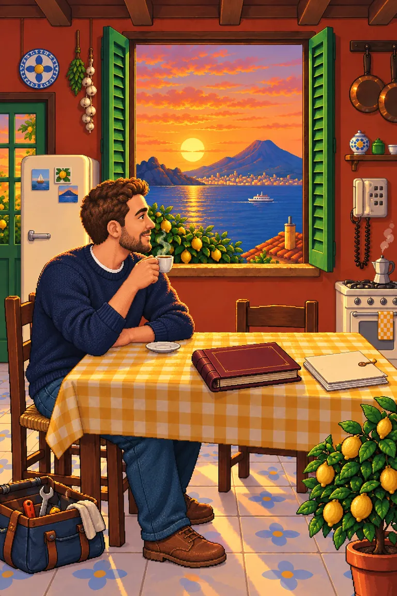
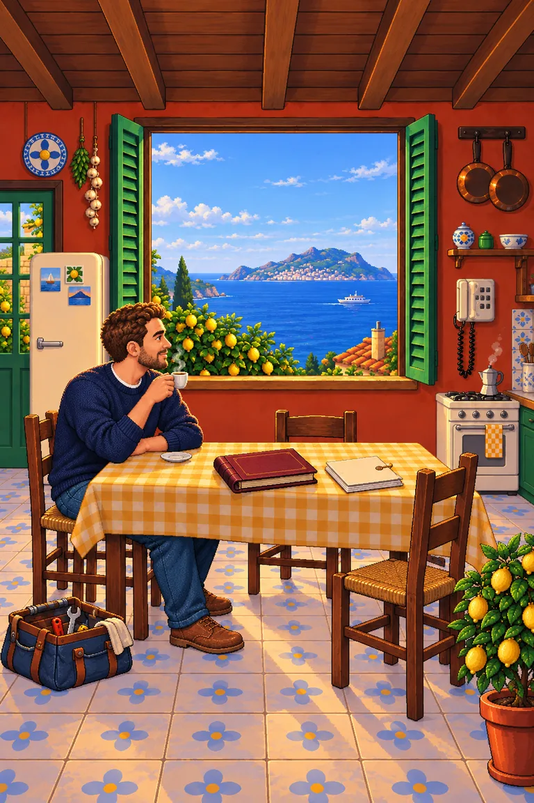
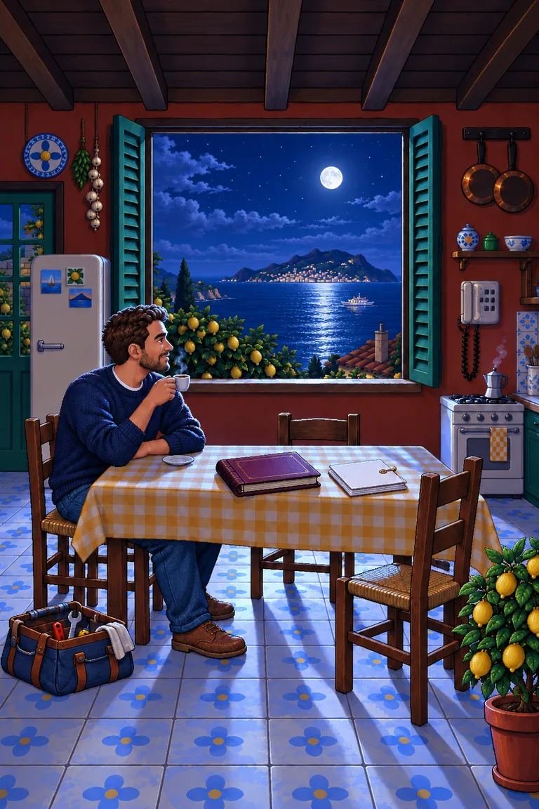

# Pocket Adventure

## Approved scene: production integration

The approved seated scene now runs in the mobile application on `floroz/pocket-adventure`, based on `V2.1`, in its own managed worktree. The earlier standing character implementation and scene image have been replaced. Historical design studies and their prompts below remain as provenance.

- The welcome invitation explicitly recommends desktop for the full experience and offers immediate Experience, Résumé and Contact links.
- Postcards open About; telephone opens Contact; album opens Experience; folder opens Résumé; backpack/laptop opens Skills. The seated character offers optional conversation, and “Coffee?” requests a sip.
- The approved day/night likeness paintings, resting pose paintings, raised arm sources, ferry and wooden boat are full-quality sources under `src/assets/mobile/`. The existing build encoder produces WebP. No new likeness or arm artwork was generated for integration.
- `PocketScene`, `pocketRenderer` and `pocketTimeline` preserve the approved 1024 × 1536 composition and movement. A full cycle takes 30 seconds (15 seconds between day/night), with two one-second mouth holds in each of four stages. Sunrise illuminates the room from offscreen east. The moon follows its own arc, with a moving reflection. Vessels alternate with gaps and receive lighting, wake and reflection changes.
- All motion pauses while reading or hidden, and reduced motion keeps the scene still. Pause and sound are accessible buttons. The scene has no hotspot captions or time-of-day badge; invisible, accessible hotspots remain tappable. Portfolio sections stay visible in the bottom toolbar at 320 px and in landscape layouts.
- Optional audio starts muted and is unlocked only by the sound button: the existing Sorrento sea ambience loop plus a moka gurgle every 18 seconds. Reading, hiding the tab, pausing the scene or leaving mobile silences it.
- Mobile owns its image preload and retry state. Content remains available if an image fails. Budget tests cover the encoded bytes, and timeline tests cover sip count, hold duration and alternating vessels.

The mobile experience replaces the Game Boy with a portrait Sorrento kitchen. It has one location and no chapter numbering. London, Zurich and the airport are unimplemented ideas for future mobile locations. The desktop world is unchanged.

First-time visitors see an illustrated invitation explaining that the full game is on desktop and recommending a computer for the complete experience. They can enter the kitchen or go straight to experience, résumé or contact. Direct section links bypass the invitation. The kitchen's Desktop edition link returns to it.

The portrait painting stays at its native 2:3 aspect ratio. Hotspots are percentages of that exact painting; the image is never cropped independently of the controls. The surrounding stage absorbs extra space. Experience, résumé and contact remain directly accessible even while reading or talking. About and skills have both objects and navigation links.

Reading uses live HTML from `profile.ts` and `sectionInspection`, not baked text. The career album presents all roles in a scrollable timeline. Hash routes (`#pocket-experience`, `#pocket-contact`, and so on) support browser Back/Forward, reload and direct linking. Reading receives keyboard focus, Escape returns to the room, and the opener receives focus on return. Conversations survive an inspection but reset on reload. Mobile navigation and headings use “Resume” because the Pocket Display font does not contain the “é” glyph.

## Next composition: coffee by the window

Art direction requested on 2026-10-01: Daniele sits at the table, drinking espresso and looking out over the bay. His face, hair, beard and clothing come from the current approved desktop front and side portrait sheets. The initial close composition below was superseded by the wider room study: the room, objects and view should attract the eye most. These historical studies led to the approved production scene described above.

Concept preview saved at `assets-src/concepts/pocket-adventure/coffee-by-the-window.webp` (768-pixel-wide; the full-size original was not kept). Generated with the built-in imagegen tool on 2026-10-01 using `assets-src/approved/portrait-rig/front.png`, `assets-src/approved/portrait-rig/side.png`, and `src/assets/mobile/sorrento-empty.webp` as references. This first generated pose was superseded by the wider framing, dedicated arm artwork and likeness correction below.

### Wider room and daylight cycle

The latest framing targets approximately 40% more camera distance, with the seated figure and table around 65–70% of their previous image size. Reveal more wall, floor, ceiling and complete objects, while widening the window aperture to keep the bay visually dominant. This is an art-direction target, not a measured optical lens calibration.

Saved artwork: `assets-src/concepts/pocket-adventure/coffee-wide-day.webp` (768-pixel-wide preview). The full-quality original is `src/assets/mobile/coffee-wide-day.png`. Generated using the built-in imagegen tool, editing the preceding seated composition. The interactive conversation study uses this plate with a separate sun, sky and room tint, stars, shore lights, and a water reflection. It demonstrates framing and the 25-second lighting cycle; the character is still in this study and the production mobile scene has not yet been replaced.

The exterior now looks toward Ischia at sunset. Replace the close Vesuvius cone in the first study with a distant, broad island silhouette. The sunset disk descends behind the island. Sunrise happens to the east, outside the view: the sky and room brighten, but a sun disk must never rise backwards over Ischia.

The reference timetable below uses a 25-second full cycle, with 12.5 seconds for each day/night half. The preview remembers the selected interval and defaults to 12.5 seconds per half. The requested 10–15 seconds applies to each half, not the whole cycle. The four stages now have equal duration so each can contain two complete sips with a one-second hold. Blend lighting continuously rather than switching with a hard cut.

| Time in default cycle | Lighting                                                                                                                |
| --------------------- | ----------------------------------------------------------------------------------------------------------------------- |
| 0–6.25 seconds        | Readable daylight, blue bay, no visible sun disk.                                                                       |
| 6.25–12.5 seconds     | Warm late light and sunset; the sun moves downward and disappears behind Ischia, with a fading reflection on the water. |
| 12.5–18.75 seconds    | Cool blue night, a few stars and distant shore lights. Interior objects retain enough contrast to use.                  |
| 18.75–25 seconds      | Dawn from the unseen east: ambient light returns and stars fade, with no sun in the window.                             |

The first lighting study used a global brightness reduction and blue tint. This was rejected because it looked faded and obscured the room. The revised night direction is a separately painted lighting plate: a visible full moon, a silver reflection on the bay, directional light on the window-facing surfaces of Daniele and his cup, a broad illuminated area across the table, and light pools on the floor with furniture shadows. Diffuse reflected light keeps the rest of the apartment bright enough to explore. Material colors remain distinct; night must not reduce the whole room to navy silhouettes.

The night plate is saved as the 768-pixel-wide preview `assets-src/concepts/pocket-adventure/coffee-wide-moonlight.webp`. The full-quality original is `src/assets/mobile/coffee-wide-moonlight.png`. It was generated with the built-in imagegen tool as a lighting-only edit of `coffee-wide-day.png`. The interactive study now blends to this illuminated painting instead of applying a brightness filter or blue overlay. Its paused night state is fully opaque and retains the table, floor and face highlights.

The subsequent orbit revision used a `coffee-night-orbit-plate` (an intermediate that was not kept in the repository). Imagegen removed the fixed moon and concentrated reflection from the night painting while retaining all interior illumination. The preview renders the original painted moon and reflection as independently positioned pieces. The moon moves along an arc during the night half, after the sunset sun disappears; both are clipped by the window and island. The silver water reflection tracks the moon horizontally and is clipped by the shoreline and foreground vegetation. The moon leaves the view during dawn, while the eastern sunrise remains off-screen. This is a stylized accelerated celestial cycle, not an astronomical simulation. The room's bounce light and furniture shadows remain painted into the plate; moving interior shadows would require separate production lighting masks.

Keep the same geometry throughout the cycle. Day and night remain fully exposed paintings; the transition blends between their lighting, without an additional global dimming filter. The sunset sun is clipped by the island silhouette and window frame; its warm reflection fades when the sun drops below the island. Night lighting arrives near the end of sunset. At dawn the moonlit scene transitions to daylight without showing an eastern sun in this window. A pause control freezes the light. Reduced motion defaults to a stable daytime scene, with manual phase selection available. Portfolio text and controls keep their own readable colors through every phase.

### Ambient objects

| Element                           | Motion                                                                              | Timing and purpose                                                                                       |
| --------------------------------- | ----------------------------------------------------------------------------------- | -------------------------------------------------------------------------------------------------------- |
| Daniele and espresso              | Lift from the saucer, meet lips, tilt cup, hold one second, return to saucer        | Two complete sips in each of Day, Sunset, Night and Dawn; eight per cycle. Torso and legs stay planted.  |
| Face and breathing                | Occasional blink and very small chest movement                                      | Staggered independently of the sip. Looking toward the window remains the resting pose.                  |
| Espresso / moka steam             | Two soft wisps that rise and dissipate                                              | Low-contrast 3–5 second cycles; steam follows the cup while held.                                        |
| Bay and sunlight                  | Local ripples and broken glints in the reflected sunlight                           | Slow 4–6 second cycles confined to the water; the room stays still.                                      |
| Ferry and wooden boat             | Ferry left to right, then boat right to left, each with a short wake and reflection | A 34-second sequence: ferry 14 seconds, gap 1 second, boat 18 seconds, gap 1 second. Never simultaneous. |
| Exterior lemon leaves and cypress | Slight local foliage movement                                                       | A gentle independent breeze; window frame, character and indoor plant remain fixed.                      |
| Telephone                         | A small receiver response when tapped; open Contact immediately                     | No unsolicited ringing or repeated attention animation.                                                  |
| Career album / document folder    | Short cover or paper response to touch                                              | Open Experience / Résumé immediately; animation never delays access.                                     |
| Postcards / backpack with laptop  | Subtle touch highlight                                                              | Open About / Skills. Keep these still during idle.                                                       |

The conversation preview now includes sipping, moka steam, alternating vessels, moving reflections and foliage. Blinking, breathing, cup steam and object responses remain production follow-ups. Avoid camera drift, pulsing hotspots and moving text. Keep ambient audio off by default. Reduced motion shows the resting coffee pose and still water; manual phase and cup-pose controls remain available.

### Required layers

1. Clean kitchen and exterior plate, with no baked character, ferry, steam or bright animated glints.
2. Chair behind the seated body; separate head, torso, seated legs, upper arm, forearm, gripping hand and cup. Use the current portrait references for every generated character asset. The existing standing rig does not contain a seated coffee pose.
3. Table foreground to cover the lap naturally, plus independent album, folder and saucer. Keep the cup attached to the hand throughout the sip to avoid an obvious handoff.
4. Ferry and wake behind a window clipping mask, water highlights, steam, and small leaf groups.

Keep a common canvas and fixed anchor points across the character assets. Build the sip from registered parts or matching keyframes; do not crossfade independently redrawn whole rooms. The exact sip timings and object coordinates are provisional until the separated artwork is checked in the final composition. Preserve the desktop recommendation screen and immediate portfolio shortcuts.

### Coffee composition generation prompt

Use case: identity-preserve.

Asset type: art-direction keyframe for a mobile 1998 point-and-click adventure, portrait 2:3.

Input images: Images 1 and 2 are the CURRENT approved character's front and side sprite sheets; use ONLY as identity, face, hair, beard, body and clothing references, never depict a sheet or multiple people. Image 3 is the existing Sorrento kitchen reference for architecture, palette and painterly adventure-game style.

Primary request: Recompose the kitchen into a warmer, intimate scene with the exact same Daniele seated at the table, enjoying an espresso and looking outside the open window over the Gulf of Naples. Preserve his recognizable face, short wavy brown hair, trimmed beard, navy sweater with white crew-neck collar, blue jeans and brown shoes. He must look like the adult man in the approved sprite references, not a new cartoon mascot.

Composition: one person only. Daniele sits on the left side of the foreground table, turned three-quarter right toward the window; enough of his side profile and face remain visible to recognize him. His face at approximately x30%, y51%, not tiny. His nearer elbow rests comfortably near the table edge, hand holding a small white espresso cup below his chin, in the resting pose between sips. The wooden chair and seated posture are clear, natural human proportions. Frame closer than the existing kitchen, less empty tiled floor. The open green-shuttered window, sea, Vesuvius and evening sky occupy the upper-middle half. Sunset light illuminates the edge of his face and shoulder. He looks toward the view, not at the viewer.

Objects for interaction: on the table at lower-right, a burgundy career photo album and a separate cream document folder, clearly exposed and easy to tap; vintage cream telephone on right wall; postcards on fridge at left; working tool bag at lower-left. A moka pot on the right stove and a potted lemon plant in lower-right. Keep objects distinct and comfortable negative space for future unobtrusive hotspot labels.

Animation-aware art: a thin wisp of steam above the espresso, a small distant ferry on the bay, a narrow reflected-sunlight path on the water, a few readable lemon leaves near the window. These will be independently layered later; keep their silhouettes clear. The character, coffee hand and cup must be readable for a future slow sipping animation.

Style: richly painted and subtly pixel-textured late-1990s LucasArts adventure background, consistent with the reference character detail. Warm terracotta, dark wood, cream tiles, green shutters, honey-gold sunlight and deep blue sea. Cozy and lived-in, cinematic stillness.

Constraints: no UI, labels, captions, lettering, borders or logos. No extra humans. No fantasy or modern tech. No exaggerated cartoon face, no new facial identity, no giant head, no additional arms or cups in his hands. Produce one polished full-bleed portrait scene.

### Wider composition generation prompt

Use case: precise-object-edit.

Edit target: image 1, the seated coffee scene. Keep its same adult man, recognizable face, short wavy brown hair, trimmed beard, navy sweater and white crew-neck collar, jeans and brown shoes. Preserve his seated three-quarter right pose, looking through the window and holding espresso, and the painterly pixel-textured late-1990s adventure style.

Primary edit: pull the camera back substantially, approximately 40% farther/wider than this framing. The man and table should occupy roughly 65–70% of their present on-image size. Reveal additional kitchen wall on both sides, more ceiling and floor, whole chairs, the entire stove, fridge, telephone, lemon pot, tool bag, and room to stage further interactive objects. Keep portrait 2:3, full bleed. No fisheye.

Visual hierarchy: the ROOM, interactive objects and especially the WINDOW VIEW are the stars, not the character. Widen the rear window aperture so the expanded exterior view remains the strongest focal point despite the camera retreat. A large open green-shuttered window in the upper middle, with broad sea and horizon visible, occupies about half the image width. Daniele seated lower left, smaller, full chair and shoes comfortably in frame; tabletop album and cream document folder clearly separated in lower-middle/right; no crowding.

Geography/art direction: replace the large close Vesuvius cone with a DISTANT ISCHIA island silhouette on the western horizon, a broad low irregular island with rounded Monte Epomeo ridge, surrounded by sea. This window faces the sunset direction over Ischia. Keep distant coastline understated. It is a view over open bay, NOT a giant mountain filling the window.

Lighting plate: clear soft daytime light, pale blue sky with a few light clouds, blue water, natural warm kitchen. Absolutely NO visible sun disk, NO sunset orange sky, NO painted shafts of direct sunlight, NO glowing sun reflection, NO stars or moon. Sun and changing light will be animated separately. Keep scene readable and richly colored without dramatic fixed golden rim lighting on the man. Tiny ferry may remain on the sea.

Preserve existing portfolio objects: burgundy album, cream document folder, vintage cream telephone, postcards on fridge, working kit on floor, moka pot, lemon plant. Do not invent additional focal objects or people. Leave breathing room around objects.

Avoid: same close-up framing, enlarging the man, giant head, changed identity, giant volcano, sunset baked into image, any text, UI, labels, borders or logos. Deliver one finished wider-room daytime portrait painting.

### Moonlight lighting prompt

Use case: lighting-weather.

Edit this exact daytime kitchen artwork into a beautifully lit MOONLIT NIGHT version for an animated game lighting transition. This is a lighting-only edit: preserve pixel-for-pixel composition as closely as possible, identical camera, crop, resolution 1024x1536, ALL silhouettes, furniture, wall features, window aperture, island silhouette, sea horizon, character pose, face, clothes, espresso, book, document folder, chair legs, leaves, tile pattern and ferry positions. No redesigning or shifting anything.

The critical requirement is a REAL READABLE LIGHT SOURCE and a BRIGHT, playable interior. Do NOT merely darken or blue-tint the whole image.

LIGHT SOURCE: one bright, believable full moon in the window sky, center approximately x63%, y23% of the whole image, diameter about 3% of image width, well above the Ischia ridge. Its cool silver light creates a strongly visible broken silver reflection across the sea directly beneath it, from below the island toward the near water. A few stars and tiny warm distant shore lights, no sun and no orange sunset.

LIGHT TRANSPORT: moonlight and the reflected sea light enter through the existing open window. Paint a coherent directional silver-blue light on the inward window sill and shutters, the man's window-facing cheek, hair edges, nose, hand and white espresso cup; a broad pale pool across the checkered tabletop, cream résumé folder and album edges; then visible cool pools of light on the floor around the table, with directional shadows cast by the table and chair legs. Pale tiles and cream furniture bounce this light into the surrounding room. Keep the wood and terracotta identifiable in softly lit shadow, and retain the man's natural skin tone under the cool highlights.

EXPOSURE: a luminous cinematic night, like a richly painted adventure game's readable moonlit interior. Midtones must stay bright enough to clearly read the book, folder, telephone, toolbag, character's face and every major room object at phone size. Darkest values mostly in the far ceiling corners and occlusion shadows. The illuminated tabletop and floor should approach the daytime image's brightness, with a cooler silver color. Preserve rich material colors, not a uniformly navy or grey scene. A strong sense of depth from light and shadow, not fog or faded opacity.

No invented lamps, candles or electric lighting. The moon and its reflection are the main visible source, with natural diffuse interior bounce. No theatrical visible laser beams, no magical glow outline, no moving the objects, no new objects, no text or interface.

Preserve the reference's detailed late-1990s painted pixel adventure style. Deliver one exact-register full-frame night lighting plate.

### Orbit background edit prompt

Built-in imagegen edited `coffee-wide-moonlight.png` into `coffee-night-orbit-plate.png`. The moon and reflection in the preview are drawn from the original painting; their motion is controlled independently.

Use case: precise-object-edit.

Edit this exact moonlit kitchen image into an animation background plate.

Remove ONLY the visible full moon disk and its small surrounding halo from the sky, filling the spot with matching dark blue night sky and a few tiny stars. Also remove ONLY the concentrated vertical silver moon-reflection trail on the water directly beneath it, replacing it with continuous richly blue moonlit water matching the neighboring bay.

Keep ALL interior moonlight, highlights, bright table and floor, furniture shadows, character lighting, sky exposure, stars, clouds, shoreline lights and other objects EXACTLY as they are. The room MUST remain just as bright and beautifully moonlit as the reference. Do not darken or recolor it.

Preserve the exact 1024x1536 canvas, camera, every object, character face, pose, architecture and scene geometry. No movement or redesign. Preserve the ferry and its wake and island.

This is the clean plate for overlaying an independently animated moon and moving sea reflection. There should be NO visible moon or sun anywhere and NO fixed vertical bright reflection stripe, but all diffuse moonlit environmental light remains.

Output one finished exact-register night background plate, no text, labels or UI.

## Living scene preview: backpack, sipping and passing vessels

The latest conversation study used `coffee-living-day` and `coffee-living-night` as clean registered plates (intermediates that were not kept in the repository). The new wooden boat ships as `src/assets/mobile/gozzo-boat.png`. The navy backpack has brown straps and a grey period laptop peeking out. The empty sea and moka are painted without a fixed ferry or steam. This study was subsequently integrated into the production mobile scene using the corrected likeness and resting-arm paintings.

The cup and hand are clipped at runtime from the earlier day/night paintings. The cup rests on the saucer, lifts for 0.65 seconds, meets the mouth with a small tilt for one second, then lowers for 0.65 seconds. Each stage contains two actions, with the remaining time spent at the table. The new background exposes the torso behind the moving arm, avoiding duplicate arms or whole-scene crossfades.

The first resting pose compressed the raised forearm around a fixed elbow, leaving a wrist split and distorted sleeve. A subsequent mesh passed continuity and triangle-orientation checks but still looked anatomically wrong. The current preview uses dedicated `coffee-rest-day.png` and `coffee-rest-night.png` paintings: the fully resting pose is drawn at its original proportions without mesh deformation. The lower movement interpolates corresponding resting/raised outlines; the accepted upper movement is preserved. Visual inspection remains necessary; geometry checks alone did not catch the earlier poor anatomy.

The user-supplied portrait is now the identity reference. `coffee-likeness-day.png` and `coffee-likeness-night.png` replace the generic curly-haired face with a shorter haircut, slimmer face and lighter beard. These full-quality source paintings are saved as `src/assets/mobile/coffee-likeness-day.png` and `coffee-likeness-night.png`. The animated preview uses these corrected backgrounds and clips only arm regions from the older paintings, so those older faces cannot reappear during sipping. These corrected sources are now used by the mobile renderer.

The ferry reuses the existing desktop asset `assets-src/approved/sorrento-ferry@hd.webp`. The new wooden boat faces left. A sea mask hides both behind shoreline foliage and the window frame. The moving light source changes the illuminated side, warm/cool tint, water shadow offset, reflected hull and wake color; ferry cabin lights appear at night. The room's illumination and furniture shadows still come from the painted plates.

Moka steam uses four rising, curling, fading wisps. Small texture displacements give the exterior lemon foliage and cypress a breeze. These run on the same pausable animation clock, but vessel and foliage timing remain independent of the lighting stages. Hidden previews pause; reduced motion starts with a still scene.

Verification: deterministic clock checks at 10, 12.5 and 15 seconds per day/night half confirmed exactly two mouth holds in each stage, each lasting one second within a frame, the ferry–gap–boat–gap sequence, correct travel directions, and manual sipping returning to the table while paused. Browser inspection checks the actual painted composition and cup contact.

Generated with the built-in imagegen tool on 2026-10-01. Sharp only resized/encoded the selected assets for the inline preview. The backpack day edit used `coffee-wide-day.png`; the matching night edit used `coffee-night-orbit-plate.png` plus the new backpack day reference. The final clean-plate edits used those intermediate backpack paintings. The boat used the desktop ferry as its style reference.

### backpack Day prompt

Use case: precise-object-edit. Edit this EXACT 1024x1536 daylight kitchen painting for a layered game animation. Preserve the camera, all character proportions and face, pose, room, furniture, window, sea and all other pixels as closely as possible.
Make two tightly localized edits:

1. Replace the open toolbox/tool bag at bottom left with an everyday navy canvas BACKPACK, upright on the same floor spot, with brown leather details and visible shoulder straps. Its top zipper is open, and the upper third of a closed grey laptop clearly peeks out. The laptop is a chunky late-1990s notebook computer with a plain grey lid, no brand or lettering. Make the backpack/laptop recognizable at phone size. Keep it below the chair arm, away from the man's shoes, within approximately x2–25%, y74–86%. No tools remain. Preserve the existing contact shadow and appropriate daytime light.
2. Prepare a CLEAN ANIMATION PLATE for his sipping arm: remove ONLY the nearer raised forearm (the diagonal sleeve from elbow to wrist), its hand, and the espresso cup it holds. Reconstruct the navy sweater/torso and red wall that were occluded by that forearm and cup. Keep his upper arm down to the elbow, his seated torso, head, face, neck, his other forearm resting across the table, the saucer and everything else EXACTLY unchanged. The removable forearm/cup region is approximately x21–36%, y46–57% of the image. The missing forearm will be supplied as a separate animated layer from the original painting. Do NOT replace it with a new hand or a different arm pose; no cup on the table. Do not move the elbow or change the face or torso position.
   This background will always have the original forearm/hand/cup composited over it. Preserve original artwork everywhere outside these two edited regions. Same style, texture, lighting and exact framing; no new labels or text.

### backpack Night prompt

Use case: precise-object-edit.
Image 1 is the EDIT TARGET: the clean moonlit kitchen animation background, with no moon disk or concentrated reflection. Image 2 is the DESIGN REFERENCE for exactly TWO localized changes: the backpack/laptop at bottom left and the cleaned character forearm region.
Transfer ONLY those two edits from image 2 into image 1, maintaining image 1's beautiful bright moonlit lighting:

1. Replace the bottom-left toolbox with the EXACT SAME navy canvas backpack, brown leather straps, open zipper and partially exposed grey late-1990s laptop as image 2, same position, shape and size. Relight its fabric and laptop edge with image 1's cool moonlight. No tools.
2. Remove the raised near forearm, hand and held espresso cup, matching the cleaned torso/arm region of image 2 exactly. This is an animation plate; a separate original arm layer will be composited later. Preserve the other resting arm, face, head, torso location and saucer. Match image 2 geometry in this small region, but maintain the cool moonlit highlights and clothing color of image 1.
   Preserve EVERYTHING ELSE from image 1 exactly: canvas1024x1536, camera, room geometry, character face and clothes, table, shadows, illuminated floor, album, paper folder, telephone, chair legs, windows, clouds, stars, island, ferry, sea and shoreline lights.
   Do not add a moon, sun, fixed bright reflection or new objects. Do not darken the room. This must align exactly with the daytime reference when blended. No text or logos.

### clean Day prompt

Use case: precise-object-edit. Edit target: attached daytime Sorrento kitchen. Preserve the exact framing, face, hair, identity, body position, clothing, window, landscape, furniture, room, backpack and laptop, and sunlight.
Make this a clean animation background with ONLY these localized removals:

1. Remove the small ferry and its wake from the sea; reconstruct matching uninterrupted sea.
2. Remove only the grey steam above the moka; keep the moka and stove unchanged.
3. Remove the man's NEAR foreground bent forearm and hand currently folded across his lower torso/table, from the navy elbow near (220,850) through the skin hand near (295,850). Reconstruct the navy torso/table behind it naturally. Keep his shoulder/upper arm and the FAR arm resting at the right unchanged. A moving forearm will be composited later. Keep the small empty white saucer on table. No cup. Do not add any hand, elbow, wrist or arm elsewhere.
   Output same 1024x1536 image; no other changes.

### clean Night prompt

Use case: precise-object-edit. Edit target: attached moonlit Sorrento kitchen. Preserve exact framing, face, hair, identity, body position, clothing, window, landscape, furniture, room, backpack/laptop, and bright blue moonlight across room.
Make a clean animation background with ONLY these localized removals:

1. Remove the small ferry and its wake from the sea; reconstruct matching uninterrupted blue night sea.
2. Remove only the grey steam above moka; keep moka/stove unchanged.
3. Remove the man's NEAR foreground bent forearm and hand currently folded across his lower torso/table, from navy elbow near (220,850) through skin hand near (295,850). Reconstruct navy torso/table behind it naturally. Keep shoulder/upper arm and FAR arm resting at the right unchanged. A moving forearm will be composited later. Keep small empty white saucer on table. No cup. Do not add any hand, elbow, wrist or arm elsewhere.
   No moon or reflection added. Output same 1024x1536 image; no other changes.

### boat prompt

Use case: stylized-concept. Asset type: isolated game sprite, transparent background. One small traditional Italian wooden motor fishing boat, elegant Mediterranean gozzo, bow points LEFT, strict side profile. Cream hull with blue trim, wooden interior, small inboard engine cover and little windscreen, no sails, no people. Hand painted late-1990s adventure game style matching attached ferry reference, crisp silhouette, painterly material details, warm cream highlights, dark indigo shadows. Isolated on genuinely transparent background, no surrounding water, no wake, no ground shadow, no glow, no text. Boat occupies most canvas width with modest transparent margin.

## Artwork provenance

- Retired first-chapter asset: `src/assets/mobile/sorrento-empty.webp`, 1024 × 1536, WebP quality 88; replaced by the approved seated-scene sources.
- Generated with the built-in imagegen tool on 2026-10-01.
- Reference: `docs/blog/images/17-sorrento-hd-full-scene.webp`, the project's existing Sorrento scene.
- The final painting is an empty background plate. The original generated character was removed because it did not match the current desktop character. The initial `PocketCharacter` used the exact desktop `CHARACTER_RIG`, atlas, `RigAnimator` and `drawRig` renderer. It animated idle breathing, blinking and speech before the seated scene superseded it.
- The moka steam overlay is decorative CSS and is hidden under reduced motion. Free walking is not part of this first chapter.
- The final asset is separate from the desktop art pipeline, whose scene dimensions and palette checks apply to the desktop engine.

### Original generation prompt

Use case: stylized-concept. Create one production game background for a mobile portrait adaptation of the supplied Sorrento adventure-game reference. Reference image is art style, location and character reference. Output a tall portrait image aspect 2:3, full bleed, no borders or UI and absolutely NO text or lettering anywhere. Match the reference's 1998 LucasArts richly hand-painted pixel adventure look: warm terracotta Italian kitchen, dark wood beams, emerald shutters, cream/yellow tiles, sunset golden light. Recompose for portrait, do not crop the wide reference. Required staging for touch hotspots, use normalized positions: a large open window centered at x50% y28% showing Gulf of Naples, Vesuvius, tiny ferry and sunset. A vintage cream wall telephone at x83% y43%, large and legible. Daniele (same dark-haired bearded adult man, navy blue shirt, blue jeans from reference) stands at x20% y70%, full body. A table with yellow checked cloth occupies x45%-88% y68%-89%; on it a large closed burgundy photograph album centered x64% y73% and a clearly separate cream document folder with pages centered x83% y80%. Small open tool bag at x14% y91%. Moka coffee stove at right mid-height x85% y59% below telephone. Small potted lemon tree near bottom right. Keep each interactive object visually distinct, no overlapping telephone/album/folder/character/tools. Beautiful immersive painted scene, detailed but legible at phone size, pixel-textured edges, subtle dithering, no photorealism, no modern UI, no fake app chrome. Preserve the reference character identity and warm personality. No labels, no writing on album or folder.

### Final background edit prompt

The built-in imagegen tool edited the original generated image on 2026-10-01. The output PNG was converted to WebP with Sharp without further image editing.

Use case: precise-object-edit. Edit this exact portrait game background. Remove ONLY the man standing in the lower left of the kitchen, including his shadow, and reconstruct the refrigerator and tiled floor naturally behind where his body was. The result must be an EMPTY kitchen with NO human or character anywhere. Preserve EXACTLY the framing, 2:3 portrait aspect ratio, original size, camera, warm painted pixel adventure art style, all architecture and every other object and its exact position, including telephone, postcards on refrigerator, burgundy album, cream document folder, tool bag, table, chairs, lemon tree, stove, window and ferry. This is a clean background plate for overlaying our existing animated desktop character. Do not redesign or move anything else. No new objects or text.

## Resting pose and portrait correction prompts

Generated with the built-in imagegen tool on 2026-10-01. The rest edits used the existing day/night paintings; the likeness edit used the supplied portrait plus `coffee-living-day.png`, followed by a matching moonlit edit of `coffee-living-night.png`. Sharp only resized and encoded preview copies.

### Resting arm — day

Use case: precise-object-edit. Edit the attached exact 1024x1536 kitchen artwork. Change ONLY the seated man's near foreground arm and hands in rectangle x140–365,y790–895 to a natural RESTING COFFEE pose. Keep all other pixels/objects, body, face and camera exactly registered.
Draw his near elbow resting around x190,y874 and relaxed forearm extending rightward along the tabletop to a hand around x306,y851. Navy cable-knit sleeve with naturally rounded elbow and soft folds, rolled cuff around x266,y866, no angular zigzags or deformed fabric. Natural wrist continuous with forearm. His hand gently holds the handle of a small white espresso cup resting UPRIGHT ON the existing saucer centered around x340,y874. Cup top around y844, base around y872. The hand/wrist should be anatomically plausible, five fingers, no pinching, twisting, detached wrist, rigid cutout edges, triangular gaps or extra arms. Far arm can rest naturally behind the near arm, with its hand on the table. Keep original shoulder and torso, face, hair and pose unchanged. Match original lighting, texture and painterly style. Do NOT change the rest of scene. Do not add ships, smoke, moon or text. Full original canvas, no zoom or crop.

### Resting arm — night

Use case: compositing. Image 1 is the edit target, the moonlit kitchen. Image 2 is the exact approved resting coffee pose. Transfer ONLY the near foreground arm, hand and cup/saucer arrangement from image 2 to image 1 in exact pixel register. Same natural relaxed forearm along the table, rounded cable-knit sleeve, cuff and anatomical wrist, hand gently holding white espresso cup resting on saucer. Preserve image 2's shapes and pose precisely. Relight only this inserted arm/hand/cup with image 1's cool blue moonlight, retaining natural skin and readable navy fabric. Keep everything else in image 1 unchanged, exact original 1024x1536 canvas, no zoom/crop, no changed face, shoulders, torso, legs, room, backpack, sea or sky. Do not add moon, ships, steam, text or new objects.

### Likeness — day

Use case: identity-preserve. Image 1 is the exact 1024x1536 game painting to edit. Image 2 is the real person's identity reference supplied by him. Replace ONLY the seated man's head, hair, face and neck (approximately x185–334,y574–744) so it recognizably depicts the man in image 2, rendered in image 1's painterly 1998 adventure-game style. Preserve his actual facial proportions: slim elongated face, short dark brown hair with close sides and short textured top (NOT abundant curls), prominent natural nose, dark eyebrows, brown eyes, short sparse beard/stubble with stronger chin/moustache, natural ears and warm gentle smile. Do not idealize, bulk up the jaw, make thick sculpted beard, or retain the generic curly-haired man. Keep the original head scale, right-facing three-quarter profile looking toward the sea, seated posture, and exact mouth contact point near x321,y681 so the existing sipping animation still meets his lips. Keep everything outside this localized head/neck region exactly unchanged and in pixel register: shoulder, sweater, empty foreground forearm animation plate, saucer, all furniture, backpack/laptop, sea, sky, trees and room. No new arms, cup, ships, steam, text or objects. Full original canvas, same camera, no zoom/crop. This is a likeness correction, not a new character design.

### Likeness — night

Use case: identity-preserve. Image 1 is the exact 1024x1536 MOONLIT kitchen edit target. Image 2 is the corrected daytime identity/geometry reference. Transfer ONLY the corrected head, hair, face and neck from image 2 to image 1, in EXACT pixel register (x185–334,y574–744). Preserve the same recognizable facial proportions, short dark haircut with close sides, nose, ears, lighter short beard/stubble and smile. Relight this face with the cool blue moonlight of image 1; preserve natural skin color and readability. Do not redesign the person or restore the old curly hair. Preserve exact face/mouth position from image 2 so animation aligns. Everything else in image 1 must remain unchanged: sweater and all body/arm geometry, empty moving-arm area, saucer, backpack and laptop, room, foliage, sea, sky and all moonlight on furniture. No new objects, no cup, no moon, no boats or steam, no text. Same full canvas, no crop or zoom.
